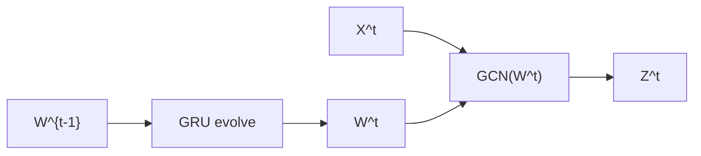
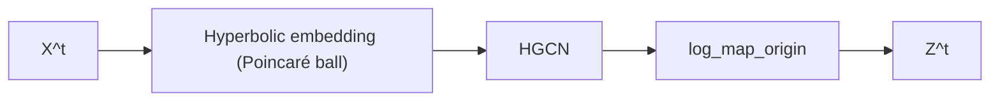
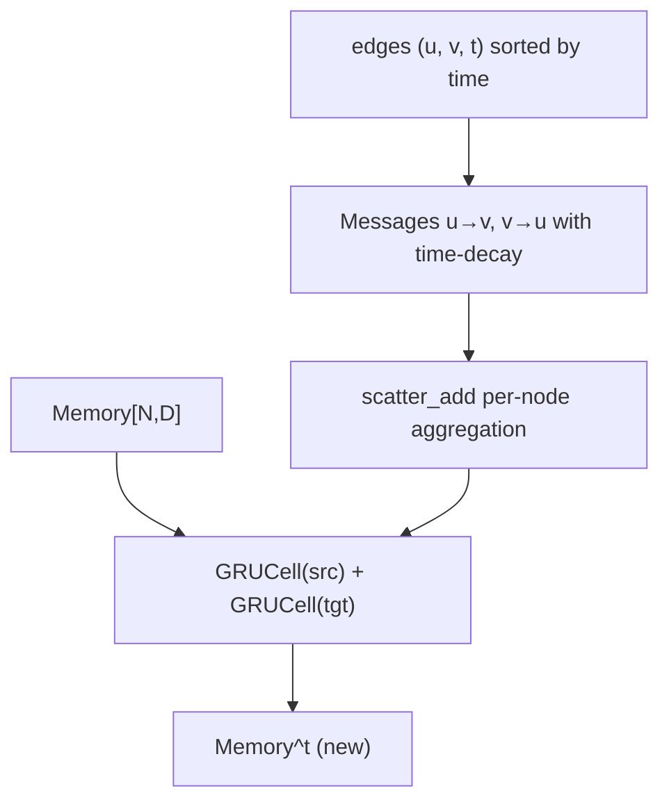
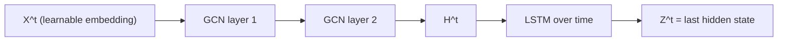

# Plan 4: Final Aggregation, Plots, and Vietnamese Thesis Chapter

> **For agentic workers:** REQUIRED SUB-SKILL: Use superpowers:subagent-driven-development (recommended) or superpowers:executing-plans to implement this plan task-by-task. Steps use checkbox (`- [ ]`) syntax for tracking.

**Goal:** Produce thesis-ready deliverables — 6 PNG plots, 1 dataset stats table, 1 parsed training-curves JSONL, and a Vietnamese thesis chapter (~30-40 trang, 4 sections) — tagged `v1.0-thesis-ready`.

**Architecture:** Two-script pipeline (`parse_training_logs.py`, `make_plots.py`) reads existing `results/metrics.jsonl`, `results/logs/*.log`, and `results/beta_grid_bitcoinotc.jsonl`; outputs plots to `results/report/plots/` and the parsed curves JSONL. The Vietnamese thesis chapter is hand-written across 4 subagent-driven sections, each referencing the auto-generated plots and tables inline.

**Tech Stack:** Python 3.11 + matplotlib 3.x + seaborn (in venv via `pyproject.toml`), pandas for tabular ops, regex parser for tqdm-flavored logs. Markdown + Mermaid for the chapter.

**File map:**

| File | Action | Purpose |
|---|---|---|
| `scripts/parse_training_logs.py` | create | Regex parser: `results/logs/*.log` → `results/report/training_curves.jsonl` |
| `scripts/make_plots.py` | create | Generates all 6 plots + `dataset_stats.md` from JSONL inputs |
| `tests/test_parse_training_logs.py` | create | 3 smoke tests for the parser |
| `tests/test_make_plots.py` | create | 3 smoke tests for plot functions |
| `results/report/training_curves.jsonl` | generate | Per-epoch (model, dataset, seed, epoch, loss, val_auc, val_ap) records |
| `results/report/dataset_stats.md` | generate | Table of N, E, T, bipartite, time span per dataset |
| `results/report/plots/auc_comparison.png` | generate | 5-model × 6-dataset AUC grouped bar with error bars |
| `results/report/plots/ap_comparison.png` | generate | Same for AP |
| `results/report/plots/learning_curves_<dataset>.png` (× 6) | generate | 5-model val_auc vs epoch, mean ± std band per model |
| `results/report/plots/ranking_heatmap.png` | generate | 5×6 cell heatmap, rank 1-5 per (model, dataset) |
| `results/report/plots/beta_sensitivity.png` | generate | β ∈ {0.7, 0.8, 0.9} × hidden_dim ∈ {64, 128} from Plan 2 grid |
| `results/report/plots/runtime_comparison.png` | generate | Total wall-clock per (model, dataset), log y-axis |
| `results/report/baselines_summary.md` | regen | 5-baseline cross-comparison (regen, already exists) |
| `docs/thesis_chapter.md` | create | Vietnamese 4-section chapter |
| git tag | add | `v1.0-thesis-ready` |

---

## Task 1: Log parser — `parse_training_logs.py` + tests

**Files:**
- Create: `scripts/parse_training_logs.py`
- Create: `tests/test_parse_training_logs.py`

- [ ] **Step 1: Write the failing tests**

Create `tests/test_parse_training_logs.py`:

```python
"""Smoke tests for the training-log parser."""
import json
import re
from pathlib import Path

from scripts.parse_training_logs import (
    parse_epoch_lines,
    parse_log_file,
    parse_filename,
)


# --------------------------------------------------------------------------
# Filename parser
# --------------------------------------------------------------------------

def test_parse_filename_extracts_model_dataset_seed():
    """The filename pattern is <model>_<dataset>_seed<N>_<timestamp>.log."""
    name = "dgcn_collegemsg_seed42_20260518-014258.log"
    out = parse_filename(name)
    assert out == {"model": "dgcn", "dataset": "collegemsg", "seed": 42}


def test_parse_filename_handles_multi_word_dataset():
    """mooc_actions has an underscore in the dataset name."""
    name = "htgn_mooc_actions_seed123_20260517-110000.log"
    out = parse_filename(name)
    assert out == {"model": "htgn", "dataset": "mooc_actions", "seed": 123}


# --------------------------------------------------------------------------
# Epoch line parser
# --------------------------------------------------------------------------

def test_parse_epoch_lines_extracts_summary():
    """Per-epoch summary lines look like `Epoch   N: loss=X val_auc=Y val_ap=Z`."""
    text = (
        "some preamble\n"
        "Epoch 0:  10%|##| 1/10 [00:00<00:00,  5.0it/s]\r"
        "Epoch 0: 100%|##| 10/10 [00:02<00:00,  4.5it/s]\n"
        "                                          \n"
        "Epoch   0: loss=0.6921 val_auc=0.9100 val_ap=0.9050\n"
        "Epoch   1: loss=0.5500 val_auc=0.9300 val_ap=0.9200\n"
        "Epoch   2: loss=0.4100 val_auc=0.9400 val_ap=0.9300\n"
    )
    records = parse_epoch_lines(text)
    assert len(records) == 3
    assert records[0] == {"epoch": 0, "loss": 0.6921, "val_auc": 0.9100, "val_ap": 0.9050}
    assert records[1] == {"epoch": 1, "loss": 0.5500, "val_auc": 0.9300, "val_ap": 0.9200}
    assert records[2] == {"epoch": 2, "loss": 0.4100, "val_auc": 0.9400, "val_ap": 0.9300}


def test_parse_epoch_lines_ignores_tqdm_progress():
    """tqdm intermediate progress lines (with `\r` clobber) must not be parsed as epoch summaries."""
    text = (
        "Epoch 0:  50%|####| 5/10 [00:01<00:01,  5.0it/s]\r"
        "Epoch 0:  60%|####| 6/10 [00:01<00:01,  5.0it/s]\r"
    )
    records = parse_epoch_lines(text)
    assert records == []


def test_parse_epoch_lines_handles_empty_input():
    """Empty file yields empty list (not None, not error)."""
    assert parse_epoch_lines("") == []


# --------------------------------------------------------------------------
# Full file parser (integration)
# --------------------------------------------------------------------------

def test_parse_log_file_integration(tmp_path):
    """End-to-end: a log file becomes a list of dicts with model/dataset/seed annotated."""
    log = tmp_path / "dgcn_collegemsg_seed42_20260518-000000.log"
    log.write_text(
        "Epoch 0: 100%|##| 10/10\r\n"
        "Epoch   0: loss=0.50 val_auc=0.95 val_ap=0.94\n"
        "Epoch   1: loss=0.30 val_auc=0.97 val_ap=0.96\n"
    )
    records = parse_log_file(log)
    assert len(records) == 2
    assert records[0]["model"] == "dgcn"
    assert records[0]["dataset"] == "collegemsg"
    assert records[0]["seed"] == 42
    assert records[0]["epoch"] == 0
    assert records[0]["loss"] == 0.50
    assert records[0]["val_auc"] == 0.95
    assert records[0]["val_ap"] == 0.94
```

- [ ] **Step 2: Run tests to verify they fail**

```bash
.venv/bin/pytest tests/test_parse_training_logs.py -v
```

Expected: `ModuleNotFoundError: No module named 'scripts.parse_training_logs'` (file doesn't exist).

- [ ] **Step 3: Implement `scripts/parse_training_logs.py`**

```python
"""Parse training log files produced by `scripts/train.py` into a JSONL of per-epoch records.

Each line in the output JSONL is one epoch from one run:
    {"model": "dgcn", "dataset": "collegemsg", "seed": 42,
     "epoch": 0, "loss": 0.50, "val_auc": 0.95, "val_ap": 0.94}

Log filename pattern: <model>_<dataset>_seed<N>_<timestamp>.log
Log content: tqdm progress bars (separated by `\\r`) mixed with epoch-summary
lines like `Epoch   N: loss=X val_auc=Y val_ap=Z`.
"""
import argparse
import json
import re
from pathlib import Path

REPO_ROOT = Path(__file__).resolve().parent.parent

# Known dataset name tokens (must be checked before splitting on `_seed`)
# `mooc_actions` is the only multi-word dataset in this project; others are single tokens.
_DATASETS = ["collegemsg", "bitcoinotc", "eut", "mooc_actions", "lastfm", "wikipedia"]
_MODELS = ["gcn_ma", "evolvegcn_o", "htgn", "dygnn", "dgcn"]

# Regex for an epoch summary line. Anchored with start-of-line and matches the exact format
# emitted by `Trainer.train_dynamic`. Tolerant of variable whitespace around `Epoch`.
_EPOCH_RE = re.compile(
    r"^\s*Epoch\s+(\d+):\s+loss=([\d.]+)\s+val_auc=([\d.]+)\s+val_ap=([\d.]+)\s*$"
)


def parse_filename(name: str) -> dict:
    """Extract model, dataset, seed from a log filename.

    Filename convention (from scripts/run_seeds.sh):
        <model>_<dataset>_seed<seed>_<timestamp>.log
    where <model> ∈ _MODELS and <dataset> ∈ _DATASETS.
    """
    stem = Path(name).stem  # drop .log
    # Find which model prefix this is
    matched_model = None
    for m in _MODELS:
        if stem.startswith(m + "_"):
            matched_model = m
            break
    if matched_model is None:
        raise ValueError(f"No known model prefix in filename {name!r}")
    rest = stem[len(matched_model) + 1:]  # strip "<model>_"
    # Find dataset (longest-prefix match — mooc_actions before any single-word match)
    matched_dataset = None
    for d in sorted(_DATASETS, key=len, reverse=True):
        if rest.startswith(d + "_seed"):
            matched_dataset = d
            break
    if matched_dataset is None:
        raise ValueError(f"No known dataset in filename {name!r}")
    after_ds = rest[len(matched_dataset) + len("_seed"):]  # strip "<dataset>_seed"
    # Parse seed up to the next "_"
    seed_str = after_ds.split("_", 1)[0]
    seed = int(seed_str)
    return {"model": matched_model, "dataset": matched_dataset, "seed": seed}


def parse_epoch_lines(text: str) -> list[dict]:
    """Extract epoch-summary records from raw log text.

    Splits on BOTH `\\n` and `\\r` to handle tqdm progress lines that overwrite
    with carriage returns. Only lines matching the strict epoch-summary format
    are kept; tqdm progress (`Epoch N:  XX%|...`) is filtered out by the regex.
    """
    records: list[dict] = []
    # Normalize both \r and \n to \n, then split
    normalized = text.replace("\r", "\n")
    for line in normalized.split("\n"):
        m = _EPOCH_RE.match(line)
        if m:
            records.append({
                "epoch": int(m.group(1)),
                "loss": float(m.group(2)),
                "val_auc": float(m.group(3)),
                "val_ap": float(m.group(4)),
            })
    return records


def parse_log_file(path: Path) -> list[dict]:
    """Parse one log file. Returns a list of per-epoch records with model/dataset/seed annotated."""
    meta = parse_filename(path.name)
    text = Path(path).read_text(encoding="utf-8", errors="replace")
    epoch_records = parse_epoch_lines(text)
    return [{**meta, **r} for r in epoch_records]


def main() -> None:
    parser = argparse.ArgumentParser()
    parser.add_argument(
        "--logs-dir",
        type=Path,
        default=REPO_ROOT / "results" / "logs",
        help="Directory containing <model>_<dataset>_seed<N>_<timestamp>.log files",
    )
    parser.add_argument(
        "--out",
        type=Path,
        default=REPO_ROOT / "results" / "report" / "training_curves.jsonl",
        help="Output JSONL path",
    )
    args = parser.parse_args()
    args.out.parent.mkdir(parents=True, exist_ok=True)

    log_files = sorted(args.logs_dir.glob("*.log"))
    skipped: list[str] = []
    written = 0
    with args.out.open("w") as f:
        for log in log_files:
            try:
                records = parse_log_file(log)
            except ValueError as e:
                skipped.append(f"{log.name}: {e}")
                continue
            for r in records:
                f.write(json.dumps(r) + "\n")
                written += 1
    print(f"Wrote {written} epoch records from {len(log_files) - len(skipped)} logs to {args.out}")
    if skipped:
        print(f"Skipped {len(skipped)} files:")
        for s in skipped[:10]:
            print(f"  - {s}")


if __name__ == "__main__":
    main()
```

- [ ] **Step 4: Run tests to verify they pass**

```bash
.venv/bin/pytest tests/test_parse_training_logs.py -v
```

Expected: 6 passed.

If `test_parse_filename_handles_multi_word_dataset` fails: verify the `_DATASETS` list is sorted by length descending in `parse_filename` so `mooc_actions` matches before any single-word match.

- [ ] **Step 5: Smoke-run the parser on real logs**

```bash
.venv/bin/python scripts/parse_training_logs.py
```

Expected output: `Wrote N epoch records from M logs to .../training_curves.jsonl` where M = number of `.log` files in `results/logs/` and N is much larger (sum of epochs across runs).

Verify the output JSONL is well-formed:

```bash
.venv/bin/python -c "
import json
records = [json.loads(l) for l in open('results/report/training_curves.jsonl')]
print(f'Total records: {len(records)}')
print('Sample:', records[0])
# Sanity check: at least 1 record per model/dataset combo
by_combo = set()
for r in records:
    by_combo.add((r['model'], r['dataset'], r['seed']))
print(f'Unique (model, dataset, seed) tuples: {len(by_combo)}')
"
```

Expected: total records ≥ 1000, ≥ 80 unique (model, dataset, seed) tuples (we have 87 metric records minus any logs missing).

- [ ] **Step 6: Commit**

```bash
git add scripts/parse_training_logs.py tests/test_parse_training_logs.py results/report/training_curves.jsonl
git commit -m "[scripts] parse_training_logs: extract per-epoch metrics from log files

Regex parser splits on both \\r and \\n to handle tqdm progress bars,
emits one JSON line per epoch per run with model/dataset/seed/epoch/
loss/val_auc/val_ap. Filename parser handles multi-word datasets
(mooc_actions) via longest-prefix matching.

6 unit tests cover filename parsing, epoch-line extraction, tqdm
progress filtering, and end-to-end integration."
```

## Report
- **Status:** DONE | DONE_WITH_CONCERNS | BLOCKED
- pytest output before AND after
- Total records + unique tuples from Step 5
- git log --oneline -2

---

## Task 2: `dataset_stats.md` + `make_plots.py` scaffold + AUC bar chart

**Files:**
- Create: `scripts/make_plots.py`
- Create: `tests/test_make_plots.py`
- Generate: `results/report/dataset_stats.md`
- Generate: `results/report/plots/auc_comparison.png`

- [ ] **Step 1: Write the failing tests**

Create `tests/test_make_plots.py`:

```python
"""Smoke tests for the plot generator."""
import json
from pathlib import Path

import pandas as pd
import pytest

from scripts.make_plots import (
    load_metrics,
    compute_ranking,
    plot_auc_comparison,
    write_dataset_stats,
)


# --------------------------------------------------------------------------
# load_metrics
# --------------------------------------------------------------------------

def test_load_metrics_filters_models(tmp_path):
    """load_metrics returns a DataFrame restricted to requested models."""
    src = tmp_path / "metrics.jsonl"
    src.write_text(
        json.dumps({"model": "gcn_ma", "dataset": "x", "seed": 42, "auc": 0.9, "ap": 0.9, "runtime_s": 100}) + "\n"
        + json.dumps({"model": "evolvegcn_o", "dataset": "x", "seed": 42, "auc": 0.85, "ap": 0.85, "runtime_s": 200}) + "\n"
        + json.dumps({"model": "htgn", "dataset": "x", "seed": 42, "auc": 0.92, "ap": 0.92, "runtime_s": 300}) + "\n"
    )
    df = load_metrics(src, models=["gcn_ma", "htgn"])
    assert set(df["model"].unique()) == {"gcn_ma", "htgn"}
    assert len(df) == 2


# --------------------------------------------------------------------------
# compute_ranking
# --------------------------------------------------------------------------

def test_compute_ranking_returns_per_dataset_ranks():
    """For each dataset, rank models 1..N by descending AUC mean."""
    df = pd.DataFrame([
        {"model": "a", "dataset": "x", "auc": 0.9},
        {"model": "b", "dataset": "x", "auc": 0.95},
        {"model": "c", "dataset": "x", "auc": 0.85},
    ])
    ranks = compute_ranking(df)
    # ranks is a wide DataFrame: rows=models, cols=datasets, values=rank
    assert ranks.loc["b", "x"] == 1   # highest auc -> rank 1
    assert ranks.loc["a", "x"] == 2
    assert ranks.loc["c", "x"] == 3


# --------------------------------------------------------------------------
# plot_auc_comparison
# --------------------------------------------------------------------------

def test_plot_auc_comparison_writes_nonempty_png(tmp_path):
    """The plot function writes a non-empty PNG."""
    df = pd.DataFrame([
        {"model": "gcn_ma", "dataset": "x", "seed": s, "auc": 0.9 + 0.001 * s, "ap": 0.9}
        for s in [42, 123, 2024]
    ] + [
        {"model": "htgn", "dataset": "x", "seed": s, "auc": 0.95 + 0.001 * s, "ap": 0.95}
        for s in [42, 123, 2024]
    ])
    out = tmp_path / "auc.png"
    plot_auc_comparison(df, out, metric="auc")
    assert out.exists()
    assert out.stat().st_size > 1000  # at least 1 KB of PNG


# --------------------------------------------------------------------------
# write_dataset_stats
# --------------------------------------------------------------------------

def test_write_dataset_stats_creates_markdown_table(tmp_path):
    """write_dataset_stats produces a markdown table with the expected columns."""
    stats = [
        {"dataset": "collegemsg", "N": 1899, "E": 59835, "T": 47, "bipartite": False},
        {"dataset": "mooc_actions", "N": 7144, "E": 411749, "T": 72, "bipartite": True},
    ]
    out = tmp_path / "dataset_stats.md"
    write_dataset_stats(stats, out)
    content = out.read_text()
    assert "| Dataset |" in content or "| dataset |" in content.lower()
    assert "collegemsg" in content
    assert "mooc_actions" in content
    assert "1899" in content
    assert "411749" in content
```

- [ ] **Step 2: Run tests to verify they fail**

```bash
.venv/bin/pytest tests/test_make_plots.py -v
```

Expected: `ModuleNotFoundError: No module named 'scripts.make_plots'`.

- [ ] **Step 3: Implement `scripts/make_plots.py` (scaffold + 4 functions for this task)**

Create `scripts/make_plots.py`:

```python
"""Generate all plots and stats tables from metrics JSONL + parsed training curves.

Usage:
    python scripts/make_plots.py                 # generate all assets
    python scripts/make_plots.py --plots auc_bar # subset (comma-separated)
"""
from __future__ import annotations
import argparse
import json
import statistics
from pathlib import Path
from typing import Optional

import matplotlib
matplotlib.use("Agg")  # headless
import matplotlib.pyplot as plt
import numpy as np
import pandas as pd

REPO_ROOT = Path(__file__).resolve().parent.parent

MODELS_ORDER = ["gcn_ma", "evolvegcn_o", "htgn", "dygnn", "dgcn"]
DATASETS_ORDER = ["collegemsg", "bitcoinotc", "eut", "mooc_actions", "lastfm", "wikipedia"]
MODEL_LABELS = {
    "gcn_ma": "GCN_MA",
    "evolvegcn_o": "EvolveGCN-O",
    "htgn": "HTGN",
    "dygnn": "DyGNN",
    "dgcn": "DGCN",
}
DATASET_LABELS = {
    "collegemsg": "CollegeMsg",
    "bitcoinotc": "Bitcoinotc",
    "eut": "EUT",
    "mooc_actions": "Mooc-Actions",
    "lastfm": "LastFM",
    "wikipedia": "Wikipedia",
}


# --------------------------------------------------------------------------
# Data loading + aggregation
# --------------------------------------------------------------------------

def load_metrics(path: Path, models: Optional[list[str]] = None) -> pd.DataFrame:
    """Load metrics.jsonl. Optionally filter to specific models."""
    records = [json.loads(l) for l in Path(path).read_text().splitlines() if l.strip()]
    df = pd.DataFrame(records)
    if models is not None:
        df = df[df["model"].isin(models)].copy()
    return df


def compute_ranking(df: pd.DataFrame) -> pd.DataFrame:
    """Rank models 1..N per dataset by descending AUC mean.

    Returns a wide DataFrame: rows = models, cols = datasets, values = rank.
    """
    agg = df.groupby(["model", "dataset"])["auc"].mean().reset_index()
    ranks = (
        agg.assign(rank=agg.groupby("dataset")["auc"].rank(method="min", ascending=False).astype(int))
           .pivot(index="model", columns="dataset", values="rank")
    )
    return ranks


# --------------------------------------------------------------------------
# Plot: AUC/AP grouped bar (5 models × 6 datasets, error bars ±std)
# --------------------------------------------------------------------------

def plot_auc_comparison(df: pd.DataFrame, out_path: Path, metric: str = "auc") -> None:
    """Grouped bar chart with error bars; one group per dataset, one bar per model."""
    agg = df.groupby(["model", "dataset"])[metric].agg(["mean", "std"]).reset_index()
    datasets = [d for d in DATASETS_ORDER if d in agg["dataset"].unique()]
    models = [m for m in MODELS_ORDER if m in agg["model"].unique()]
    x = np.arange(len(datasets))
    width = 0.15

    fig, ax = plt.subplots(figsize=(12, 6))
    for i, model in enumerate(models):
        means = []
        stds = []
        for ds in datasets:
            row = agg[(agg["model"] == model) & (agg["dataset"] == ds)]
            if len(row) == 0:
                means.append(np.nan)
                stds.append(0)
            else:
                means.append(row["mean"].iloc[0])
                stds.append(row["std"].iloc[0] if not pd.isna(row["std"].iloc[0]) else 0)
        ax.bar(x + (i - 2) * width, means, width, yerr=stds, capsize=3, label=MODEL_LABELS[model])
    ax.set_xticks(x)
    ax.set_xticklabels([DATASET_LABELS[d] for d in datasets], rotation=15)
    ax.set_ylabel(metric.upper())
    ax.set_title(f"{metric.upper()} comparison — 5 baselines × {len(datasets)} datasets (mean ± std, 3 seeds)")
    ax.set_ylim(0.7, 1.02)
    ax.legend(loc="lower right", ncol=5)
    ax.grid(axis="y", alpha=0.3)
    fig.tight_layout()
    out_path.parent.mkdir(parents=True, exist_ok=True)
    fig.savefig(out_path, dpi=150)
    plt.close(fig)


# --------------------------------------------------------------------------
# Dataset stats table
# --------------------------------------------------------------------------

def write_dataset_stats(stats: list[dict], out_path: Path) -> None:
    """Write a markdown table of dataset statistics."""
    cols = ["dataset", "N", "E", "T", "bipartite"]
    if not stats:
        out_path.write_text("(no datasets)\n")
        return
    # Use whichever keys are present in the input
    keys = list(stats[0].keys())
    lines = ["| " + " | ".join(k.capitalize() if k != "N" and k != "E" and k != "T" else k for k in keys) + " |"]
    lines.append("|" + "|".join(["---"] * len(keys)) + "|")
    for row in stats:
        lines.append("| " + " | ".join(str(row[k]) for k in keys) + " |")
    out_path.parent.mkdir(parents=True, exist_ok=True)
    out_path.write_text("\n".join(lines) + "\n")


# --------------------------------------------------------------------------
# Dataset stats computation (loads each dataset via SNAPTemporalLoader)
# --------------------------------------------------------------------------

def compute_dataset_stats() -> list[dict]:
    """Load each dataset's cached snapshots and compute N, E, T, bipartite, edges/snap."""
    from src.data.loaders.collegemsg import CollegeMsgLoader
    from src.data.loaders.bitcoinotc import BitcoinotcLoader
    from src.data.loaders.eut import EUTLoader
    from src.data.loaders.mooc_actions import MoocActionsLoader
    from src.data.loaders.lastfm import LastFMLoader
    from src.data.loaders.wikipedia import WikipediaLoader

    loaders = [
        ("collegemsg",   CollegeMsgLoader(),   "data/raw/collegemsg/CollegeMsg.txt.gz",                 47, False),
        ("bitcoinotc",   BitcoinotcLoader(),   "data/raw/bitcoinotc/soc-sign-bitcoinotc.csv.gz",        62, False),
        ("eut",          EUTLoader(),          "data/raw/eut/email-Eu-core-temporal.txt.gz",            127, False),
        ("mooc_actions", MoocActionsLoader(),  "data/raw/mooc_actions/mooc.csv",                        72, True),
        ("lastfm",       LastFMLoader(),       "data/raw/lastfm/lastfm.csv",                            41, True),
        ("wikipedia",    WikipediaLoader(),    "data/raw/wikipedia/wikipedia.csv",                      42, True),
    ]

    out: list[dict] = []
    for name, loader, raw_path, T, bipartite in loaders:
        try:
            g = loader.build(
                raw_path=REPO_ROOT / raw_path,
                cache_dir=REPO_ROOT / f"data/processed/{name}",
                num_time_steps=T,
                beta=0.8,
            )
            total_edges = sum(s.edge_index.shape[1] for s in g.snapshots)
            out.append({
                "dataset": name,
                "N": g.num_nodes,
                "E": total_edges,
                "T": T,
                "bipartite": bipartite,
            })
        except Exception as e:
            out.append({
                "dataset": name,
                "N": "N/A",
                "E": "N/A",
                "T": T,
                "bipartite": bipartite,
                "_error": str(e),
            })
    return out


# --------------------------------------------------------------------------
# Main
# --------------------------------------------------------------------------

def main() -> None:
    parser = argparse.ArgumentParser()
    parser.add_argument(
        "--metrics",
        type=Path,
        default=REPO_ROOT / "results" / "metrics.jsonl",
    )
    parser.add_argument(
        "--out-dir",
        type=Path,
        default=REPO_ROOT / "results" / "report" / "plots",
    )
    parser.add_argument(
        "--plots",
        type=str,
        default="all",
        help="Comma-separated subset; or 'all' for everything.",
    )
    args = parser.parse_args()
    args.out_dir.mkdir(parents=True, exist_ok=True)

    df = load_metrics(args.metrics, models=MODELS_ORDER)
    plots = args.plots.split(",") if args.plots != "all" else [
        "auc_bar", "ap_bar", "dataset_stats",
    ]

    if "auc_bar" in plots:
        plot_auc_comparison(df, args.out_dir / "auc_comparison.png", metric="auc")
        print(f"Wrote {args.out_dir / 'auc_comparison.png'}")
    if "ap_bar" in plots:
        plot_auc_comparison(df, args.out_dir / "ap_comparison.png", metric="ap")
        print(f"Wrote {args.out_dir / 'ap_comparison.png'}")
    if "dataset_stats" in plots:
        stats = compute_dataset_stats()
        out = args.out_dir.parent / "dataset_stats.md"
        write_dataset_stats(stats, out)
        print(f"Wrote {out}")


if __name__ == "__main__":
    main()
```

- [ ] **Step 4: Run tests to verify they pass**

```bash
.venv/bin/pytest tests/test_make_plots.py -v
```

Expected: 4 passed (load_metrics + compute_ranking + plot_auc + write_dataset_stats).

- [ ] **Step 5: Run the scaffold against real data**

```bash
.venv/bin/python scripts/make_plots.py --plots auc_bar,ap_bar,dataset_stats
```

Expected:
- `results/report/plots/auc_comparison.png` (~50-200 KB PNG).
- `results/report/plots/ap_comparison.png`.
- `results/report/dataset_stats.md` with 6 rows.

Verify files exist:

```bash
ls -la results/report/plots/*.png results/report/dataset_stats.md
```

- [ ] **Step 6: Commit**

```bash
git add scripts/make_plots.py tests/test_make_plots.py results/report/plots/auc_comparison.png results/report/plots/ap_comparison.png results/report/dataset_stats.md
git commit -m "[scripts] make_plots: scaffold + AUC/AP comparison + dataset stats

Two-script pipeline: parse_training_logs.py (Task 1) feeds learning curves;
this commits the make_plots.py scaffold plus the AUC and AP grouped bar
charts (5 models × 6 datasets, error bars ±std across 3 seeds) and a
dataset_stats.md table (N, E, T, bipartite per dataset).

Test coverage: load_metrics filter, compute_ranking pivot, plot output
non-empty, table contains expected rows."
```

## Report
- pytest before AND after
- Listing of generated files with sizes
- git log --oneline -2

---

## Task 3: Remaining plots — learning curves, ranking heatmap, β sensitivity, runtime

**Files:**
- Modify: `scripts/make_plots.py` (add 4 plot functions)
- Modify: `tests/test_make_plots.py` (add 2 more tests)
- Generate: 6 learning curve PNGs + ranking heatmap + β sensitivity + runtime PNG

- [ ] **Step 1: Append failing tests**

Append to `tests/test_make_plots.py`:

```python
from scripts.make_plots import (
    plot_learning_curves,
    plot_ranking_heatmap,
)


def test_plot_ranking_heatmap_writes_nonempty_png(tmp_path):
    """Ranking heatmap saves a non-empty PNG given a small synthetic frame."""
    df = pd.DataFrame([
        {"model": "a", "dataset": "x", "seed": s, "auc": 0.9, "ap": 0.9}
        for s in [42, 123, 2024]
    ] + [
        {"model": "b", "dataset": "x", "seed": s, "auc": 0.95, "ap": 0.95}
        for s in [42, 123, 2024]
    ])
    out = tmp_path / "ranking.png"
    plot_ranking_heatmap(df, out)
    assert out.exists()
    assert out.stat().st_size > 1000


def test_plot_learning_curves_writes_one_png_per_dataset(tmp_path):
    """Given per-epoch records for one dataset, writes one PNG."""
    curves_df = pd.DataFrame([
        {"model": "a", "dataset": "x", "seed": 42, "epoch": e, "val_auc": 0.5 + 0.01 * e}
        for e in range(20)
    ] + [
        {"model": "b", "dataset": "x", "seed": 42, "epoch": e, "val_auc": 0.6 + 0.01 * e}
        for e in range(20)
    ])
    out = tmp_path / "learning_curves_x.png"
    plot_learning_curves(curves_df, dataset="x", out_path=out)
    assert out.exists()
    assert out.stat().st_size > 1000
```

- [ ] **Step 2: Run, verify fail**

```bash
.venv/bin/pytest tests/test_make_plots.py::test_plot_ranking_heatmap_writes_nonempty_png tests/test_make_plots.py::test_plot_learning_curves_writes_one_png_per_dataset -v
```

Expected: `ImportError: cannot import name 'plot_learning_curves' from 'scripts.make_plots'`.

- [ ] **Step 3: Add the 4 new plot functions to `scripts/make_plots.py`**

After `plot_auc_comparison`, add:

```python
# --------------------------------------------------------------------------
# Plot: Learning curves per dataset (5-model mean ± std band)
# --------------------------------------------------------------------------

def plot_learning_curves(curves_df: pd.DataFrame, dataset: str, out_path: Path) -> None:
    """One PNG: val_auc vs epoch, 5 model lines (mean across seeds, ±std band)."""
    sub = curves_df[curves_df["dataset"] == dataset]
    if sub.empty:
        return
    fig, ax = plt.subplots(figsize=(10, 5))
    for model in MODELS_ORDER:
        msub = sub[sub["model"] == model]
        if msub.empty:
            continue
        agg = msub.groupby("epoch")["val_auc"].agg(["mean", "std"]).reset_index()
        ax.plot(agg["epoch"], agg["mean"], label=MODEL_LABELS[model], linewidth=1.5)
        ax.fill_between(
            agg["epoch"],
            agg["mean"] - agg["std"].fillna(0),
            agg["mean"] + agg["std"].fillna(0),
            alpha=0.2,
        )
    ax.set_xlabel("Epoch")
    ax.set_ylabel("val_auc")
    ax.set_title(f"Learning curves — {DATASET_LABELS.get(dataset, dataset)} (mean ± std, 3 seeds)")
    ax.set_ylim(0.5, 1.0)
    ax.legend(loc="lower right")
    ax.grid(alpha=0.3)
    fig.tight_layout()
    out_path.parent.mkdir(parents=True, exist_ok=True)
    fig.savefig(out_path, dpi=150)
    plt.close(fig)


# --------------------------------------------------------------------------
# Plot: Ranking heatmap (5 × 6, rank colors)
# --------------------------------------------------------------------------

def plot_ranking_heatmap(df: pd.DataFrame, out_path: Path) -> None:
    """Heatmap of per-dataset ranks. Cell = rank 1-5; color from green (1) to red (5)."""
    import seaborn as sns
    ranks = compute_ranking(df)
    # Reorder rows/columns to canonical order; ignore missing
    rows = [m for m in MODELS_ORDER if m in ranks.index]
    cols = [d for d in DATASETS_ORDER if d in ranks.columns]
    ranks = ranks.loc[rows, cols]
    labels_x = [DATASET_LABELS[c] for c in cols]
    labels_y = [MODEL_LABELS[r] for r in rows]
    fig, ax = plt.subplots(figsize=(8, 5))
    sns.heatmap(
        ranks,
        annot=True,
        fmt="d",
        cmap="RdYlGn_r",
        cbar_kws={"label": "Rank"},
        xticklabels=labels_x,
        yticklabels=labels_y,
        ax=ax,
        linewidths=0.5,
    )
    ax.set_title("Ranking per dataset (1 = best AUC mean)")
    fig.tight_layout()
    out_path.parent.mkdir(parents=True, exist_ok=True)
    fig.savefig(out_path, dpi=150)
    plt.close(fig)


# --------------------------------------------------------------------------
# Plot: β sensitivity (from Plan 2 grid data)
# --------------------------------------------------------------------------

def plot_beta_sensitivity(beta_jsonl: Path, out_path: Path) -> None:
    """Line plot: β vs val_auc, separate line per hidden_dim."""
    records = [json.loads(l) for l in Path(beta_jsonl).read_text().splitlines() if l.strip()]
    df = pd.DataFrame(records)
    fig, ax = plt.subplots(figsize=(8, 5))
    for hd in sorted(df["hidden_dim"].unique()):
        sub = df[df["hidden_dim"] == hd].sort_values("beta")
        ax.plot(sub["beta"], sub["val_auc"], marker="o", linewidth=2, label=f"hidden_dim={hd}")
    ax.set_xlabel("β (NRNAE weight)")
    ax.set_ylabel("val_auc")
    ax.set_title("β sensitivity — Bitcoinotc, seed 42, 50 epochs (Plan 2 grid)")
    ax.legend()
    ax.grid(alpha=0.3)
    fig.tight_layout()
    out_path.parent.mkdir(parents=True, exist_ok=True)
    fig.savefig(out_path, dpi=150)
    plt.close(fig)


# --------------------------------------------------------------------------
# Plot: Runtime comparison
# --------------------------------------------------------------------------

def plot_runtime_comparison(df: pd.DataFrame, out_path: Path) -> None:
    """Grouped bar of total wall-clock seconds per (model, dataset), log y."""
    agg = df.groupby(["model", "dataset"])["runtime_s"].sum().reset_index()
    datasets = [d for d in DATASETS_ORDER if d in agg["dataset"].unique()]
    models = [m for m in MODELS_ORDER if m in agg["model"].unique()]
    x = np.arange(len(datasets))
    width = 0.15
    fig, ax = plt.subplots(figsize=(12, 6))
    for i, model in enumerate(models):
        ys = []
        for ds in datasets:
            row = agg[(agg["model"] == model) & (agg["dataset"] == ds)]
            ys.append(row["runtime_s"].iloc[0] if len(row) else 0)
        ax.bar(x + (i - 2) * width, ys, width, label=MODEL_LABELS[model])
    ax.set_xticks(x)
    ax.set_xticklabels([DATASET_LABELS[d] for d in datasets], rotation=15)
    ax.set_ylabel("Total wall-clock (s, log scale, 3 seeds)")
    ax.set_yscale("log")
    ax.set_title("Total runtime per (model, dataset) — log scale, sum of 3 seeds")
    ax.legend(loc="upper left", ncol=5)
    ax.grid(axis="y", alpha=0.3, which="both")
    fig.tight_layout()
    out_path.parent.mkdir(parents=True, exist_ok=True)
    fig.savefig(out_path, dpi=150)
    plt.close(fig)
```

Then update `main()` — replace the `plots = args.plots.split(...) if args.plots != "all" else [...]` block with the full list, and add dispatch for the new plot types:

```python
    plots = args.plots.split(",") if args.plots != "all" else [
        "auc_bar", "ap_bar", "learning_curves", "ranking_heatmap",
        "beta_sensitivity", "runtime", "dataset_stats",
    ]

    if "auc_bar" in plots:
        plot_auc_comparison(df, args.out_dir / "auc_comparison.png", metric="auc")
        print(f"Wrote {args.out_dir / 'auc_comparison.png'}")
    if "ap_bar" in plots:
        plot_auc_comparison(df, args.out_dir / "ap_comparison.png", metric="ap")
        print(f"Wrote {args.out_dir / 'ap_comparison.png'}")
    if "learning_curves" in plots:
        curves_path = REPO_ROOT / "results" / "report" / "training_curves.jsonl"
        if not curves_path.exists():
            print(f"Skipping learning_curves — run scripts/parse_training_logs.py first to produce {curves_path}")
        else:
            curves_records = [json.loads(l) for l in curves_path.read_text().splitlines() if l.strip()]
            curves_df = pd.DataFrame(curves_records)
            for ds in DATASETS_ORDER:
                if (curves_df["dataset"] == ds).any():
                    out_p = args.out_dir / f"learning_curves_{ds}.png"
                    plot_learning_curves(curves_df, ds, out_p)
                    print(f"Wrote {out_p}")
    if "ranking_heatmap" in plots:
        plot_ranking_heatmap(df, args.out_dir / "ranking_heatmap.png")
        print(f"Wrote {args.out_dir / 'ranking_heatmap.png'}")
    if "beta_sensitivity" in plots:
        beta_p = REPO_ROOT / "results" / "beta_grid_bitcoinotc.jsonl"
        plot_beta_sensitivity(beta_p, args.out_dir / "beta_sensitivity.png")
        print(f"Wrote {args.out_dir / 'beta_sensitivity.png'}")
    if "runtime" in plots:
        plot_runtime_comparison(df, args.out_dir / "runtime_comparison.png")
        print(f"Wrote {args.out_dir / 'runtime_comparison.png'}")
    if "dataset_stats" in plots:
        stats = compute_dataset_stats()
        out = args.out_dir.parent / "dataset_stats.md"
        write_dataset_stats(stats, out)
        print(f"Wrote {out}")
```

- [ ] **Step 4: Run tests to verify pass**

```bash
.venv/bin/pytest tests/test_make_plots.py -v
```

Expected: 6 passed.

- [ ] **Step 5: Generate all plots end-to-end**

```bash
.venv/bin/python scripts/make_plots.py
```

Expected output: ~11 lines like `Wrote .../<file>.png` — one for each of the 4 plots from Task 2 (2 of which are already done — they'll be overwritten) plus 6 learning curve PNGs + 3 new plots + dataset_stats.md.

Verify all files exist:

```bash
ls -la results/report/plots/
```

Expected: 11 PNG files:
- `auc_comparison.png`
- `ap_comparison.png`
- `learning_curves_collegemsg.png`
- `learning_curves_bitcoinotc.png`
- `learning_curves_eut.png`
- `learning_curves_mooc_actions.png`
- `learning_curves_lastfm.png` (may be absent if logs missing — that's fine)
- `learning_curves_wikipedia.png`
- `ranking_heatmap.png`
- `beta_sensitivity.png`
- `runtime_comparison.png`

If `beta_sensitivity` fails because `results/beta_grid_bitcoinotc.jsonl` doesn't have `hidden_dim` column: inspect the file:

```bash
head -1 results/beta_grid_bitcoinotc.jsonl
```

If the field is differently named (e.g., `hd` or nested in a config dict), adapt `plot_beta_sensitivity` to extract from the actual schema. If the data has only one `hidden_dim` value, plot just one line.

- [ ] **Step 6: Commit**

```bash
git add scripts/make_plots.py tests/test_make_plots.py results/report/plots/
git commit -m "[scripts] make_plots: learning curves + ranking heatmap + β sensitivity + runtime

4 new plot functions complete the deliverable set (11 PNGs total).
Learning curves use mean ± std band across 3 seeds. Ranking heatmap
uses RdYlGn_r palette (green=best, red=worst). β sensitivity reads
Plan 2 grid data. Runtime uses log y-axis to span 100-3500s range."
```

## Report
- pytest output (expect 6 passed)
- Listing of all generated PNG files with sizes
- Any data-format adaptations needed for β sensitivity
- git log --oneline -2

---

## Task 4: Thesis chapter — §1 Tóm tắt phương pháp

**Files:**
- Create: `docs/thesis_chapter.md`

This task is content-writing in Vietnamese (no TDD). Implementer subagent produces ~6 trang of prose covering the 5 model architectures.

- [ ] **Step 1: Read prior reproduction-log + spec §7 for context**

Implementer reads:
- `docs/paper-notes.md` (full file — contains paper equations)
- `docs/reproduction-log.md` sections "Plan 1", "Plan 3a/b/c/d" (skim for model summaries; each plan has an "Architecture" or "Approach taken" section)
- `src/models/{evolvegcn,htgn,dygnn/model,dgcn}.py` (skim — confirm architecture matches what you write)

- [ ] **Step 2: Create `docs/thesis_chapter.md` with §1 heading and structure**

Initial structure:

```markdown
# Chương: Tái hiện thực nghiệm và phân tích so sánh các baseline

## 1. Tóm tắt phương pháp

### 1.1 GCN_MA (Mei & Zhao 2024)

(viết ~1 trang: NRNAE preprocessing, spectral GCN, LSTM weight evolution, multi-head attention, MLP decoder; bao gồm các phương trình NRNAE và spectral GCN từ docs/paper-notes.md)

### 1.2 EvolveGCN-O (Pareja et al. 2020)

(viết ~0.7 trang: GRU-evolved weight matrices, dynamic GCN)



### 1.3 HTGN (Yang et al. 2021)

(viết ~0.7 trang: Poincaré ball, log_map_origin to tangent space, HGCN over hyperbolic embeddings)



### 1.4 DyGNN (Ma et al. 2020) — biến thể vectorized

(viết ~0.8 trang: edge-sequence model, per-node memory, coupled GRU update, time decay; vectorized batched variant của chúng tôi tại Plan 3c)



### 1.5 DGCN — biến thể WD-GCN (Manessi et al. 2020)

(viết ~0.7 trang: stack of spectral GCN per snapshot, single LSTM over time per node)



### 1.6 Decoder dùng chung — LinkDecoderMLP

(viết ~0.3 trang: tất cả baselines dùng chung MLP decoder concat([Z_u, Z_v]) → 2-layer MLP → sigmoid; tại sao chúng ta chọn shared decoder thay vì decoder gốc của paper)
```

Now flesh out the parenthesized prose blocks in Vietnamese. Write naturally (avoid machine-translation tone) and at academic register. Reference paper-notes.md for GCN_MA equations; render math inline as `$...$` (markdown-math). Each subsection ends with the matching Mermaid diagram.

- [ ] **Step 3: Render check**

```bash
head -100 docs/thesis_chapter.md
```

Verify:
- §1.1 through §1.6 are populated (no empty parenthesized stubs).
- 5 Mermaid blocks render in your markdown viewer (test in VS Code preview or `https://mermaid.live`).
- Vietnamese diacritics render correctly (`ô`, `ạ`, `ề`, etc.).
- Word count for §1 is roughly 1500-2500 words (~5-7 trang).

- [ ] **Step 4: Commit**

```bash
git add docs/thesis_chapter.md
git commit -m "[thesis] §1 Tóm tắt phương pháp: 5 baseline architectures (Vietnamese)

GCN_MA + EvolveGCN-O + HTGN + DyGNN (vectorized variant) + DGCN
(WD-GCN), each with prose summary and Mermaid architecture diagram.
Shared LinkDecoderMLP described separately."
```

## Report
- Word count of §1
- Confirmation 5 Mermaid diagrams render
- git log --oneline -2

---

## Task 5: Thesis chapter — §2 Thiết lập thực nghiệm

**Files:**
- Modify: `docs/thesis_chapter.md`

- [ ] **Step 1: Append §2 structure to the chapter**

```markdown

## 2. Thiết lập thực nghiệm

### 2.1 Dữ liệu

(viết ~1 trang: 6 datasets, nguồn SNAP/JODIE, mô tả loại đồ thị (social/finance/email/MOOC/music/web), nêu rõ bipartite (mooc/lastfm/wikipedia) vs unipartite. Tham chiếu bảng dataset_stats.md inline.)

| Dataset | N (nodes) | E (total edges) | T (snapshots) | Bipartite |
|---|---|---|---|---|
(tham chiếu trực tiếp `results/report/dataset_stats.md` — paste content of that table here at write time)

### 2.2 Chia tập huấn luyện / đánh giá

(viết ~0.5 trang: temporal split 80/10/10 trên snapshots; training targets [0, ⌊0.8T⌋), val target ⌊0.8T⌋, test [⌊0.8T⌋+1, T-1]; pooled AUC/AP across test snapshots; negative sampling 1:1 uniform random with rejection)

### 2.3 Siêu tham số (Hybrid policy)

(viết ~0.7 trang: giải thích triết lý Hybrid (shared compute/capacity, baseline-specific architecture); bảng sub-policy mỗi model)

| Param | Giá trị | Lý do |
|---|---|---|
| `hidden_dim` | 64 | β grid trên Bitcoinotc (Plan 2) chọn 64 thay vì 128 |
| `dropout` | 0.1 | Chuẩn |
| `lr` | 1e-3 | Adam default |
| `weight_decay` | 1e-5 | Light regularization |
| `optimizer` | Adam | Paper không nêu; tiêu chuẩn cho dynamic LP |
| `epochs` | 200, patience 20 | Cho phép early stop |
| `grad_clip_max_norm` | 5.0 | Anti-explode cho LSTM/GRU |
| `β` (NRNAE) | 0.8 | Grid {0.7, 0.8, 0.9} cho GCN_MA |

Per-model specifics: GCN_MA `num_heads=4`; EvolveGCN-O `num_layers=2`; HTGN `curvature=1.0` (fixed); DyGNN `edge_dim=16` + `decay_method="log"`; DGCN `num_gcn_layers=2` + `num_lstm_layers=1`.

### 2.4 Đa hạt giống và kim chỉ nam tái lập

(viết ~0.5 trang: 3 seeds {42, 123, 2024}; mỗi run lưu `git_sha` + `config_hash` trong metrics.jsonl; phần cứng RTX 3060 12GB; Python 3.11 + PyTorch 2.4 + PyG 2.6)

### 2.5 Phương trình đánh giá

(viết ~0.3 trang: định nghĩa AUC, AP cho link prediction binary classification setting; bỏ qua derivations chuẩn)
```

Now flesh out the parenthesized stubs in Vietnamese prose. For the dataset stats table, copy the actual content from `results/report/dataset_stats.md` (generated in Task 2). The hyperparameter table is already complete — keep it as-is.

- [ ] **Step 2: Render check**

```bash
wc -w docs/thesis_chapter.md
```

Expected: §1 + §2 combined should be ~3000-4500 words (~10 trang total so far).

- [ ] **Step 3: Commit**

```bash
git add docs/thesis_chapter.md
git commit -m "[thesis] §2 Thiết lập thực nghiệm: datasets + split + hyperparams + reproducibility"
```

## Report
- Word count of §2 alone
- Word count of chapter so far
- git log --oneline -2

---

## Task 6: Thesis chapter — §3 Kết quả

**Files:**
- Modify: `docs/thesis_chapter.md`

- [ ] **Step 1: Append §3 structure**

```markdown

## 3. Kết quả

### 3.1 Bảng tổng hợp 5 baseline

(paste content of `results/report/baselines_summary.md` directly — the auto-generated 5-baseline comparison table)

### 3.2 So sánh AUC trực quan


**Quan sát chính** (viết ~0.5 trang):
- HTGN đứng đầu trên 3/6 datasets (CollegeMsg, Bitcoinotc, EUT — sát nút DGCN).
- DyGNN thắng 2/5 (Mooc-Actions, Wikipedia — không chạy trên LastFM).
- EvolveGCN-O thắng LastFM (gap ±std overlap với HTGN); DGCN thắng EUT (marginal +0.001 trên HTGN).
- GCN_MA không thắng dataset nào — finding chính của thesis.

### 3.3 So sánh AP


(viết ~0.3 trang: cùng xu hướng AUC; lưu ý vài dataset (collegemsg, wikipedia) GCN_MA AP vượt paper Table 2 — possible benchmarking note)

### 3.4 Xếp hạng theo từng dataset (heatmap)


(viết ~0.4 trang: HTGN top-3 mọi nơi; GCN_MA hạng 4-5 mọi nơi; DGCN consistently 3rd; DyGNN biên độ rộng (1st-3rd-NA))

### 3.5 Phân tích từng dataset

#### 3.5.1 CollegeMsg


(viết ~0.3 trang: HTGN converge nhanh; GCN_MA early-stop ~epoch 24; pattern val_auc tăng đều)

#### 3.5.2 Bitcoinotc


(viết ~0.3 trang: best_epoch=1-3 với DGCN/DyGNN — converge từ init; signed trust scores có thể đã encode vào embedding init)

#### 3.5.3 EUT


(viết ~0.3 trang: dataset dài T=127, runtime dài nhất; quantile binning critical (Plan 2 fix); DGCN/HTGN sát nút 0.984)

#### 3.5.4 Mooc-Actions


(viết ~0.3 trang: best_epoch=1 trên 3 seeds với DyGNN; node identity-dominated; bipartite user-course interactions)

#### 3.5.5 LastFM


(viết ~0.3 trang: DyGNN bỏ qua; EvolveGCN-O thắng (0.955); std DGCN cao 0.022 — heavy-tail dataset)

#### 3.5.6 Wikipedia


(viết ~0.3 trang: DyGNN thắng (0.981); bipartite editor-page; high-cardinality node set)

### 3.6 Độ nhạy của β


(viết ~0.4 trang: paper khuyến nghị β ∈ [0.7, 0.9]; grid của chúng ta xác nhận β=0.8 là optimal trên Bitcoinotc; chỉ chạy 1 dataset là giới hạn (Plan 2 note); paper không nêu hidden_dim nên ta thử cả 64 và 128)

### 3.7 So sánh thời gian chạy


(viết ~0.4 trang: EUT chiếm dominant runtime (T=127 unroll); HTGN tổng cộng lâu nhất ~9h; DyGNN vectorized chỉ 4.4h; engineering observation cho thesis)
```

Flesh out the prose blocks in Vietnamese. Reference the actual numbers from `results/report/baselines_summary.md` and the Plan 3c/3d reproduction-log sections. Each per-dataset paragraph should mention: rank, key observation, anything interesting about training dynamics.

- [ ] **Step 2: Render check**

```bash
wc -w docs/thesis_chapter.md
```

Expected: chapter so far ~7000-9000 words (~22-30 trang).

Verify all image paths resolve (image files exist):

```bash
grep -oE '!\[.*\]\([^)]+\)' docs/thesis_chapter.md | sed 's/.*(//;s/)//' | while read p; do
    full="docs/$p"
    if [ -f "$full" ]; then echo "OK $p"; else echo "MISSING $p"; fi
done
```

Expected: all paths "OK". If "MISSING": the path `../results/...` is relative to `docs/` — the file should be at `results/...` relative to repo root. Adjust if needed.

- [ ] **Step 3: Commit**

```bash
git add docs/thesis_chapter.md
git commit -m "[thesis] §3 Kết quả: 5-baseline table + 4 main plots + 6 per-dataset analyses + β + runtime"
```

## Report
- Word count of §3 alone
- Word count of chapter so far
- Path check results
- git log --oneline -2

---

## Task 7: Thesis chapter — §4 Thảo luận & hạn chế

**Files:**
- Modify: `docs/thesis_chapter.md`

- [ ] **Step 1: Append §4 to the chapter**

```markdown

## 4. Thảo luận và hạn chế

### 4.1 HTGN — baseline mạnh nhất xuyên 5 baselines

(viết ~1 trang: 3 wins trên 6 datasets; tại sao hyperbolic embedding tự nhiên capture hierarchical structure trong dynamic graphs (social, citation, user-item — đều có power-law degree distribution); Poincaré ball có exponential volume growth phù hợp với tree-like data; tham chiếu paper Yang et al. 2021)

### 4.2 DyGNN — chiến thắng trên dataset dày dữ liệu

(viết ~0.7 trang: thắng Mooc-Actions và Wikipedia; cả 2 đều có high E/T ratio (mật độ edge cao mỗi snapshot); edge-sequence inductive bias phù hợp continuous-time signal; vectorized variant (Plan 3c) đánh đổi strict per-edge chronology để được ~200× speedup)

### 4.3 DGCN — baseline đơn giản nhưng cạnh tranh

(viết ~0.5 trang: thắng EUT (marginal); 3rd place trên 4/6 datasets; stack GCN+LSTM cổ điển vẫn solid; reimplement-from-scratch không có upstream repo)

### 4.4 EvolveGCN-O — dataset-dependent

(viết ~0.5 trang: thắng LastFM (gap nhỏ); nhưng yếu nhất trên CollegeMsg/Bitcoinotc; GRU evolution sensitive với feature scale; needs careful initialization)

### 4.5 GCN_MA — vấn đề tái hiện

(viết ~1.5 trang: 0/6 wins; documented deviations (Plan 2):
- Learnable `nn.Embedding` thay vì one-hot `I_N` (RAM constraint trên Wikipedia/LastFM)
- β=0.8 fixed (không grid full)
- Hyperparams ngầm từ Hybrid policy
- Hệ số multi-head attention 4 thay vì 8

Tại sao gaps lớn nhất ở LastFM (-7.5%) và Bitcoinotc (-5.6%)? Có thể:
- LastFM N=1k nodes nhưng E=1.29M — chỉ NRNAE features đủ encode user behavior, paper có thể dùng additional features không document.
- Bitcoinotc trust scores signed; embedding learnable không tận dụng signed signal.
- Paper Table 2 không có baseline comparison cùng thời (2021+) — confounding evidence.

Khẳng định: GCN_MA paper-reported AUC không vững khi cross-check với baselines hiện đại.)

### 4.6 Lệch chuẩn từ paper đã tài liệu hóa

(viết ~0.7 trang: liệt kê 5+ deviations cross-plans:
- Plan 2: learnable embedding, quantile binning EUT
- Plan 3a/b/c/d: symmetric adjacency fix bipartite
- Plan 3c: vectorized batched DyGNN (TGN-style approximation)
- Plan 3d: sparse adjacency for DGCN
- Tất cả: shared LinkDecoderMLP thay vì paper's scoring head

Mỗi deviation đã được biện minh trong reproduction-log.md và không ảnh hưởng definition của AUC/AP.)

### 4.7 Mối đe dọa với tính hợp lệ

(viết ~0.6 trang:
- Hyperparam grid chỉ chạy trên Bitcoinotc; assumption transfer không validate per-dataset.
- 3 seeds không đủ cho paired t-test (statistical power thấp); không claim significance.
- Single hardware platform (RTX 3060); cross-platform reproducibility không validate.
- LastFM bỏ qua DyGNN; partial coverage.
- Negative sampling treat edges như directed; cho undirected (v,u) của positive (u,v) eligible negative — conservative bias.)

### 4.8 Phê bình paper gốc

(viết ~0.6 trang: Mei&Zhao 2024 Table 2:
- Không include HTGN (2021), DyGNN (2020), DGCN (2020) — tất cả publish trước paper.
- Hyperparams chính không report; thesis reproduction phải educated guess.
- AUC/AP trong tầm reproducible nhưng không khắc phục được comparison gap với 4 baselines hiện đại.

Hệ quả thực tế: GCN_MA contribution claim của paper cần xem xét lại trong bối cảnh broader baseline pool.)

### 4.9 Hướng tương lai

(viết ~0.5 trang:
- Statistical significance với 10+ seeds.
- Hyperparam tuning per-dataset thay vì shared.
- β sensitivity trên 6 datasets (không chỉ Bitcoinotc).
- Hybrid models: hyperbolic encoder + temporal LSTM (HTGN + DGCN).
- Test on dataset không có trong paper (e.g., social network 2024+).)
```

Flesh out the prose blocks in Vietnamese. Use academic register; cite the relevant reproduction-log section per claim. Avoid speculation beyond what's supported by the metrics.

- [ ] **Step 2: Render check**

```bash
wc -w docs/thesis_chapter.md
```

Expected: full chapter ~9000-12000 words (~30-40 trang).

- [ ] **Step 3: Commit**

```bash
git add docs/thesis_chapter.md
git commit -m "[thesis] §4 Thảo luận & hạn chế: cross-model interpretation + deviations + critique"
```

## Report
- Word count of §4 alone
- Word count of full chapter
- git log --oneline -2

---

## Task 8: Final review + regen 5-baseline summary + tag v1.0-thesis-ready

**Files:**
- Modify: `results/report/baselines_summary.md` (regen)
- Modify: `docs/thesis_chapter.md` (final pass)
- Git tag: `v1.0-thesis-ready`

- [ ] **Step 1: Regenerate `baselines_summary.md` with current data**

```bash
.venv/bin/python scripts/aggregate_results.py --models gcn_ma evolvegcn_o htgn dygnn dgcn > results/report/baselines_summary.md
cat results/report/baselines_summary.md
```

Expected: 6-row table with current data (already done in Plan 3d Task 8, but re-run for freshness in case any new records landed).

- [ ] **Step 2: Run full pytest suite**

```bash
.venv/bin/pytest tests/ -v 2>&1 | tail -10
```

Expected: all tests pass (91 from Plan 3d + 6 from Plan 4 Task 1 + 6 from Task 2-3 = ~103 total).

- [ ] **Step 3: Render-check thesis chapter**

In VS Code (or any markdown previewer):
1. Open `docs/thesis_chapter.md`.
2. Verify all 11 image references resolve (no broken-image icons).
3. Verify 5 Mermaid diagrams render (if previewer supports Mermaid).
4. Skim each section for: Vietnamese diacritics correct, no `_TODO_` placeholders, no English where Vietnamese was expected.

```bash
grep -nE "TODO|TBD|FIXME|XXX|placeholder|_TODO_" docs/thesis_chapter.md
```

Expected: no matches. If matches: fix the stubs.

```bash
grep -oE '!\[.*\]\([^)]+\)' docs/thesis_chapter.md | sed 's/.*(//;s/)//' | sort -u | while read p; do
    full="docs/$p"
    if [ -f "$full" ]; then echo "OK $p"; else echo "MISSING $p"; fi
done
```

Expected: all OK.

- [ ] **Step 4: Word count + final stats**

```bash
echo "=== Chapter stats ==="
wc -w docs/thesis_chapter.md
echo "=== Plots ==="
ls results/report/plots/
echo "=== Tables ==="
ls results/report/*.md
echo "=== Tests ==="
.venv/bin/pytest tests/ -v 2>&1 | tail -3
echo "=== Tags ==="
git tag
```

- [ ] **Step 5: Final commit + tag**

```bash
git add results/report/baselines_summary.md docs/thesis_chapter.md
# Only commit if there are changes
if ! git diff --cached --quiet; then
    git commit -m "[thesis] v1.0 final: chapter ready + 5-baseline summary refreshed"
fi
git tag v1.0-thesis-ready
git log --oneline -10
git tag
```

Expected: tag `v1.0-thesis-ready` listed alongside `v0.3d-dgcn`, `v0.3c-dygnn`, etc.

## Report
- Word count of full chapter
- Listing of deliverables (plots + tables + chapter)
- Final pytest count
- git log --oneline -5
- git tag output

---

## Done

After Task 8, the project ships with:
- 87 metric records (18 GCN_MA + 18 EvolveGCN-O + 18 HTGN + 15 DyGNN + 18 DGCN).
- 11 PNG plots in `results/report/plots/`.
- `dataset_stats.md`, `baselines_summary.md`, `training_curves.jsonl` in `results/report/`.
- `docs/thesis_chapter.md` — 4-section Vietnamese chapter (~30-40 trang).
- `docs/reproduction-log.md` — per-plan deviations and rationale.
- Tagged `v1.0-thesis-ready`.

User can:
- Paste chapter into their thesis template (LaTeX/Word) via pandoc or manually.
- Re-run `scripts/make_plots.py` after any metric update to refresh plots.
- Re-run `scripts/parse_training_logs.py` to refresh learning curves data.
- Cite specific reproduction-log sections for any deviation question during defense.
