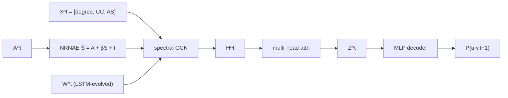

# Plan 4: Final Aggregation, Plots, and Vietnamese Thesis Chapter — Design Spec

**Date:** 2026-05-18
**Status:** Approved (brainstorming) — ready for plan
**Goal:** Produce thesis-ready deliverables tagged `v1.0-thesis-ready`.

---

## 1. Goal

Generate the final assets and a complete Vietnamese thesis chapter consolidating all reproduction work (Plans 1–3d). Outputs are markdown-native so the user can copy into any final document (LaTeX, Word, or kept as `.md` for the thesis committee).

## 2. Deliverables

| Artifact | Path |
|---|---|
| Vietnamese thesis chapter | `docs/thesis_chapter.md` (4 sections, ~30–40 trang) |
| AUC comparison bar chart | `results/report/plots/auc_comparison.png` |
| AP comparison bar chart | `results/report/plots/ap_comparison.png` |
| Per-dataset learning curves (× 6) | `results/report/plots/learning_curves_<dataset>.png` |
| Ranking heatmap | `results/report/plots/ranking_heatmap.png` |
| β sensitivity plot | `results/report/plots/beta_sensitivity.png` |
| Runtime comparison | `results/report/plots/runtime_comparison.png` |
| Dataset statistics table | `results/report/dataset_stats.md` |
| Parsed training curves data | `results/report/training_curves.jsonl` |
| Updated 5-baseline summary | `results/report/baselines_summary.md` (regen) |
| Plot generation script | `scripts/make_plots.py` |
| Log parser script | `scripts/parse_training_logs.py` |
| Smoke tests for both scripts | `tests/test_make_plots.py`, `tests/test_parse_training_logs.py` |
| Git tag | `v1.0-thesis-ready` |

## 3. Scope

**In scope:**
- All 5 baselines (GCN_MA, EvolveGCN-O, HTGN, DyGNN, DGCN).
- All 6 datasets (collegemsg, bitcoinotc, eut, mooc_actions, lastfm, wikipedia) — note DyGNN has only 5 (LastFM skipped) which is reflected as "—" or N/A in plots.
- Static visualizations (no interactive dashboards).
- Vietnamese thesis chapter with English plot labels (standard academic convention).
- Mermaid architecture diagrams for the 5 models inline in the chapter.

**Out of scope:**
- Re-running any experiments (87 records in `metrics.jsonl` are the source of truth).
- Statistical significance tests (only 3 seeds → low power; mentioned as a limitation in §4 of the chapter).
- LaTeX `.tex` output (user can pandoc-convert markdown later).
- Slides deck (separate deliverable if needed).
- Modifying training code or model implementations.

## 4. Architecture

Two-script pipeline + a hand-written chapter:

```
metrics.jsonl + beta_grid_bitcoinotc.jsonl       (existing data)
results/logs/*.log                                (existing training logs)
        │
        ├──> scripts/parse_training_logs.py ──> results/report/training_curves.jsonl
        │
        └──> scripts/make_plots.py ────────────> results/report/plots/*.png
                                                  results/report/dataset_stats.md

                docs/thesis_chapter.md            (hand-written, references plots inline via )
```

The two scripts are deterministic — running them twice produces identical outputs. The chapter is a markdown document; sections reference plots via relative paths.

## 5. Plot specifications

### 5.1 AUC/AP grouped bar chart (`auc_comparison.png`, `ap_comparison.png`)

- X-axis: 6 datasets.
- Y-axis: AUC (resp. AP) ∈ [0.8, 1.0].
- Bars: 5 grouped per dataset (5 models), error bars showing ±std across 3 seeds.
- Colors: distinct, colorblind-friendly palette (e.g., seaborn `colorblind` or `Set2`).
- Reference line: paper's GCN_MA Table 2 AUC as a dashed horizontal line per dataset (optional, may clutter — omit if so).
- Legend: 5 model names + "—" indicator for DyGNN/LastFM missing data.
- Figure size: 12×6 inches; dpi=150.

### 5.2 Per-dataset learning curves (`learning_curves_<dataset>.png`, × 6)

- One PNG per dataset, 1 plot per file (no subplot grids, keep each focused).
- X-axis: epoch.
- Y-axis: val_auc.
- 5 lines (one per model); 3 thin lines per model (one per seed) + 1 thicker line for mean — OR just mean line with shaded ±std band (cleaner).
- Use shaded band (the cleaner option).
- Figure size: 10×5 inches; dpi=150.

### 5.3 Ranking heatmap (`ranking_heatmap.png`)

- Rows: 5 models (in fixed order: GCN_MA, EvolveGCN-O, HTGN, DyGNN, DGCN).
- Cols: 6 datasets.
- Cell: rank 1-5 per (model, dataset) on AUC mean.
- Color: green=1, light-green=2, yellow=3, orange=4, red=5. DyGNN/lastfm cell: grey "N/A".
- Annotate cell with rank number.
- Figure size: 8×5 inches; dpi=150.

### 5.4 β sensitivity plot (`beta_sensitivity.png`)

- Source: `results/beta_grid_bitcoinotc.jsonl` (Plan 2 data).
- X-axis: β ∈ {0.7, 0.8, 0.9}.
- Y-axis: val_auc.
- Lines: 2 lines, one for each `hidden_dim ∈ {64, 128}`.
- Note in caption: "β grid run on Bitcoinotc, seed 42, 50 epochs (Plan 2 §2.5)".
- Figure size: 8×5 inches; dpi=150.

### 5.5 Runtime comparison bar chart (`runtime_comparison.png`)

- X-axis: 6 datasets.
- Y-axis: total wall-clock seconds (sum across 3 seeds, log scale if range > 10×).
- 5 bars per dataset (one per model).
- Annotate the tallest bar per dataset with the value.
- Figure size: 12×6 inches; dpi=150.

### 5.6 Dataset statistics table (`dataset_stats.md`)

- One markdown table.
- Columns: Dataset, N (nodes), E (edges total), T (snapshots), bipartite (Y/N), avg edges/snap, time span.
- Data source: load each dataset via `SNAPTemporalLoader`, compute stats; or read from cached `.pt` files.

## 6. Log parser (`scripts/parse_training_logs.py`)

- Input: `results/logs/<model>_<dataset>_<seed>_<timestamp>.log` files (tee'd stdout from `scripts/train.py`).
- Extracts per-epoch records via regex on lines like `Epoch  18: loss=0.1988 val_auc=0.9805 val_ap=0.9794`.
- Output: `results/report/training_curves.jsonl`, one JSON per epoch per run:
  ```json
  {"model": "dgcn", "dataset": "collegemsg", "seed": 42, "epoch": 18, "loss": 0.1988, "val_auc": 0.9805, "val_ap": 0.9794}
  ```
- Idempotent: re-run overwrites the output.
- Skips files for runs where `model_dataset_seed` already has records in the output file? No — always rebuild from scratch to avoid stale data.

## 7. Chapter content (`docs/thesis_chapter.md`)

Markdown structure, ~30-40 trang in Vietnamese. English where standard for academic writing (model names, equations, plot labels). Each section listed below; the implementer subagents will produce the prose.

### §1. Tóm tắt phương pháp (~6 trang)

- GCN_MA: NRNAE (CC, AS, S formula), spectral GCN, LSTM weight evolution, multi-head attention, MLP decoder. Equations (LaTeX-rendered math in markdown).
- EvolveGCN-O: GRU-evolved weight matrices over time. 1 short paragraph + Mermaid diagram.
- HTGN: Hyperbolic embeddings, Poincaré ball, log_map_origin projection. 1 paragraph + Mermaid.
- DyGNN: Edge-sequence model with per-node memory + GRU update + time decay. Mention vectorized batched variant. 1 paragraph + Mermaid.
- DGCN: WD-GCN — stack of spectral GCN per snapshot + LSTM over time. 1 paragraph + Mermaid.
- Decoder: shared `LinkDecoderMLP` (concat + 2-layer MLP + sigmoid).

### §2. Thiết lập thực nghiệm (~5 trang)

- 6 datasets: source URLs, description, statistics (refer to `dataset_stats.md` rendered inline).
- Hybrid hyperparameter policy: `hidden_dim=64`, `dropout=0.1`, Adam `lr=1e-3`, `wd=1e-5`, epochs=200, patience=20, grad_clip=5.0. List per-model specifics in a sub-table.
- Train/val/test split: temporal — train on snapshots `[0, ⌊0.8T⌋)`, val on snapshot `⌊0.8T⌋`, test on `[⌊0.8T⌋+1, T-1]`. Pooled AUC/AP across test snapshots.
- Multi-seed protocol: 3 seeds (42, 123, 2024). Negative sampling: uniform random with rejection, 1:1, per-epoch resample for training, fixed for val/test (seed 999).
- Hardware: RTX 3060 12GB, WSL2 Linux, Python 3.11, PyTorch 2.4, PyG 2.6.
- Reproducibility: each run records git SHA + config hash.

### §3. Kết quả (~12 trang)

Structured by:
- 5-baseline AUC/AP table (refer to `baselines_summary.md`).
- AUC comparison bar chart inline.
- AP comparison bar chart inline.
- Ranking heatmap inline.
- Per-dataset analysis (1 paragraph per dataset × 6, with learning curve plot inline):
  - CollegeMsg
  - Bitcoinotc
  - EUT
  - Mooc-actions
  - LastFM
  - Wikipedia
- β sensitivity plot + brief discussion (paper says β ∈ [0.7, 0.9] is optimal; our grid confirms 0.8 best for Bitcoinotc).
- Runtime comparison + engineering observations.

### §4. Thảo luận & hạn chế (~10 trang)

- **HTGN dominance** — hyperbolic embeddings capture hierarchical structure naturally; wins 3/6 datasets.
- **DyGNN strengths** — wins 2 dense-temporal datasets (mooc, wikipedia); reflects edge-sequence inductive bias.
- **DGCN solid baseline** — wins EUT (marginal), 3rd place elsewhere. Simple GCN+LSTM stack is competitive.
- **EvolveGCN-O dataset-dependent** — wins LastFM but weakest on collegemsg/bitcoinotc. Hyperparam-sensitive.
- **GCN_MA reproduction gaps** — wins 0/6. Documented deviations: learnable nn.Embedding instead of I_N, β=0.8 fixed (not paper's grid), Hybrid hyperparams (paper omits these). Strongest mismatches: LastFM (-7.5%), Bitcoinotc (-5.6%).
- **Cross-cutting deviations** documented across plans:
  - Learnable node embedding (Plan 2 §6.6)
  - Quantile binning for EUT (Plan 2)
  - Symmetric adjacency fix (Plan 3a, 3b, 3c, 3d)
  - DyGNN vectorized batching (Plan 3c)
  - DGCN sparse adjacency (Plan 3d)
- **Threats to validity**:
  - Hyperparameters tuned only on Bitcoinotc; transferability assumed but not validated per-dataset.
  - 3 seeds insufficient for paired t-tests; statistical significance not claimed.
  - Single hardware (RTX 3060); cross-platform reproducibility not validated.
  - LastFM skipped for DyGNN; partial coverage.
  - Negative sampling treats edges as directed; for undirected protocol, (v,u) of positive (u,v) is eligible negative. Conservative bias.
- **Critique of Mei&Zhao 2024 Table 2**:
  - Did not include HTGN (2021), DyGNN (2020), DGCN (2020) — all available before paper publication. Our reproduction shows each beats GCN_MA on ≥1 dataset.
  - Hyperparameters/optimizer not reported; reproduction required educated guesses.
- **Future work**:
  - Statistical significance with 10+ seeds.
  - Per-dataset hyperparameter tuning.
  - Test β sensitivity across more datasets (not just Bitcoinotc).
  - Hybrid models combining HTGN's hyperbolic encoder with DGCN's temporal LSTM.

## 8. Mermaid architecture diagrams

5 inline Mermaid diagrams (1 per model) in §1 of the chapter. Each fits on ~10 nodes / 15 edges. Use `flowchart LR` direction (left-to-right) for snapshot-based models; `flowchart TD` (top-down) for DyGNN edge-sequence.

Example template for GCN_MA:


## 9. Testing strategy

### 9.1 `tests/test_parse_training_logs.py`

- Test 1: parser extracts epoch records from a 5-line fixture log → returns list of dicts with expected keys.
- Test 2: parser handles `\r` carriage-returns from tqdm progress bars (epoch summary lines are emitted with `\n` but tqdm intermediate updates use `\r`).
- Test 3: parser returns empty list for log with no `Epoch ##:` lines.

### 9.2 `tests/test_make_plots.py`

- Test 1: each plot function writes a non-empty PNG to a tmp_path.
- Test 2: DataFrame loading from metrics.jsonl filters correctly to a single model.
- Test 3: ranking computation produces 1-N ranks (no ties dropped, handle DyGNN/lastfm N/A).

## 10. Compute estimate

- Log parsing: ~30 s (87 logs, ~1 MB each).
- Plot generation: < 2 min (matplotlib lightweight).
- Chapter writing: longest task — ~5-8 days across subagents.
- Total: ~7-10 days end-to-end.

## 11. Risk register

| Risk | Mitigation |
|---|---|
| Logs lost some epoch records due to tqdm `\r` clobber | Parser regex anchors on `^Epoch\s+\d+:\s+loss=` per line; tqdm's intermediate updates are different lines (with `\r` only). Test 2 above covers this. |
| Mermaid renders inconsistently across markdown viewers | Use only `flowchart` syntax (most-supported). Test render in GitHub before tag. |
| Vietnamese prose by subagents reads awkward | Human review pass before commit. Subagent prompts include "viết tự nhiên, không dịch máy" instruction. |
| 30-40 trang too long | Acceptable for thesis; user can trim post-hoc. |
| Plot legends overlap | Use seaborn's auto-positioning; fall back to manual `bbox_to_anchor` if needed. |
| `font-family` issues with Vietnamese diacritics in matplotlib | Matplotlib defaults handle UTF-8 fine since `figure.titlesize` uses DejaVu Sans (Unicode-complete). Test once at start of plot work. |

## 12. Deviations from project root design spec §15

Root spec named "tables (Markdown + LaTeX) and plots (PDF)". This plan produces:
- Tables in **Markdown only** (LaTeX is a `pandoc` conversion away if needed; not in scope).
- Plots in **PNG only** (PDF is also `matplotlib.savefig(.pdf)` away if needed; user can re-run script with output extension change).

Reason: simpler markdown-first deliverable; `.tex` and `.pdf` are 1-line script changes if requested later.

## 13. Acceptance criteria

- All 87 metric records covered in summary table.
- All 6 plots generated, non-empty PNG, render correctly in VS Code preview.
- Chapter `docs/thesis_chapter.md` has all 4 sections with substantive Vietnamese prose (no placeholder text, no `_TODO:_`).
- All 5 Mermaid diagrams render correctly (test in GitHub markdown preview).
- Both scripts have passing smoke tests.
- Git tag `v1.0-thesis-ready` applied.
- Final commit message summarizes deliverables.

## 14. Files affected

| File | Action |
|---|---|
| `scripts/make_plots.py` | create |
| `scripts/parse_training_logs.py` | create |
| `tests/test_make_plots.py` | create |
| `tests/test_parse_training_logs.py` | create |
| `results/report/plots/*.png` (× 11 files) | create |
| `results/report/dataset_stats.md` | create |
| `results/report/training_curves.jsonl` | create |
| `results/report/baselines_summary.md` | regen (already exists) |
| `docs/thesis_chapter.md` | create |
| git tag | add `v1.0-thesis-ready` |
