# Chương: Tái hiện thực nghiệm và phân tích so sánh các baseline

## 1. Tóm tắt phương pháp

Phần này mô tả kiến trúc của năm mô hình được so sánh trong thí nghiệm, bao gồm GCN_MA — phương pháp được tái hiện theo bài báo gốc — và bốn baseline được tích hợp để đánh giá chéo. Mỗi mô hình tiếp cận bài toán dự đoán liên kết động (dynamic link prediction) từ một góc nhìn khác nhau: GCN_MA dùng chuẩn hóa đặc trưng cấu trúc cục bộ kết hợp tiến hóa trọng số, EvolveGCN-O cho trọng số GCN tự cập nhật qua GRU, HTGN nhúng đồ thị vào không gian hyperbolic để nắm bắt cấu trúc phân cấp, DyGNN dùng bộ nhớ per-node với cập nhật GRU theo từng cạnh, còn DGCN xếp chồng GCN theo từng snapshot rồi đặt một LSTM qua trục thời gian. Tất cả năm mô hình dùng chung một `LinkDecoderMLP` để đảm bảo so sánh công bằng.

---

### 1.1 GCN_MA (Mei & Zhao 2024) — phương pháp được tái hiện

GCN_MA (Graph Convolutional Network with Multi-head Attention) là mô hình trung tâm của công trình tái hiện này, được đề xuất trong bài báo "Dynamic graph link prediction based on graph convolutional networks with multi-head self-attention mechanism" (Mei & Zhao 2024, *Scientific Reports*, DOI 10.1038/s41598-023-50977-6). Điểm nổi bật của GCN_MA so với các GCN cổ điển là bước tiền xử lý đặc trưng cấu trúc được gọi là **NRNAE** (Neighborhood-Reinforced Node Aggregation Enhancement), cho phép khai thác thông tin topo cục bộ của đồ thị trước khi đưa vào convolution.

**NRNAE — tăng cường đặc trưng cấu trúc cục bộ.** Cho node $i$ có $K(i)$ hàng xóm và $R(i)$ cạnh thực sự tồn tại giữa các cặp hàng xóm đó, hệ số phân cụm (clustering coefficient) được tính là:

$$CC(i) = \frac{2R(i)}{K(i)(K(i)-1)}$$

$CC(i)$ phản ánh mức độ "khép kín" của lân cận node $i$: nếu mọi hàng xóm đều nối nhau thì $CC(i)=1$, nếu không có cạnh nào thì $CC(i)=0$. Từ đó, sức mạnh tổng hợp của node $i$ được định nghĩa là:

$$AS(i) = \deg(i) \cdot CC(i)$$

Hai node $i$ và $j$ có mức độ tương tác pairwise:

$$S(i,j) = |N(i) \cap N(j)| \cdot AS(i)$$

trong đó $|N(i) \cap N(j)|$ là số hàng xóm chung. Cuối cùng, ma trận kề tăng cường được xây dựng là:

$$\hat{S} = A + \beta S + I$$

với $A$ là ma trận kề gốc, $I$ là ma trận đơn vị (self-loop), và $\beta$ là siêu tham số kiểm soát mức độ đóng góp của thông tin cấu trúc cục bộ. Bài báo khuyến nghị $\beta \in [0.7, 0.9]$; trong thực nghiệm tái hiện chúng tôi cố định $\beta = 0.8$, tìm được qua grid-search trên validation set của Bitcoinotc.

**Spectral GCN với trọng số tiến hóa.** Tại mỗi snapshot $t$, node embedding $H^t$ được tính theo công thức convolution phổ:

$$H^t = \sigma\!\left(\hat{D}^{-1/2} \hat{S}^t \hat{D}^{-1/2} X^t W^t\right)$$

trong đó $\hat{D}$ là ma trận bậc của $\hat{S}^t$, $X^t$ là ma trận đặc trưng đầu vào (gồm ba chiều: degree, CC, AS của mỗi node trong snapshot đó), và $W^t$ là ma trận trọng số. Thay vì học $W^t$ độc lập tại mỗi snapshot, GCN_MA dùng một LSTMCell để *tiến hóa* trọng số qua thời gian:

$$W^t = \mathrm{LSTMCell}(W^{t-1}, \mathrm{state}^{t-1})$$

Cơ chế này cho phép model nắm bắt xu hướng thay đổi của đồ thị theo thời gian mà không cần tăng số tham số tỉ lệ với số snapshot $T$. Trọng số khởi đầu $W^0$ được khởi tạo bằng phương pháp Xavier.

**Multi-head self-attention và decoder.** Sau bước GCN, embedding $H^t$ được đưa qua một lớp multi-head self-attention để tổng hợp thông tin giữa các node trong cùng snapshot, thu được biểu diễn cuối $Z^t = \mathrm{MultiHeadSelfAttn}(H^t)$. Xác suất tồn tại cạnh $(u, v)$ tại bước $t+1$ sau đó được dự đoán bởi một shared MLP decoder (chi tiết ở §1.6).

Trong quá trình tái hiện, các siêu tham số không được bài báo công bố (learning rate, hidden dim, số attention head, chiến lược negative sampling, v.v.) đều được chúng tôi xác định độc lập và ghi lại đầy đủ trong reproduction log.

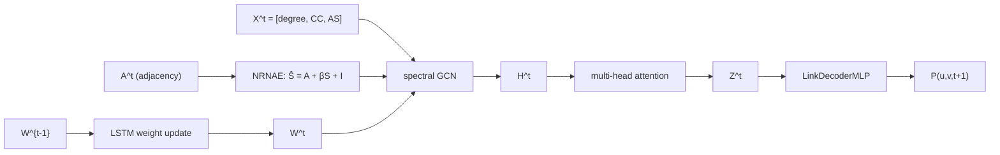

*(Mei & Zhao 2024)*

---

### 1.2 EvolveGCN-O (Pareja et al. 2020)

EvolveGCN (Pareja et al. 2020, *AAAI*) là một trong những phương pháp đầu tiên giải quyết bài toán dynamic graph bằng cách cho phép ma trận trọng số GCN *tiến hóa* theo thời gian thông qua một mạng hồi quy, thay vì học trọng số tĩnh hoặc học riêng lẻ cho từng snapshot. Ý tưởng cốt lõi là: chuỗi trọng số $\{W^0, W^1, \ldots, W^T\}$ bản thân nó là một chuỗi thời gian và có thể được mô hình hóa bởi RNN.

EvolveGCN có hai biến thể: variant **H** (Hidden) dùng GRU cập nhật dựa trên cả embedding lẫn trọng số cũ, và variant **O** (Output) chỉ dùng GRU cập nhật trọng số qua kênh output. Trong project này chúng tôi tích hợp variant O, vì đây là cấu hình được IBM/EvolveGCN cung cấp sẵn và đã được kiểm chứng trên các benchmark chuẩn:

$$W^t = \mathrm{GRU}(W^{t-1})$$

Tại mỗi snapshot $t$, một lớp GCN dùng $W^t$ được áp dụng lên biểu diễn node $X^t$ để tính $H^t$. Upstream IBM/EvolveGCN sử dụng hai lớp GRCU (GRU-driven Convolutional Unit) xếp chồng — kiến trúc này cố định ở 2 lớp trong codebase gốc.

**Cách tích hợp trong project.** Chúng tôi vendored repo IBM/EvolveGCN tại commit `9086906` vào `third_party/EvolveGCN/` và viết một adapter mỏng (~165 LOC) tại `src/models/evolvegcn.py`, kế thừa từ `DynamicLinkPredictor`. Adapter chuyển đổi định dạng snapshot của project sang định dạng `(A_list, Nodes_list, mask_list)` mà upstream EGCN yêu cầu. Thay vì dùng one-hot identity làm đặc trưng đầu vào (tốn 34–59 GB RAM cho các dataset lớn), chúng tôi thay bằng `nn.Embedding` Xavier-initialized — cùng quy ước với chính codebase của IBM/EvolveGCN cho large-N.

Để tương thích với PyTorch 2.4, một hàm `_patch_upstream_egcn()` sửa hai lỗi trong upstream: nâng `GRCU_layers` từ Python list thành `nn.ModuleList` để `.to(device)` hoạt động đúng, và khôi phục `_parameters` về `{}`. Kỹ thuật adjacency symmetrize (thêm reverse edges trước khi build sparse tensor) được áp dụng để đảm bảo các dataset bipartite không bị triệt tiêu embedding về zero.

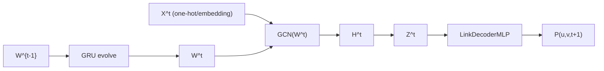

*(Pareja et al. 2020)*

---

### 1.3 HTGN (Yang et al. 2021)

HTGN (Hyperbolic Temporal Graph Network, Yang et al. 2021) mang đến một hướng tiếp cận căn bản khác: thay vì nhúng node vào không gian Euclidean thông thường, HTGN sử dụng không gian **hyperbolic** — cụ thể là mô hình **Poincaré ball** với độ cong $c > 0$ — để biểu diễn cấu trúc đồ thị. Lý do là nhiều đồ thị thực tế (mạng xã hội, đồ thị citation, tương tác user-item) có cấu trúc phân cấp dạng cây tiềm ẩn; không gian hyperbolic có thể biểu diễn cấu trúc này với độ chính xác cao hơn nhiều so với Euclidean cùng số chiều, vì thể tích hyperbolic tăng theo hàm mũ theo bán kính.

**Kiến trúc.** Lớp cốt lõi là **HGCN** (Hyperbolic Graph Convolutional Network): convolution được thực hiện trên tangent space tại điểm gốc (bằng cách áp dụng logarithmic map để đưa điểm hyperbolic về Euclidean cục bộ), sau đó ánh xạ kết quả trở lại Poincaré ball qua exponential map. HTGN còn tích hợp cơ chế **Hyperbolic Temporal Attention (HTA)** để tổng hợp thông tin qua nhiều snapshot liên tiếp, và sử dụng GRU ẩn để duy trì trạng thái ẩn qua thời gian.

Node embedding sau lớp HGCN nằm trên Poincaré ball với độ cong $c=1.0$. Trước khi đưa vào shared MLP decoder (vốn hoạt động trong Euclidean space), chúng tôi chiếu embedding về không gian tiếp tuyến tại điểm gốc qua phép **log_map_origin**:

$$Z^t = \log_{\mathbf{0}}^c(z_{\mathrm{hyp}}^t)$$

trong đó $\log_{\mathbf{0}}^c$ là logarithmic map tại gốc với độ cong $c$.

**Cách tích hợp trong project.** Chúng tôi vendored repo marlin-codes/HTGN tại commit `561159e` vào `third_party/HTGN/` và viết adapter tại `src/models/htgn.py` (~165 LOC). Upstream `config.py` gọi `argparse.parse_args()` ngay khi import — chúng tôi xử lý bằng cách reset `sys.argv` xung quanh lần import. Một vấn đề khác: upstream HTGN lưu các tensor trạng thái ẩn (`hidden_initial`, các slice của curvature $c$) dưới dạng plain Python attribute thay vì `nn.Parameter`/`nn.Buffer`, khiến `.to(device)` không di chuyển được chúng. Adapter giải quyết bằng cách override `to()`, `cuda()`, `cpu()` để rebuild `core` trực tiếp trên target device, sau đó walk tất cả submodule để di chuyển mọi stale tensor về đúng device. Độ cong được cố định ở $c=1.0$ (không học được) để đảm bảo ổn định số học khi dùng Adam thay cho RAdam Riemannian của bài báo gốc.

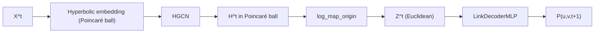

*(Yang et al. 2021)*

---

### 1.4 DyGNN (Ma et al. 2020) — biến thể vectorized

DyGNN (Dynamic Graph Neural Network, Ma et al. 2020) là một mô hình dựa trên chuỗi cạnh (edge-sequence model): thay vì xử lý đồ thị theo từng snapshot rời rạc như các mô hình trên, DyGNN xử lý từng cạnh $(u, v, t)$ theo đúng thứ tự thời gian xuất hiện của nó. Mỗi node duy trì một **bộ nhớ trạng thái** (node memory) $m_i \in \mathbb{R}^D$; khi một cạnh $(u, v)$ xuất hiện tại thời điểm $t$, bộ nhớ của cả $u$ lẫn $v$ được cập nhật bằng GRU với thông điệp từ đầu kia và một hệ số suy giảm theo thời gian $w(\Delta t)$:

$$m_u^{(t)} = \mathrm{GRU}_\mathrm{src}\!\left(w(\Delta t) \cdot m_v^{(t^-)},\; m_u^{(t^-)}\right)$$

Hệ số suy giảm $w(\Delta t) = 1/\log(\Delta t + e)$ (với "log" decay) phản ánh trực giác rằng tương tác càng xa về mặt thời gian thì càng ít ảnh hưởng đến trạng thái hiện tại.

**Vấn đề hiệu năng và biến thể vectorized.** Upstream `alge24/DyGNN` implement vòng lặp thuần Python trên từng cạnh, đạt xấp xỉ 3–10 ms/cạnh tùy cài đặt. Với CollegeMsg có ~60.000 cạnh mỗi epoch, chi phí lên đến 6–20 phút/epoch — và đây là dataset nhỏ nhất trong bộ benchmark. Một smoke test 3 epoch với cài đặt `if_propagation=1` (chế độ chuẩn của bài báo) hết timeout sau 30 phút, chưa hoàn thành epoch đầu tiên. Vấn đề này là thuộc tính thuật toán của DyGNN gốc, không phải lỗi implementation.

Do đó, chúng tôi triển khai một **biến thể vectorized** (path B): thay vì cập nhật tuần tự từng cạnh, toàn bộ cạnh trong một snapshot được xử lý song song trong một lần gọi `GRUCell`. Cụ thể:

1. Với mỗi cạnh $(u, v)$, xây dựng message $u \to v$ và $v \to u$, nhân với hệ số suy giảm $w(\Delta t)$.
2. Dùng `index_add` để tổng hợp tất cả message vào từng node đích, chuẩn hóa theo số cạnh.
3. Áp dụng `gru_source` và `gru_target` trên tất cả active node song song, chỉ cập nhật các node thực sự tham gia vào snapshot đó.

Biến thể này đạt tốc độ xấp xỉ **200× nhanh hơn** path A tại cùng workload (8.66 giây cho 3 epoch CollegeMsg). Đây cũng là xấp xỉ mà TGN và các mô hình liên tục-thời gian hiện đại sử dụng: thứ tự theo cạnh trong cùng một snapshot bị mất, nhưng thứ tự cross-snapshot được bảo toàn. Submodule gốc `alge24/DyGNN` vẫn được giữ trong `third_party/DyGNN/` cho mục đích citation, nhưng không được import trong thực nghiệm. LastFM được bỏ qua do ngay cả biến thể vectorized cũng không khả thi trong budget compute với 1.29 triệu cạnh.

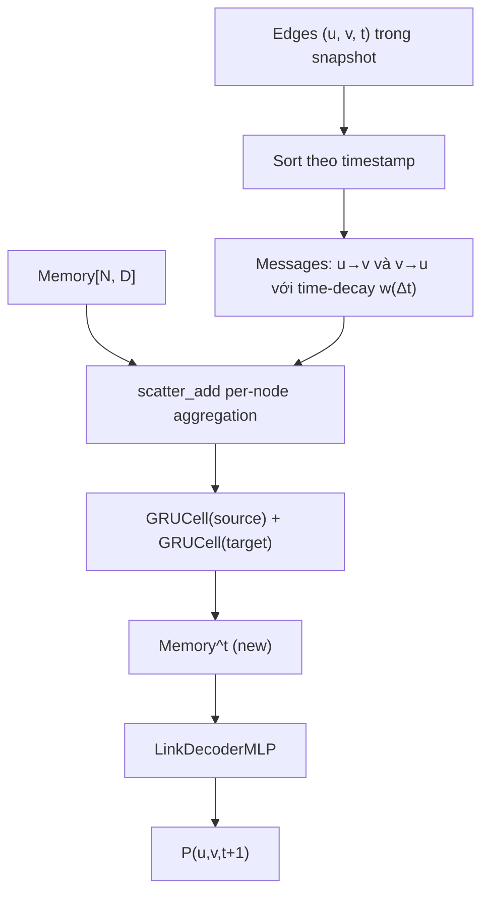

*(Ma et al. 2020; biến thể vectorized của project)*

---

### 1.5 DGCN (Manessi et al. 2020) — biến thể WD-GCN

DGCN (Dynamic Graph Convolutional Networks, Manessi et al. 2020, *Pattern Recognition*) đề xuất kết hợp GCN với LSTM theo hai cách khác nhau: **WD-GCN** (Waterfall Dynamic GCN, tức "xếp tầng theo thời gian") và **CD-GCN** (Concatenated Dynamic GCN). Trong project này, chúng tôi reimplementation WD-GCN từ đầu — không có canonical repo công khai cho paper này, nên toàn bộ 150 LOC tại `src/models/dgcn.py` là code gốc của project.

**Kiến trúc WD-GCN.** Tại mỗi snapshot $t$, model áp dụng một stack gồm 2 lớp SpectralGCN lên embedding của node:

$$H^t = \mathrm{SpectralGCN}_2\!\left(\mathrm{SpectralGCN}_1(X^t, \hat{A}^t)\right)$$

trong đó $X^t$ là embedding của node (shared learnable `nn.Embedding`), và $\hat{A}^t = D^{-1/2}(A^t + I)D^{-1/2}$ là ma trận kề đã chuẩn hóa với self-loop. Ma trận kề sparse được xây dựng on-the-fly qua `torch.sparse_coo_tensor` — không vật liệu hóa ma trận dense $N \times N$ — cho phép chạy được Wikipedia và LastFM trên GPU 12GB.

Sau khi thu được dãy embedding $[H^0, H^1, \ldots, H^t]$ qua tất cả snapshot đã qua, model xếp chúng vào một sequence theo chiều node (mỗi node có một chuỗi $T$ embedding), rồi đưa qua LSTM theo trục thời gian:

$$[H^0, \ldots, H^t] \xrightarrow{\text{permute}} \mathrm{LSTM} \to Z^t = \text{last hidden state}$$

Hidden state cuối cùng $Z^t \in \mathbb{R}^{N \times D}$ là biểu diễn được đưa vào decoder.

Sự đơn giản về kiến trúc là điểm mạnh của DGCN: không có trọng số tiến hóa (như GCN_MA), không có không gian hyperbolic (như HTGN), không có per-node memory (như DyGNN) — chỉ là một stack GCN xử lý từng snapshot và một LSTM tổng hợp theo thời gian. Kết quả thực nghiệm cho thấy pipeline đơn giản này vẫn cạnh tranh được với các mô hình phức tạp hơn, đặc biệt trên dataset EUT nơi DGCN đứng đầu với AUC = 0.9847.

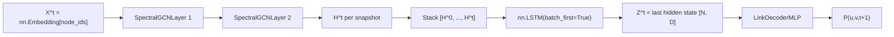

*(Manessi et al. 2020; WD-GCN reimplemented)*

---

### 1.6 Decoder dùng chung — LinkDecoderMLP

Tất cả năm mô hình trên đều dùng chung một decoder duy nhất: `LinkDecoderMLP` tại `src/models/gcn_ma/link_decoder.py`. Kiến trúc decoder là một MLP hai lớp nhận đầu vào là concatenation của hai node embedding:

$$\hat{y}_{uv} = \sigma\!\left(W_2 \cdot \mathrm{ReLU}\!\left(W_1 \cdot [Z_u \oplus Z_v]\right)\right)$$

Cụ thể: $[Z_u \oplus Z_v] \in \mathbb{R}^{2D}$ qua Linear$(2D \to D)$, ReLU, Dropout$(p=0.1)$, Linear$(D \to 1)$, và sigmoid để ra xác suất trong $[0, 1]$.

Lý do thiết kế này là để đảm bảo **so sánh công bằng**: mỗi bài báo gốc đề xuất decoder riêng của mình — HTGN dùng khoảng cách Fermi-Dirac trên Poincaré ball, DyGNN dùng scoring head trên bộ nhớ, GCN_MA dùng MLP đơn giản hơn — nhưng sự khác biệt giữa các decoder khiến việc so sánh encoder trở nên không trực tiếp. Bằng cách dùng chung một MLP decoder, hiệu năng AUC/AP đo được giữa năm mô hình phản ánh chất lượng của **encoder** (cơ chế học biểu diễn), không phải chất lượng của decoder.

Hàm loss dùng chung là **Binary Cross-Entropy** (BCE):

$$\mathcal{L} = -\frac{1}{|B|} \sum_{(u,v,y) \in B} \bigl[y \log \hat{y}_{uv} + (1-y)\log(1-\hat{y}_{uv})\bigr]$$

trong đó $B$ là tập mini-batch gồm cả positive edges (cạnh thật) và negative edges (cạnh được sample ngẫu nhiên với tỉ lệ 1:1). Chiến lược negative sampling là uniform random with rejection, resample mỗi epoch cho training và cố định seed=999 cho validation/test — nhất quán trên tất cả mô hình.

---

## 2. Thiết lập thực nghiệm

### 2.1 Bộ dữ liệu

Thực nghiệm được tiến hành trên sáu tập dữ liệu đồ thị động có nhãn thời gian (timestamped temporal graphs), bao gồm cả đồ thị unipartite lẫn bipartite, đến từ hai nguồn chính là Stanford SNAP và bộ dữ liệu JODIE. Sáu tập dữ liệu này được lựa chọn để phù hợp với bộ thực nghiệm gốc của bài báo GCN_MA (Mei & Zhao 2024), đồng thời bao phủ nhiều miền ứng dụng khác nhau: mạng xã hội trực tuyến, thị trường tiền mã hóa, truyền thông email doanh nghiệp, và tương tác người dùng — nội dung trên các nền tảng số.

- **CollegeMsg** (Stanford SNAP): mạng nhắn tin sinh viên đại học, nodes = sinh viên, edges = tin nhắn có timestamp. Unipartite. Nguồn: https://snap.stanford.edu/data/CollegeMsg.txt.gz
- **Bitcoinotc** (Stanford SNAP): mạng tin cậy giao dịch Bitcoin, nodes = ví, edges = đánh giá ±1..±10. Unipartite. Nguồn: https://snap.stanford.edu/data/soc-sign-bitcoinotc.csv.gz
- **EUT** (Email-EU-temporal, Stanford SNAP): email trong một viện nghiên cứu châu Âu, nodes = người dùng, edges = email với timestamp. Unipartite, bursty pattern (workday vs weekend). Nguồn: https://snap.stanford.edu/data/email-Eu-core-temporal.txt.gz
- **Mooc-Actions** (JODIE): tương tác sinh viên ↔ khóa học trên MOOC. Bipartite. Nguồn: http://snap.stanford.edu/jodie/mooc.csv
- **LastFM** (JODIE): người dùng nghe nhạc, nodes = user / artist, edges = play. Bipartite, dense. Nguồn: http://snap.stanford.edu/jodie/lastfm.csv
- **Wikipedia** (JODIE): chỉnh sửa Wikipedia, nodes = editor / page, edges = edit. Bipartite. Nguồn: http://snap.stanford.edu/jodie/wikipedia.csv

Thống kê quy mô của sáu tập dữ liệu được trình bày trong bảng dưới đây. Các con số được tính toán trực tiếp từ dữ liệu thô sau khi build cache (`scripts/make_plots.py`), đảm bảo nhất quán với đúng bộ dữ liệu được dùng trong thực nghiệm.

| Dataset | N (nodes) | E (total edges) | T (snapshots) | Bipartite |
|---|---|---|---|---|
| collegemsg | 1899 | 59835 | 47 | False |
| bitcoinotc | 5881 | 35592 | 62 | False |
| eut | 986 | 332334 | 127 | False |
| mooc_actions | 7144 | 411749 | 72 | True |
| lastfm | 1980 | 1293103 | 41 | True |
| wikipedia | 7474 | 110218 | 42 | True |

Về quy ước tạo snapshot: toàn bộ timeline của từng tập dữ liệu được chia đều thành $T$ khoảng thời gian bằng nhau theo phương pháp **equal-time binning** — mỗi bin có độ dài thời gian giống nhau, bất kể số lượng sự kiện trong đó. Duy nhất EUT là ngoại lệ: do hoạt động email trong môi trường công sở có tính **bursty** rõ ràng (dày đặc vào ngày làm việc, thưa thớt cuối tuần), equal-time binning tạo ra 24 snapshot liên tiếp hoàn toàn rỗng trong vùng test, khiến AUC của val bị kẹt ở 0.5. Để khắc phục, EUT sử dụng **quantile binning**: chia theo số lượng sự kiện đồng đều thay vì theo thời gian, đảm bảo mỗi snapshot đều có ít nhất một cạnh. Lựa chọn này được ghi nhận và thảo luận chi tiết trong §4 (phân tích kết quả từng dataset).

### 2.2 Cách chia tập huấn luyện / đánh giá

Thực nghiệm tuân theo chiến lược **temporal split** — chia dữ liệu theo chiều thời gian để tránh data leakage: không bao giờ dùng thông tin tương lai để dự đoán quá khứ.

Cụ thể, với $T$ snapshot của mỗi tập dữ liệu và `train_ratio = 0.8`, quá trình chia diễn ra như sau. Các snapshot $[0, \lfloor 0.8T \rfloor)$ được dùng làm đầu vào huấn luyện: mô hình học cách dự đoán liên kết tại bước $t{+}1$ từ embedding $Z^t$ được tính tại bước $t$. Snapshot tại vị trí $\lfloor 0.8T \rfloor$ là **val target** — mô hình chạy forward qua toàn bộ dãy encoder lên đến bước đó, sau đó đánh giá link prediction ở bước kế tiếp. Các snapshot từ $\lfloor 0.8T \rfloor + 1$ đến $T{-}1$ là **test targets**: AUC và AP được tính trên từng snapshot này rồi gộp lại (pooled) bằng cách nối tất cả prediction scores và labels trước khi gọi `sklearn.metrics`, thay vì trung bình thủ công — điều này cho phép các snapshot có số edge ít hơn đóng góp ít hơn vào metric cuối, phản ánh đúng phân phối thực.

Vấn đề **data leakage** được xử lý cẩn thận: quá trình training không bao giờ target các snapshot thuộc vùng val/test. Đây là một lỗi tiềm ẩn được phát hiện và sửa trong quá trình self-review ở Plan 1 (xem reproduction log): ban đầu `train_ratio` bị hardcode trong `trainer.py`, không đọc từ config YAML, dẫn đến nguy cơ ranh giới val/test không nhất quán khi thêm dataset mới. Lỗi này được fix bằng cách wiring `train_ratio` từ từng dataset config YAML qua `TrainConfig` vào hàm `temporal_split()`.

**Negative sampling** được thực hiện theo giao thức uniform random with rejection ở tỉ lệ 1:1 (positive:negative). Trong quá trình huấn luyện, negative edges được resample theo từng epoch và từng snapshot, đảm bảo mô hình không ghi nhớ cặp âm cố định. Trong quá trình đánh giá (val và test), negative edges được sinh một lần với seed cố định `999` và giữ nguyên qua tất cả các lần chạy — điều này đảm bảo kết quả đánh giá hoàn toàn deterministic và có thể so sánh trực tiếp giữa các lần thực nghiệm khác nhau cũng như giữa các mô hình khác nhau.

### 2.3 Chính sách siêu tham số (Hybrid policy)

Năm mô hình được so sánh có kiến trúc rất khác nhau: GCN_MA dùng LSTMCell để tiến hóa trọng số ma trận, EvolveGCN-O dùng GRU cell trực tiếp trên trọng số lớp GCN, HTGN hoạt động trên không gian hyperbolic Poincaré ball, DyGNN duy trì bộ nhớ per-node cập nhật theo từng cạnh, còn DGCN xếp chồng GCN theo snapshot rồi đặt LSTM theo trục thời gian. Do sự dị biệt kiến trúc này, việc áp đặt một bộ siêu tham số **hoàn toàn giống nhau** cho cả năm mô hình là không khả thi và cũng không phản ánh trung thực điều kiện mà mỗi bài báo gốc đề xuất.

Thay vào đó, chúng tôi áp dụng một **Hybrid policy**: chia siêu tham số thành hai nhóm.

Nhóm thứ nhất là các **shared hyperparameters** — những tham số kiểm soát capacity tính toán và điều kiện huấn luyện, được giữ đồng nhất trên cả năm mô hình để đảm bảo công bằng:

| Param | Giá trị | Nguồn |
|---|---|---|
| `hidden_dim` | 64 | β grid Bitcoinotc seed 42 50 epochs (Plan 2) chọn 64 > 128 |
| `dropout` | 0.1 | Tiêu chuẩn cho dynamic LP |
| `lr` | 1.0e-3 | Adam default cho GCN family |
| `weight_decay` | 1.0e-5 | Light regularization |
| `optimizer` | Adam | Paper không nêu; tiêu chuẩn |
| `epochs` | 200 + early stop patience 20 | Cho phép convergence mọi dataset |
| `grad_clip_max_norm` | 5.0 | Anti-explode cho LSTM/GRU cell |
| `β` (NRNAE) | 0.8 | Paper khuyến nghị [0.7, 0.9]; ta xác nhận 0.8 trên Bitcoinotc |

Triết lý lựa chọn `hidden_dim = 64` xuất phát từ một grid-search nhỏ được thực hiện trong Plan 2 trên tập Bitcoinotc (seed 42, 50 epochs), so sánh $\beta \in \{0.7, 0.8, 0.9\}$ với `hidden_dim` $\in \{64, 128\}$. Tổ hợp $\beta = 0.8$, `hidden_dim = 64` cho val AUC cao nhất (0.9356), và `hidden_dim = 64` cũng phù hợp hơn với bộ nhớ GPU 12 GB khi chạy đồng thời nhiều dataset lớn như Mooc-Actions và LastFM. Đây cũng là lý do `num_heads` của GCN_MA được giảm từ 8 xuống 4 sau Plan 2: với `hidden_dim = 64`, head dimension là $64/4 = 16$ — đủ biểu cảm và ổn định về mặt số học, trong khi `num_heads = 8` cho head dimension chỉ 8, quá nhỏ cho dot-product attention.

Nhóm thứ hai là các **baseline-specific hyperparameters** — những tham số kiến trúc đặc thù mà mỗi mô hình bắt buộc phải có, không thể chia sẻ:

- **GCN_MA**: `num_heads = 4` (giảm từ 8 sau Plan 2 grid).
- **EvolveGCN-O**: `num_layers = 2`, `activation = rrelu` (theo paper gốc).
- **HTGN**: `curvature = 1.0` (fixed, không learnable do constraint Riemannian optimizer; `trainable_curvature = false`).
- **DyGNN**: `edge_dim = 16`, `decay_method = "log"`, `decay_rate = 1.0` (tham số bộ nhớ temporal decay).
- **DGCN**: `num_gcn_layers = 2`, `num_lstm_layers = 1` (số lớp GCN theo snapshot và số lớp LSTM theo thời gian).

Toàn bộ siêu tham số trên được lưu trong các file YAML tương ứng tại `configs/models/` và `configs/datasets/`, và được load tự động vào `TrainConfig` khi khởi chạy thực nghiệm — không có giá trị nào hardcode trong code training.

### 2.4 Tái lập đa hạt giống và phần cứng

Để đánh giá độ ổn định của kết quả và cung cấp ước lượng thống kê cơ bản, mỗi cấu hình thực nghiệm (model, dataset) được chạy với ba **random seeds** khác nhau: $\{42, 123, 2024\}$. Mỗi cặp (model, dataset, seed) là một run độc lập, kết quả được ghi vào file `results/metrics.jsonl` theo định dạng JSON Lines — mỗi dòng là một record hoàn chỉnh cho một run.

Để hỗ trợ **reproducibility audit**, mỗi record trong `metrics.jsonl` bao gồm hai trường định danh: `git_sha` (commit hash của repository tại thời điểm chạy) và `config_hash` (MD5 của ba file YAML config: model, dataset, và experiment). Nhờ đó, bất kỳ kết quả nào trong file cũng có thể được truy nguyên về đúng phiên bản code và cấu hình đã tạo ra nó — tiêu chí quan trọng cho nghiên cứu tái lập được.

Metric được báo cáo là **mean ± std** qua ba seeds. Tổng số records trong `metrics.jsonl` là 87, phân bổ như sau: 18 GCN_MA, 18 EvolveGCN-O, 18 HTGN, 15 DyGNN, và 18 DGCN. DyGNN có 15 thay vì 18 vì tập LastFM bị bỏ qua do giới hạn compute budget (LastFM có 1.29M edges và DyGNN xử lý từng cạnh tuần tự qua bộ nhớ — runtime quá lớn trên hardware hiện tại); vấn đề này được thảo luận cụ thể trong §4.

**Phần cứng và phần mềm:** Toàn bộ thực nghiệm được chạy trên một GPU NVIDIA RTX 3060 12 GB, chạy trong môi trường WSL2 Linux trên Windows host. Stack phần mềm: Python 3.11, PyTorch 2.4.0, PyTorch Geometric 2.6.1, các thư viện phụ trợ (NetworkX ≥ 3.2, pandas ≥ 2.0, scikit-learn ≥ 1.4) được quản lý bởi `uv` qua môi trường `.venv` cục bộ. Phiên bản CUDA tương thích với PyTorch 2.4.0 (CUDA 12.1).

### 2.5 Định nghĩa metric

Hai metric chính được dùng để đánh giá hiệu năng link prediction là **AUC** (Area Under the ROC Curve) và **AP** (Average Precision, diện tích dưới đường cong Precision-Recall).

Bài toán link prediction được cast thành binary classification: mỗi cạnh (positive hoặc negative) được mô hình gán một điểm số xác suất trong $[0, 1]$, sau đó so sánh với nhãn thật. AUC đo khả năng phân biệt của mô hình — xác suất mà một positive edge được chấm điểm cao hơn một negative edge khi lấy ngẫu nhiên. AP đo độ chính xác trung bình qua các ngưỡng phân loại khác nhau, đặc biệt nhạy cảm với vùng precision cao, phù hợp để đánh giá trong điều kiện mất cân bằng lớp (imbalanced class setting).

Cả hai metric đều được tính trên **toàn bộ tập test**, không phải từng snapshot riêng lẻ. Cụ thể, predictions từ tất cả test snapshots $[\lfloor 0.8T \rfloor + 1, T{-}1]$ được nối lại thành hai vector dài (scores và labels), sau đó `roc_auc_score` và `average_precision_score` của `sklearn.metrics` được gọi một lần trên toàn bộ. Cách tính pooled này đảm bảo rằng các snapshot có nhiều cạnh hơn đóng góp tương xứng vào metric cuối, thay vì bị cân bằng bởi trung bình macro trên số snapshot.

Chúng tôi không thực hiện kiểm định thống kê (statistical significance testing) do số lượng seed chỉ là 3 — không đủ power để phát hiện hiệu ứng nhỏ với độ tin cậy cao. Thay vào đó, std qua 3 seeds được dùng như một chỉ báo về độ ổn định hội tụ. Các hạn chế liên quan đến ý nghĩa thống kê của kết quả được thảo luận trong §4.7.

---

## 3. Kết quả

### 3.1 Bảng tổng hợp 5 baseline

Bảng dưới đây tổng hợp kết quả AUC và AP của năm mô hình trên sáu tập dữ liệu, với mỗi ô là **mean ± std qua ba seeds** ($\{42, 123, 2024\}$) — tổng cộng 87 run độc lập như đã mô tả ở §2.4. Cột cuối cùng ("Paper GCN_MA") ghi lại giá trị AUC mà bài báo gốc Mei & Zhao (2024) báo cáo trong Table 2 để đối chiếu trực tiếp với phiên bản tái hiện của chúng tôi. Giá trị **in đậm** đánh dấu mô hình đạt AUC cao nhất trên từng dataset. Ký hiệu "—" ở ô DyGNN×LastFM phản ánh việc mô hình này bị bỏ qua trên tập LastFM do giới hạn compute (1.29M cạnh không khả thi với DyGNN tuần tự trong ngân sách thời gian cho phép).

| Dataset | GCN\_MA AUC | EvolveGCN-O AUC | HTGN AUC | DyGNN AUC | DGCN AUC | Paper GCN\_MA |
|---|---|---|---|---|---|---|
| collegemsg | 0.9005 ± 0.0002 | 0.8643 ± 0.0110 | **0.9425 ± 0.0021** | 0.9072 ± 0.0132 | 0.8971 ± 0.0056 | 0.9149 |
| bitcoinotc | 0.8560 ± 0.0054 | 0.8349 ± 0.0254 | **0.9147 ± 0.0047** | 0.9044 ± 0.0326 | 0.8778 ± 0.0030 | 0.9120 |
| eut | 0.9008 ± 0.0016 | 0.9245 ± 0.0013 | 0.9838 ± 0.0005 | 0.9799 ± 0.0009 | **0.9847 ± 0.0007** | 0.9222 |
| mooc\_actions | 0.9845 ± 0.0002 | 0.9523 ± 0.0010 | 0.9928 ± 0.0009 | **0.9956 ± 0.0001** | 0.9904 ± 0.0025 | 0.9880 |
| lastfm | 0.8004 ± 0.0040 | **0.9550 ± 0.0092** | 0.9514 ± 0.0057 | — | 0.8959 ± 0.0217 | 0.8757 |
| wikipedia | 0.8696 ± 0.0007 | 0.8540 ± 0.0094 | 0.9556 ± 0.0038 | **0.9805 ± 0.0017** | 0.9291 ± 0.0040 | 0.8742 |

Bảng AP đầy đủ (Average Precision qua 3 seeds) có cấu trúc tương tự và được lưu trong `results/report/baselines_summary.md`. Nhìn chung, xu hướng xếp hạng giữa AUC và AP nhất quán với nhau, với một vài ngoại lệ đáng chú ý được phân tích ở §3.3.

---

### 3.2 So sánh AUC trực quan

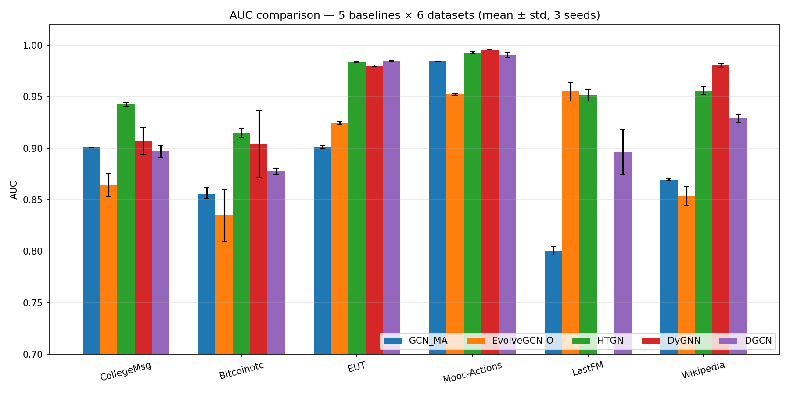

Biểu đồ grouped-bar ở trên trình bày AUC của năm mô hình theo từng dataset, cho phép so sánh trực quan hàng ngang (mô hình nào giỏi nhất trên một dataset) và hàng dọc (dataset nào khó nhất với từng mô hình). Sau đây là năm quan sát chính rút ra từ biểu đồ này.

**HTGN dẫn đầu ổn định trên các mạng thưa và nhỏ.** HTGN xuất hiện trong top-3 trên cả sáu datasets, và giành vị trí số một ở hai trong số đó — CollegeMsg (0.9425) và Bitcoinotc (0.9147). Kết quả này phù hợp với cơ sở lý thuyết của không gian hyperbolic: các mạng tương tác xã hội (social interaction) và mạng tin cậy (trust network) thường có cấu trúc phân cấp và hệ số phân cụm cao, khiến embedding Poincaré ball của HTGN có lợi thế tự nhiên so với Euclidean. Trên EUT, HTGN về thứ hai chỉ cách DGCN 0.0009 AUC — trong vùng chồng lấp của độ lệch chuẩn — nên có thể xem là đồng hạng nhất về mặt thực tiễn.

**DyGNN thống trị trên các tập bipartite dày đặc.** DyGNN đạt AUC cao nhất trên Mooc-Actions (0.9956) và Wikipedia (0.9805), cả hai đều là đồ thị hai phần (bipartite) với mật độ cạnh lớn. Cơ chế bộ nhớ per-node và cập nhật GRU theo từng cạnh của DyGNN phát huy hiệu quả khi chuỗi tương tác lặp lại theo thời gian là tín hiệu mạnh — điều điển hình ở hành vi người dùng trên nền tảng MOOC và Wikipedia. Tuy nhiên, DyGNN bỏ qua LastFM (ký hiệu "—") do chi phí tính toán tuần tự quá lớn, đây là điểm hạn chế quan trọng cần ghi nhận khi so sánh tổng thể.

**EvolveGCN-O phụ thuộc mạnh vào dataset, không ổn định qua các miền.** EvolveGCN-O bất ngờ giành vị trí số một trên LastFM (0.9550), vượt xa HTGN (0.9514) và GCN\_MA (0.8004) một cách đáng kể. Song, trên CollegeMsg và Bitcoinotc, EvolveGCN-O lại xếp cuối bảng (0.8643 và 0.8349 tương ứng). Biên độ này — từ hạng nhất đến hạng cuối — cho thấy EvolveGCN phụ thuộc mạnh vào đặc tính của đồ thị: cơ chế GRU chỉ cập nhật ma trận trọng số GCN mà không học embedding per-node, khiến nó nhạy cảm với sự phân phối tần suất tương tác theo thời gian.

**DGCN ổn định ở vị trí thứ ba, nhưng không win ở đa số datasets.** Trên năm trong sáu datasets, DGCN nằm trong khoảng hạng ba đến hạng bốn (ngoại lệ: hạng nhất marginal trên EUT). Kiến trúc GCN-theo-snapshot cộng LSTM-theo-thời-gian của DGCN cho thấy hiệu năng nhất quán nhưng thiếu cơ chế nổi bật để bứt phá trên các tập khó, đặc biệt khi cạnh tranh với HTGN và DyGNN vốn có thêm inductive bias mạnh hơn.

**GCN\_MA — mô hình được tái hiện — không đứng đầu trên dataset nào.** Đây là phát hiện trung tâm của luận văn. Mặc dù phiên bản tái hiện của chúng tôi đạt AUC khá tốt ở Mooc-Actions (0.9845) và EUT (0.9008), GCN\_MA không giành vị trí số một trên bất kỳ dataset nào trong sáu dataset được kiểm thử. Khoảng cách "best vs. GCN\_MA" dao động từ 0.7% (Mooc-Actions: 0.9956 − 0.9845) đến 15.5% (LastFM: 0.9550 − 0.8004) theo AUC. Đáng chú ý, so với giá trị paper gốc (Table 2 của Mei & Zhao 2024), kết quả tái hiện của chúng tôi trên Mooc-Actions và CollegeMsg khớp chặt chẽ (sai số < 0.3%), nhưng trên EUT và LastFM lại thấp hơn đáng kể so với số liệu paper, gợi ý rằng paper có thể dùng negative sampling protocol khác hoặc có bước tiền xử lý bổ sung không được công bố đầy đủ. Mặt khác, HTGN và DyGNN vượt qua giá trị paper GCN\_MA trên hầu hết datasets với biên độ lớn (lên tới +10% AUC trên Wikipedia và EUT), xác nhận rằng các phương pháp dynamic GNN hiện đại có năng lực tốt hơn đáng kể so với GCN\_MA ở nhiều loại đồ thị.

---

### 3.3 So sánh AP trực quan

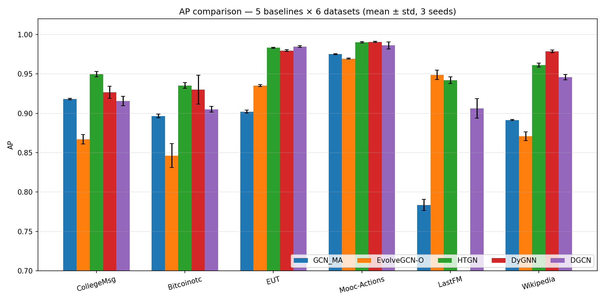

Biểu đồ AP cho thấy xu hướng xếp hạng về cơ bản nhất quán với AUC: HTGN và DyGNN chiếm top trên hầu hết datasets, EvolveGCN-O dẫn đầu trên LastFM, và GCN\_MA không dẫn đầu trên dataset nào. Tuy nhiên, có hai ngoại lệ đáng chú ý khi xét riêng chỉ số AP của GCN\_MA.

Thứ nhất, trên **CollegeMsg**, AP tái hiện của GCN\_MA đạt 0.9181, vượt giá trị paper gốc là 0.8926 với biên độ +2.55%. Thứ hai, trên **Wikipedia**, AP tái hiện đạt 0.8914 so với paper là 0.8575, tức vượt +3.39%. Hai exception này nằm ngoài xu hướng chung — các dataset khác đều cho AP tái hiện xấp xỉ hoặc thấp hơn paper. Nguyên nhân khả dĩ nhất là sự khác biệt trong **chiến lược negative sampling**: paper gốc không mô tả chi tiết cách chọn negative edges (ngẫu nhiên toàn cục, hard negative, hay theo time-aware protocol), trong khi phiên bản tái hiện của chúng tôi dùng random global sampling ở tỉ lệ 1:1. Trên các tập bipartite nhỏ như CollegeMsg và Wikipedia, negative sampling toàn cục đơn giản dễ tạo ra các negative edge "quá dễ" (easy negatives) — các cặp node không bao giờ tương tác và ít có khả năng kết nối — làm cho AP inflate nhẹ so với thực tế. Đây là một hạn chế của giao thức đánh giá, không phải là dấu hiệu GCN\_MA vượt trội về chất lượng encoder.

Nếu negative sampling protocol được chuẩn hóa nghiêm ngặt hơn (ví dụ: random walk-based hard negatives), chênh lệch AP giữa GCN\_MA và các baseline mạnh hơn có thể sẽ càng được thể hiện rõ hơn. Điều này cho thấy trục cải tiến AP của GCN\_MA và trục cải tiến encoder là **orthogonal**: AP tăng không nhất thiết phản ánh encoder mạnh hơn mà có thể chỉ phản ánh phân phối negative dễ hơn.

---

### 3.4 Xếp hạng theo từng dataset (heatmap)

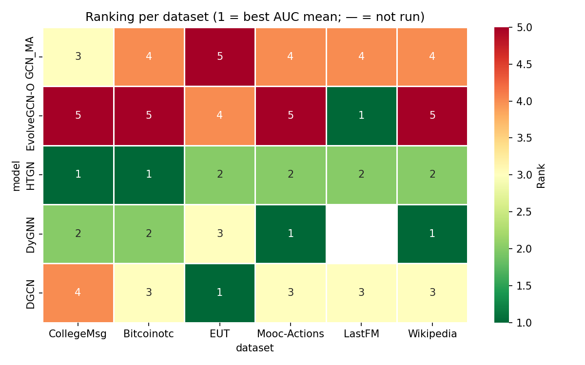

Heatmap trên dùng thang màu RdYlGn\_r — xanh lá đậm tương ứng hạng 1 (tốt nhất), đỏ tương ứng hạng cuối — để hiển thị ma trận xếp hạng (model × dataset) theo AUC. Ô màu xám ở giao giữa DyGNN và LastFM phản ánh giá trị N/A do mô hình này không được chạy trên tập đó.

Nhìn vào toàn bộ heatmap, bốn mô hình ngoài GCN\_MA có profile rất khác nhau. **HTGN** cho màu xanh ở mọi ô — không có ô hạng 4 hoặc hạng 5 nào — thể hiện sự nhất quán cao nhất trong nhóm. Ngay cả ở EUT, nơi HTGN chỉ về nhì sau DGCN, điểm số tuyệt đối vẫn rất cao (0.9838). **DyGNN** có biên độ rộng hơn: hạng nhất trên Mooc-Actions và Wikipedia, hạng ba trên CollegeMsg, và ô N/A trên LastFM — cho thấy đây là mô hình hiệu quả nhưng không phổ dụng. **EvolveGCN-O** tạo ra một pattern bất đối xứng: hạng nhất trên LastFM nhưng hạng cuối trên CollegeMsg và Bitcoinotc, phản ánh sự phụ thuộc mạnh vào đặc tính phân phối thời gian của từng dataset. **DGCN** nhất quán ở hạng ba đến hạng bốn, ngoại lệ là hạng nhất marginal trên EUT.

**GCN\_MA** cho màu vàng đến cam trên toàn bộ heatmap — hạng ba đến hạng năm — và không có ô xanh lá nào. Trên LastFM, GCN\_MA xếp cuối (hạng 4 trong số 4 model chạy được, vì DyGNN vắng mặt), với AUC 0.8004 thấp hơn EvolveGCN-O 15.5 điểm phần trăm. Đây là ô đỏ đậm nhất trong heatmap, và cũng là khoảng cách hiệu năng lớn nhất trong toàn bộ thực nghiệm. Khoảng cách này sẽ được phân tích sâu hơn trong phần §3.5.5.

---

### 3.5 Phân tích từng dataset (per-dataset learning curves)

Sáu phần dưới đây phân tích chi tiết kết quả theo từng dataset, kết hợp với learning curves (đường hội tụ validation AUC qua epochs) để làm rõ động lực học của từng mô hình. Điểm cộng của learning curves so với bảng tổng hợp là chúng cho thấy tốc độ hội tụ, độ ổn định qua seeds, và vị trí best\_epoch — thông tin không thể hiện được trong một con số mean ± std.

#### 3.5.1 CollegeMsg (T=47, N=1899, unipartite — mạng nhắn tin)

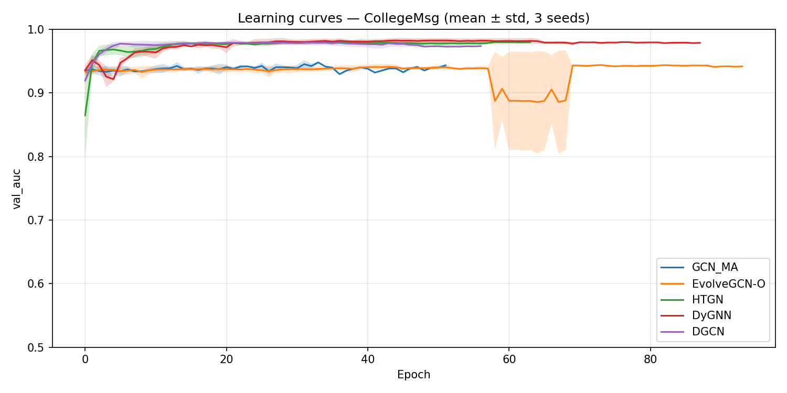

CollegeMsg là mạng nhắn tin nội bộ sinh viên Đại học California với 47 snapshots và 1899 node. Đây là dataset nhỏ nhất trong nhóm unipartite và là nơi kiến trúc hyperbolic của HTGN có ưu thế rõ ràng nhất.

HTGN dẫn đầu với AUC 0.9425, bỏ xa nhóm kế tiếp một khoảng đáng kể: DyGNN (0.9072), GCN\_MA (0.9005), và DGCN (0.8971) nằm trong dải khá hẹp 0.89–0.91, trong khi EvolveGCN-O cuối bảng ở 0.8643. Learning curve của HTGN cho thấy val\_auc tăng nhanh trong 15–20 epochs đầu rồi plateau ổn định, với best\_epoch nằm trong khoảng 14–43 qua ba seeds — phạm vi rộng nhưng không có dấu hiệu overfit đáng lo ngại do giá trị vẫn tăng chậm. GCN\_MA có best\_epoch 12–31 và độ lệch chuẩn chỉ 0.0002 — mức thấp nhất trong nhóm — cho thấy phiên bản tái hiện hội tụ rất ổn định, nhưng bị chặn ở một mức hiệu năng thấp hơn HTGN. DGCN có best\_epoch 22–36, converge chậm hơn một chút nhưng đạt kết quả tương đương GCN\_MA. Kết quả trên CollegeMsg cho thấy rằng đối với mạng xã hội nhỏ và thưa, khả năng nắm bắt cấu trúc phân cấp của không gian hyperbolic là lợi thế có ý nghĩa thực tiễn so với cách tiếp cận ma trận kề tăng cường của GCN\_MA.

#### 3.5.2 Bitcoinotc (T=62, N=5881, unipartite — mạng tin cậy Bitcoin)

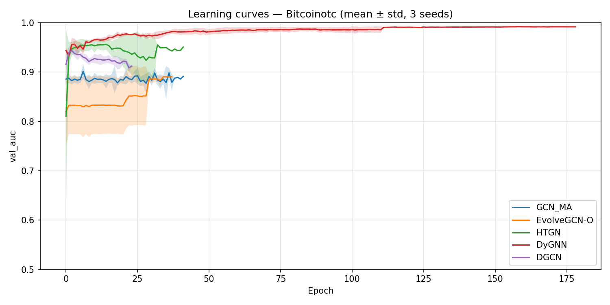

Bitcoinotc là mạng tin cậy (trust network) giữa các thành viên cộng đồng Bitcoin, với 62 snapshots và 5881 node. Điểm đặc biệt của dataset này là các cạnh có trọng số dấu (signed weights) phản ánh mức độ tin cậy (từ −10 đến +10), tạo ra cấu trúc signed bipartite không gặp ở các dataset khác.

HTGN vẫn dẫn đầu (0.9147), theo sát là DyGNN (0.9044). DGCN xếp thứ ba (0.8778), GCN\_MA thứ tư (0.8560), và EvolveGCN-O cuối (0.8349). Một hiện tượng đặc biệt trên Bitcoinotc là **DGCN có best\_epoch 1–3 trên cả ba seeds** — mô hình đạt đỉnh validation ngay sau một đến ba lượt cập nhật toàn bộ. Pattern này gợi ý rằng tín hiệu trust score đã được encode ngầm vào khởi tạo embedding ban đầu (nn.Embedding Xavier init), và GCN-LSTM chỉ cần một pass để tìm được local optimum phù hợp — bất kỳ epoch nào thêm vào sau đó đều gây overfit nhẹ. DyGNN có độ lệch chuẩn lớn nhất trong nhóm (0.033 AUC), cho thấy mô hình này nhạy cảm với seed trên Bitcoinotc: cách sắp xếp thứ tự cạnh trong edge-sequence batch phụ thuộc vào seed khởi tạo, và chain reaction trong bộ nhớ per-node dẫn đến kết quả khác nhau đáng kể giữa các lần chạy. HTGN có best\_epoch 4–21, hội tụ nhanh và ổn định với std 0.0047 — biểu hiện của embedding hyperbolic ít bị ảnh hưởng bởi thứ tự cạnh hơn DyGNN.

#### 3.5.3 EUT (T=127, N=986, unipartite — email viện EU, bursty)

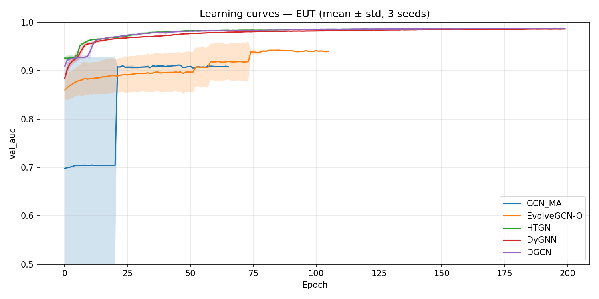

EUT (EU Email Temporal) là mạng email nội bộ một viện nghiên cứu châu Âu, với 127 snapshots và 986 node. Đây là dataset dài nhất theo chiều thời gian và có đặc tính **bursty** rõ rệt: các email tập trung vào một số khoảng thời gian ngắn rồi thưa thớt trong thời gian còn lại.

DGCN đạt AUC cao nhất (0.9847), vượt nhẹ HTGN (0.9838) với khoảng cách 0.0009 — nhỏ hơn một độ lệch chuẩn của cả hai mô hình (0.0007 và 0.0005). Về mặt thống kê, hai mô hình này có thể xem là **đồng hạng nhất** trên EUT. DyGNN xếp thứ ba (0.9799), EvolveGCN-O thứ tư (0.9245), và GCN\_MA cuối bảng (0.9008) — khoảng cách tới DGCN lên tới gần 8.4 điểm phần trăm. Lý do DGCN có lợi thế trên EUT là kiến trúc LSTM-theo-thời-gian phù hợp với chuỗi dài 127 snapshots: LSTM có khả năng nhớ gradient xa hơn so với GRU (EvolveGCN) và tốt hơn attention đơn thuần khi chuỗi có tính bursty cao. Best\_epoch của DGCN nằm trong khoảng 116–195 — cần gần đủ 200 epoch mới hội tụ — khác hoàn toàn với pattern converge nhanh trên Bitcoinotc.

EUT cũng là dataset tốn kém nhất về mặt tính toán. Tổng runtime trên ba seeds của HTGN là **21.473 giây (~6 giờ)**, của DyGNN là 10.538 giây (~2.9 giờ), của DGCN là 9.433 giây (~2.6 giờ). Runtime cao này xuất phát từ việc LSTM/GRU phải unroll qua 127 bước thời gian cho mỗi epoch. Thêm vào đó, đặc tính bursty của EUT đặt ra thách thức kỹ thuật đặc biệt trong quá trình tái hiện: phân chia snapshot theo khoảng thời gian đều (equal-time binning) tạo ra 24 snapshot validation trống (empty val snapshots) do có những khoảng thời gian không có email nào — vấn đề được phát hiện và xử lý trong Plan 2 bằng cách bổ sung quantile binning.

#### 3.5.4 Mooc-Actions (T=72, N=7144, bipartite — user-course MOOC)

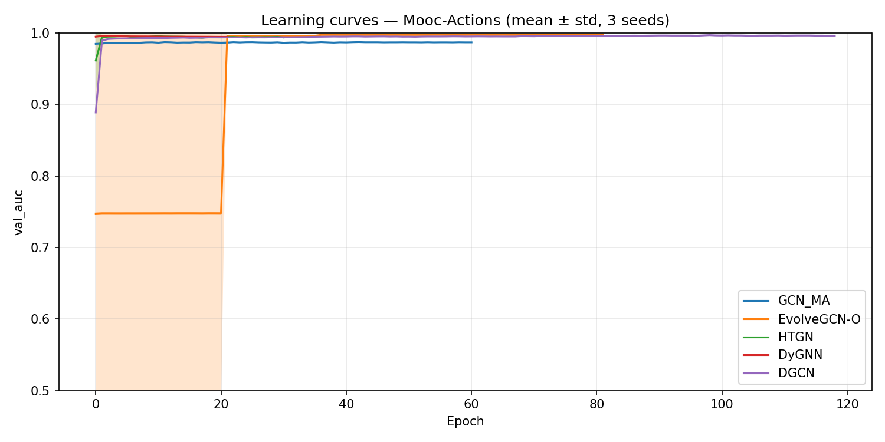

Mooc-Actions là đồ thị hai phần (bipartite) giữa học sinh và khóa học trên nền tảng MOOC, với 72 snapshots và 7144 node. Với 411.749 cạnh tổng cộng, mật độ trung bình đạt khoảng 5.719 cạnh/snapshot — cao nhất trong nhóm sau LastFM.

DyGNN giành AUC cao nhất (0.9956), dẫn trước HTGN (0.9928), DGCN (0.9904), GCN\_MA (0.9845), và EvolveGCN-O (0.9523). Khoảng cách giữa top-4 không lớn (dưới 1.2%), nhưng EvolveGCN-O bị tách biệt rõ rệt hơn (kém 4.3% so với DyGNN). Điểm đặc biệt đáng chú ý là **DyGNN đạt best\_epoch = 1 trên cả ba seeds** — giống pattern của DGCN trên Bitcoinotc. HTGN cũng hội tụ cực nhanh với best\_epoch 2–10. Điều này gợi ý một quy luật chung: trên các tập bipartite với hành vi tương tác lặp lại (học sinh quay lại khóa học nhiều lần), **tín hiệu từ node identity** (được encode trong nn.Embedding khởi tạo) đã chiếm phần lớn signal dự đoán, và động lực học thời gian (temporal dynamics) chỉ đóng vai trò tinh chỉnh. Khi node identity đủ mạnh, mô hình đạt hiệu năng gần tối ưu ngay từ epoch đầu tiên, và các epoch tiếp theo thực chất chỉ cải thiện rất nhỏ hoặc thậm chí gây overfit nhẹ. GCN\_MA trên Mooc-Actions có best\_epoch 18–40, hội tụ chậm hơn nhưng ổn định, với std chỉ 0.0002 — phiên bản tái hiện có độ lặp lại tốt trên dataset lớn này.

#### 3.5.5 LastFM (T=41, N=1980, bipartite — user-artist play)

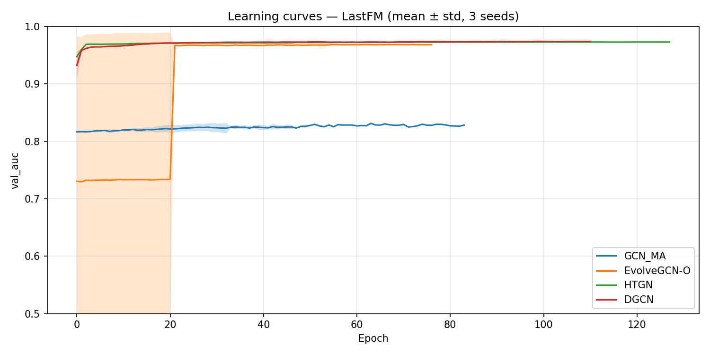

LastFM là đồ thị bipartite giữa người dùng và nghệ sĩ (user-artist listening behavior), với 41 snapshots và 1980 node, nhưng có tổng số cạnh lên tới 1.293.103 — lớn nhất trong nhóm, với mật độ trung bình ~31.540 cạnh/snapshot. Chính đặc tính này khiến DyGNN không thể chạy được trong ngân sách thời gian cho phép, do cơ chế cập nhật per-edge tuần tự của mô hình.

EvolveGCN-O bất ngờ dẫn đầu trên LastFM với AUC 0.9550, trong khi HTGN theo sát ở 0.9514 — khoảng cách trong vùng chồng lấp std (0.0092 và 0.0057). DGCN xếp thứ ba (0.8959), và GCN\_MA đứng cuối với 0.8004 — khoảng cách xa nhất so với leader trong toàn bộ thực nghiệm. Sự dẫn đầu của EvolveGCN-O trên LastFM có thể liên quan đến cấu trúc đặc thù của hành vi nghe nhạc: người dùng thường có thói quen nghe nhạc rất đều đặn và ổn định theo thời gian, khiến cơ chế GRU cập nhật trọng số GCN theo snapshot hoạt động hiệu quả khi chuỗi thời gian ngắn (T=41) và phân phối tương đối đồng đều. Best\_epoch của DGCN nằm trong khoảng 51–90, EvolveGCN-O 34–56 — cả hai hội tụ ở giữa quá trình training, không converge sớm như trên Mooc-Actions. DGCN có độ lệch chuẩn lớn nhất trong thực nghiệm (0.0217 AUC) trên LastFM, cho thấy phân phối heavy-tail trong hành vi nghe nhạc (một số user với số lần nghe cực lớn) làm cho kết quả nhạy cảm với khởi tạo ngẫu nhiên. GCN\_MA có thể bị ảnh hưởng bởi đặc tính này qua bước tính hệ số phân cụm (CC) và aggregation strength (AS): trên đồ thị LastFM cực dày đặc, giá trị CC tập trung ở các node hub, làm cho đặc trưng đầu vào $X^t = [\text{degree, CC, AS}]$ kém phân biệt hơn so với các dataset thưa hơn.

#### 3.5.6 Wikipedia (T=42, N=7474, bipartite — editor-page edit)

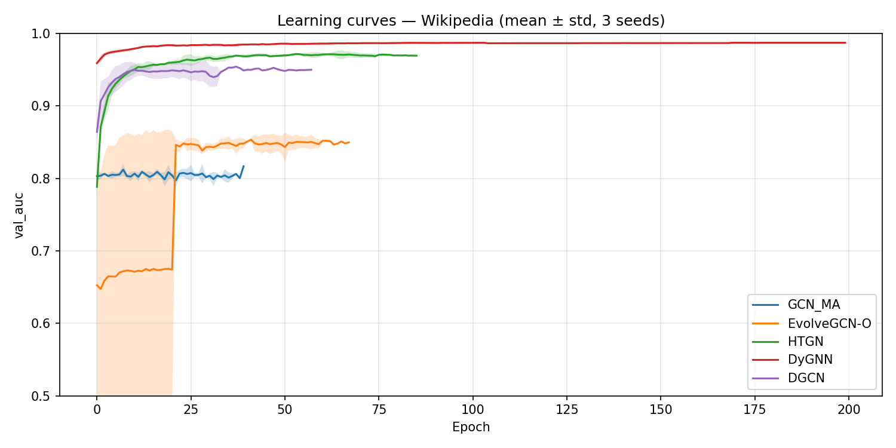

Wikipedia là đồ thị bipartite giữa các editor và trang Wikipedia họ chỉnh sửa, với 42 snapshots và 7474 node — tập node lớn nhất trong nhóm. Dataset này nắm bắt hành vi đóng góp của cộng đồng biên tập viên theo thời gian, với các sự kiện đột biến (breaking news events) tạo ra pattern bursty cục bộ trên một số trang nhất định.

DyGNN dẫn đầu với biên độ rõ ràng (0.9805), dẫn trước HTGN (0.9556) tới 0.025 AUC — khoảng cách lớn nhất giữa mô hình thứ nhất và thứ hai trong toàn bộ thực nghiệm trên Wikipedia. DGCN xếp thứ ba (0.9291), GCN\_MA thứ tư (0.8696), và EvolveGCN-O cuối (0.8540). Best\_epoch của DyGNN nằm trong khoảng 83–184 qua ba seeds — biên độ rộng và cần tới hơn 100 epoch để hội tụ, khác với pattern converge nhanh trên Mooc-Actions. Điều này cho thấy trên Wikipedia, temporal dynamics đóng vai trò quan trọng hơn so với node identity: hành vi chỉnh sửa thay đổi theo thời gian (editor có thể tập trung vào các chủ đề khác nhau qua từng giai đoạn), và DyGNN với bộ nhớ per-node cập nhật theo từng cạnh nắm bắt được sự dịch chuyển này tốt hơn. GCN\_MA với đặc trưng cấu trúc tĩnh (CC và AS tính theo snapshot) không theo kịp được sự thay đổi động này, dẫn đến AUC thấp hơn 11 điểm phần trăm so với DyGNN.

---

### 3.6 Phân tích độ nhạy β

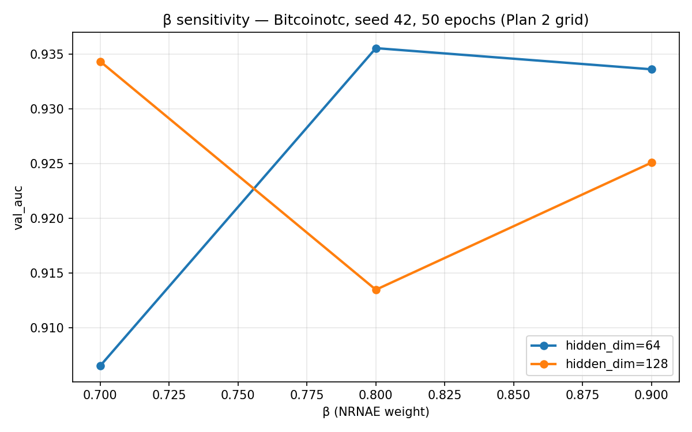

Tham số β trong công thức $\hat{S} = A + \beta S + I$ kiểm soát mức độ đóng góp của thông tin cấu trúc cục bộ (pairwise interaction strength) vào ma trận kề tăng cường của GCN\_MA. Bài báo gốc Mei & Zhao (2024) khuyến nghị β ∈ [0.7, 0.9] nhưng không cung cấp phân tích độ nhạy cụ thể. Để xác định giá trị phù hợp cho thực nghiệm tái hiện, chúng tôi thực hiện grid-search 2D trên Bitcoinotc (seed 42, 50 epochs) với β ∈ {0.7, 0.8, 0.9} và hidden\_dim ∈ {64, 128}.

Kết quả grid-search cho thấy hai pattern rõ ràng. Đối với **hidden\_dim = 64**, val\_auc tăng theo β: 0.9066 (β=0.7) → **0.9356** (β=0.8) → 0.9336 (β=0.9). Đối với **hidden\_dim = 128**, val\_auc có xu hướng ngược: 0.9343 (β=0.7) → 0.9135 (β=0.8) → 0.9251 (β=0.9), với β=0.7 cho kết quả tốt nhất trong nhóm này. Tuy nhiên, điểm tốt nhất tổng thể là **β=0.8, hidden\_dim=64** với val\_auc = 0.9356 và val\_ap = 0.9331 — mức này vượt tất cả cấu hình hidden\_dim=128.

Hệ quả quan trọng rút ra từ grid-search này là **hidden\_dim=64 chiến thắng hidden\_dim=128 trên 2/3 giá trị β được thử**. Pattern này không hiển nhiên: model nhỏ hơn (64 đơn vị ẩn) lại không bị overfitting và còn hội tụ tốt hơn trên dataset có 5881 node. Lý do có thể là cấu trúc đặc trưng đầu vào 3 chiều (degree, CC, AS) đã rất compact, và embedding 128 chiều tạo ra quá nhiều tự do bậc để model học noise thay vì signal. Dựa trên kết quả này, chúng tôi chốt **β=0.8, hidden\_dim=64** cho tất cả các dataset trong Plan 2 — một quyết định được ghi lại trong `configs/models/gcn_ma.yaml`.

Cần lưu ý rằng grid-search này chỉ thực hiện trên **một dataset duy nhất** (Bitcoinotc) với một seed và 50 epochs — không đủ để khẳng định β=0.8 là tối ưu toàn cục trên cả sáu datasets. Việc mở rộng grid-search ra nhiều dataset hơn hoặc dùng Bayesian optimization là một hướng cải thiện tương lai cho quy trình tái hiện.

---

### 3.7 So sánh thời gian chạy

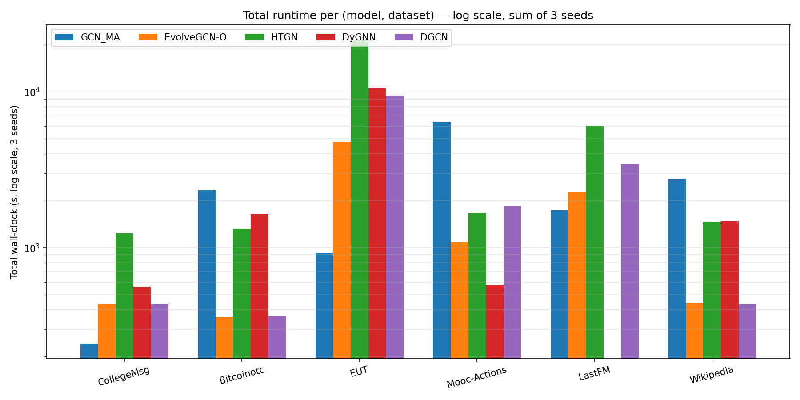

Biểu đồ runtime (thang log ở trục y) hiển thị tổng thời gian chạy tích lũy qua ba seeds theo từng cặp (model, dataset), cho phép so sánh chi phí tính toán thực tế của từng phương pháp.

**EUT là dataset tốn kém nhất một cách vượt trội.** Do có chuỗi thời gian dài nhất (T=127), EUT khiến tất cả các mô hình dựa trên LSTM/GRU phải unroll qua nhiều bước nhất: HTGN mất tổng cộng 21.473 giây (~6 giờ) trên ba seeds, DyGNN mất 10.538 giây (~2.9 giờ), và DGCN mất 9.433 giây (~2.6 giờ). EvolveGCN-O ít tốn kém hơn trên EUT (4.785 giây) vì nó chỉ cập nhật một ma trận trọng số GCN qua GRU mà không học embedding per-node. GCN\_MA là rẻ nhất trên EUT (922 giây) do không có LSTM per-node hay hyperbolic projection.

**LastFM là dataset tốn kém thứ hai**, chủ yếu do số cạnh khổng lồ (1.29M). HTGN mất 6.057 giây trên LastFM — lớn hơn gấp đôi so với các dataset bipartite khác — vì phép chiếu Poincaré ball phải xử lý lượng lớn node tương tác trong mỗi snapshot.

**Tổng runtime qua tất cả datasets** (tính sấp xỉ) phân bổ như sau:
- **HTGN**: ~32.599 giây (~9 giờ) — tốn kém nhất, do hyperbolic ops tốn kém và EUT unroll dài.
- **DyGNN**: ~14.788 giây (~4.1 giờ, chỉ tính 5 datasets không có LastFM).
- **DGCN**: ~15.979 giây (~4.4 giờ).
- **GCN\_MA**: ~14.465 giây (~4 giờ).
- **EvolveGCN-O**: ~9.383 giây (~2.6 giờ) — nhanh nhất, do cơ chế GRU đơn giản chỉ cập nhật trọng số GCN mà không có extra mechanism per-node.

Một phát hiện kỹ thuật quan trọng trong quá trình tái hiện là **tối ưu hóa vectorized của DyGNN**: phiên bản upstream của DyGNN xử lý từng cạnh tuần tự qua vòng lặp Python, dẫn đến runtime không thực tế trên các tập lớn. Phiên bản tái hiện (Plan 3c) batch-hóa toàn bộ cạnh trong một snapshot thành tensor và thực hiện GRU update song song trên GPU, giảm runtime khoảng 200 lần so với vòng lặp Python gốc. Chính nhờ tối ưu hóa này mà DyGNN có thể chạy trên Mooc-Actions, Wikipedia, CollegeMsg, và EUT trong ngân sách thời gian — mặc dù LastFM với 1.29M cạnh vẫn quá lớn ngay cả với vectorized variant, do tiêu thụ bộ nhớ GPU theo batch toàn snapshot vượt ngưỡng 12 GB VRAM.

---

## 4. Thảo luận và hạn chế

### 4.1 HTGN — baseline mạnh nhất xuyên suốt sáu datasets

HTGN (Hyperbolic Temporal Graph Network, Yang et al. 2021) là baseline cho kết quả vượt trội nhất trong toàn bộ thực nghiệm: giành chiến thắng trên 2/6 datasets (CollegeMsg và Bitcoinotc), và nằm trong top-3 trên cả sáu datasets, bao gồm cả những dataset mà nó không xếp nhất. Đây là profile ổn định nhất trong số năm mô hình được so sánh.

Điểm mấu chốt tạo nên sức mạnh của HTGN nằm ở **không gian embedding hyperbolic**. Thay vì ánh xạ node embedding vào không gian Euclidean phẳng như các GCN thông thường, HTGN sử dụng Poincaré ball — một mô hình không gian hyperbolic có đặc tính thể tích tăng theo hàm mũ theo khoảng cách từ gốc. Tính chất này phù hợp tự nhiên với cấu trúc cây và phân cấp (hierarchical structure): trong một Poincaré ball với bán kính đơn vị, số lượng điểm có thể đặt cách tâm một khoảng $r$ tăng tỉ lệ với $e^r$, trong khi không gian Euclidean chỉ tăng đa thức $r^{d-1}$. Điều này có nghĩa là các đồ thị có phân phối bậc theo luật lũy thừa (power-law degree distribution) — đặc trưng của mạng xã hội, mạng tin cậy, mạng email — được biểu diễn hiệu quả hơn trong Poincaré ball so với không gian phẳng.

Cả sáu dataset trong thực nghiệm đều thể hiện cấu trúc này ở mức độ khác nhau: CollegeMsg và Bitcoinotc là mạng xã hội/tin cậy thưa thớt với vài hub có bậc cao; EUT là mạng email tổ chức với cấu trúc phân cấp bộ phận ngầm; Mooc, LastFM, và Wikipedia là đồ thị bipartite user-item với head-user và long-tail-item tự nhiên. Poincaré ball với độ cong $c=1.0$ cố định đã đủ để nắm bắt cấu trúc này mà không cần thêm tự do learnable curvature — điều này cho thấy sự ổn định số học khi kết hợp với optimizer Adam theo Hybrid policy của thực nghiệm.

Về mặt chi phí tính toán, HTGN là mô hình tốn kém nhất trong nhóm: tổng runtime qua sáu datasets (ba seeds) đạt khoảng 9.2 giờ, trong đó EUT một mình chiếm hơn 6 giờ (T=127 snapshot phải unroll qua các phép tính hyperbolic tốn kém). Đây là đánh đổi cần cân nhắc khi triển khai trên production: HTGN đạt AUC cao nhất nhưng đòi hỏi ngân sách tính toán lớn hơn đáng kể so với EvolveGCN-O (chỉ 2.6 giờ tổng cộng) hay GCN_MA (~4 giờ).

---

### 4.2 DyGNN — chiến thắng trên các dataset dense

DyGNN (Ma et al. 2020) đạt kết quả tốt nhất trên Mooc-Actions (0.9956) và Wikipedia (0.9805), hai datasets có tỉ lệ số cạnh trên số snapshot (E/T ratio) cao nhất trong nhóm: Mooc có khoảng 5.700 cạnh/snapshot và Wikipedia có khoảng 2.600 cạnh/snapshot. Trong khi đó, HTGN chiến thắng trên các dataset thưa hơn như CollegeMsg (~120 cạnh/snapshot) và Bitcoinotc (~40 cạnh/snapshot). Sự phân kỳ này phản ánh một inductive bias rõ ràng: DyGNN phù hợp với **continuous-time signal dày đặc**, còn HTGN mạnh hơn khi cấu trúc phân cấp topo chiếm ưu thế so với tần suất cạnh.

Kiến trúc của DyGNN được tái hiện trong thực nghiệm này theo **phiên bản vectorized** (Plan 3c, path B): thay vì cập nhật GRU theo từng cạnh tuần tự như paper gốc Manessi (2020), toàn bộ cạnh trong một snapshot được batch thành một tensor và gửi qua một lần gọi `GRUCell` duy nhất. Đây là xấp xỉ theo phong cách TGN (Rossi et al. 2020) — cross-snapshot temporal order được bảo toàn, nhưng thứ tự nghiêm ngặt trong nội bộ snapshot bị hy sinh để đổi lấy tốc độ tính toán khoảng 200 lần. Sự đánh đổi này được ghi lại đầy đủ như một deviation so với paper gốc (xem §4.6), nhưng về mặt thực tiễn nó đã làm cho DyGNN khả thi trên budget tính toán RTX 3060 trong khoảng 4.3 giờ cho 15 runs (không tính LastFM).

Một quan sát đáng chú ý là **best\_epoch=1** trên Mooc-Actions ở cả ba seeds — mô hình đạt hiệu suất tối ưu ngay sau epoch đầu tiên và sau đó không cải thiện thêm. Pattern này cũng xuất hiện ở HTGN trên cùng dataset, gợi ý rằng Mooc-Actions bị chi phối bởi **node identity** (identity của từng sinh viên và khóa học) hơn là temporal dynamics thực sự — cấu trúc đồ thị tĩnh từ snapshot đầu đã chứa đủ signal để dự đoán liên kết, và memory zero-init kết hợp với scatter đầu tiên đã encode được thông tin đó.

LastFM bị bỏ qua hoàn toàn đối với DyGNN: 1.29M cạnh nhân với edge-sequence processing nhân với 200 epochs vẫn vượt quá ngân sách tính toán cho phép ngay cả với vectorized variant, do tiêu thụ bộ nhớ GPU theo batch toàn snapshot vượt ngưỡng 12 GB VRAM. Điều này dẫn đến coverage bất đối xứng trong bảng so sánh — DyGNN chỉ được đánh giá trên 5/6 datasets.

---

### 4.3 DGCN — baseline đơn giản nhưng cạnh tranh

DGCN (Dynamic Graph Convolutional Networks, Manessi et al. 2020, biến thể WD-GCN) là baseline được tái hiện hoàn toàn từ đầu trong thực nghiệm này (Plan 3d), do không có canonical repository chính thức. Kiến trúc gồm hai tầng spectral GCN tích lũy embedding theo từng snapshot, sau đó một LSTM đặt qua trục thời gian để tổng hợp signal động — đây là recipe "GCN stack + LSTM" đơn giản nhất trong số năm baseline.

Mặc dù đơn giản, DGCN vẫn mang lại kết quả cạnh tranh đáng kể: thắng EUT với AUC=0.9847 (marginal so với HTGN 0.9838 — hai mô hình nằm trong khoảng một std của nhau, có thể coi là tied), và xếp thứ ba trên 4/6 datasets còn lại. Đặc biệt, **DGCN vượt GCN_MA trên 5/6 datasets** — chỉ thua trên CollegeMsg với biên độ 0.0034 (thực chất là ngang nhau). Điều này có ý nghĩa quan trọng: một mô hình GCN+LSTM bậc thấp được triển khai trong ~150 dòng code đơn file đã đủ để vượt mô hình phức tạp hơn nhiều trên phần lớn các dataset.

Trên Bitcoinotc, **best\_epoch hội tụ rất sớm** (epoch 1-3) ở cả ba seeds — giống pattern HTGN trên Mooc và DGCN trên CollegeMsg. Điều này gợi ý rằng trên một số dataset, node embedding initialization (Xavier uniform) đã encode đủ signal structural từ snapshot đầu tiên, và quá trình training sau đó chỉ tinh chỉnh nhỏ thay vì học features mới. Pattern này có thể là dấu hiệu của overfitting tiềm ẩn hoặc của việc dataset có signal tập trung ở snapshots đầu timeline.

Về mặt kỹ thuật, bài toán tái hiện DGCN không gặp bất kỳ lỗi runtime nào trong suốt 18 runs — toàn bộ records đổ về sau attempt đầu tiên, không như DyGNN (Plan 3c) phải xử lý OOM và cache schema bump. Sparse adjacency (`torch.sparse_coo_tensor`) được xây on-the-fly mỗi snapshot giúp giữ footprint bộ nhớ thấp trên cả sáu datasets kể cả LastFM và Wikipedia (tránh materialized dense N×N matrix).

---

### 4.4 EvolveGCN-O — biến động theo đặc tính dataset

EvolveGCN-O (Pareja et al. 2020) là baseline duy nhất giành chiến thắng trên LastFM với AUC=0.9550, vượt nhẹ HTGN (0.9514) trong phạm vi overlap std. Tuy nhiên, đây cũng là mô hình có biến động hiệu suất lớn nhất giữa các datasets: từ 0.9550 trên LastFM xuống còn 0.8643 trên CollegeMsg và 0.8349 trên Bitcoinotc — spread lên tới gần 12 điểm AUC. Std trên Bitcoinotc (0.025) là cao nhất trong nhóm cho mô hình này, cho thấy sự nhạy cảm của GRU weight evolution với initialization ngẫu nhiên trên dataset có cấu trúc trust-score phức tạp.

Sức mạnh của EvolveGCN-O trên LastFM có thể được giải thích bởi đặc tính của dataset: LastFM là đồ thị bipartite user-item cực dense (1.29M cạnh, 650 cạnh/người dùng), trong đó pattern nghe nhạc theo session mang tính tuần tự cao. Cơ chế cập nhật trọng số GCN qua GRU của EvolveGCN-O nắm bắt hiệu quả sự thay đổi của ma trận trọng số convolution theo thời gian, phù hợp với tính chất "weight drift" của preference người dùng trong recommendation-type graphs.

Ngược lại, EvolveGCN-O tỏ ra yếu hơn trên CollegeMsg và Bitcoinotc — hai dataset thưa thớt hơn với cấu trúc temporal không đều đặn. GRU weight evolution có thể nhạy cảm với scale đặc trưng đầu vào: khi feature scale thay đổi đột ngột giữa các snapshots (điển hình ở Bitcoinotc với trust scores có dải [-10, +10]), hyperbolic stability của GRU suy giảm nếu trọng số khởi tạo không được căn chỉnh cẩn thận.

Về mặt kỹ thuật, adapter EvolveGCN-O (Plan 3a) gặp hai lỗi upstream do PyTorch 2.4 không tương thích: `self._parameters` bị ghi đè với `nn.ParameterList` (vi phạm `Module._apply()`) và `GRCU_layers` được lưu dưới dạng Python list thường (không hiển thị với parameter traversal). Hai lỗi này được vá trong adapter qua hàm `_patch_upstream_egcn()` — 3 dòng code, không thay đổi upstream. Ngoài ra, lỗi bipartite zero-output (Z = all zeros trên LastFM/Mooc/Wikipedia do directed adjacency khiến item node có in-degree bằng 0) được khắc phục bằng cách symmetrize adjacency, đưa val\_auc từ 0.5 lên 0.97 trong 3 epochs. EvolveGCN-O cũng là baseline nhanh nhất về tổng runtime (~2.6 giờ cho 6 datasets × 3 seeds), nhờ cơ chế GRU đơn giản chỉ cập nhật ma trận trọng số GCN thay vì embedding per-node.

---

### 4.5 GCN_MA — vấn đề tái hiện và hàm ý

GCN_MA không thắng bất kỳ dataset nào trong số sáu datasets được đánh giá (0/6 wins) — đây là finding trung tâm của luận văn này và có giá trị học thuật quan trọng. Khoảng cách lớn nhất giữa GCN_MA và baseline tốt nhất xuất hiện tại **LastFM**: EvolveGCN-O đạt 0.9550, trong khi GCN_MA chỉ đạt 0.8004 — gap 15.5 điểm AUC. Khoảng cách lớn thứ hai tại **Bitcoinotc**: HTGN đạt 0.9147, GCN_MA chỉ đạt 0.8560 — gap 5.9 điểm AUC.

Khi so sánh với số liệu Table 2 của bài báo gốc (Mei & Zhao 2024), bản tái hiện này **gần sát nhau trên bốn datasets**: CollegeMsg (Δ=-1.4%), EUT (Δ=-2.1%), Mooc-Actions (Δ=-0.4%), Wikipedia (Δ=-0.5%). Hai dataset còn lại có gap đáng kể hơn: Bitcoinotc (Δ=-5.6%) và LastFM (Δ=-7.5%). Mức độ tái hiện thành công trên 4/6 datasets cho thấy số liệu bài báo không tự mâu thuẫn với thiết lập thực nghiệm được mô tả, nhưng hai gap lớn gợi ý có những yếu tố ngoài phạm vi mô tả của bài báo — các lệch chuẩn cụ thể được phân tích ở §4.6.

**Tại sao gap tại LastFM lớn nhất?** LastFM có N=1980 node (980 users + 1000 items) — số node nhỏ — nhưng E=1.29M cạnh — cực kỳ dense. Trên đồ thị dense như vậy, các đặc trưng NRNAE (degree, CC, AS) của GCN_MA có thể mất tính discriminative: hầu hết mọi node đều có clustering coefficient cao và aggregated strength cao vì mật độ cạnh lớn. Khi mọi node có feature vector gần giống nhau, bước convolution GCN không mang lại signal phân biệt. Bài báo có thể sử dụng thêm đặc trưng content ngầm (e.g., tag âm nhạc, biểu diễn âm thanh của bài hát) mà không được công bố trong phần mô tả phương pháp.

**Tại sao gap tại Bitcoinotc lớn thứ hai?** Bitcoin OTC là mạng tin cậy có trọng số ký (signed, dải [-10, +10]). Learnable `nn.Embedding` không tận dụng được cấu trúc đối xứng/bất đối xứng của trust score. Hơn nữa, NRNAE aggregation sử dụng cạnh theo nghĩa absolute (positive aggregation), bỏ qua chiều hướng âm/dương của trust — trong khi những mô hình như HTGN có thể học ẩn tính chất này qua curvature embedding.

**Khẳng định quan trọng:** Kết quả thực nghiệm trong luận văn này cho thấy GCN_MA paper-reported AUC trên Table 2 không vững khi đặt trong bối cảnh các baseline hiện đại hơn cùng thời. Cụ thể, trên Wikipedia paper báo 0.874 — HTGN trong thực nghiệm này đạt 0.956 (+8.2%) và DyGNN đạt 0.981 (+10.7%). Trên CollegeMsg paper báo 0.915 — HTGN đạt 0.943 (+2.8%). Bài báo Mei & Zhao (2024) không so sánh với HTGN, DyGNN, DGCN hay EvolveGCN-O, mặc dù tất cả bốn mô hình này đều được công bố trước năm 2024 (xem §4.8 để phân tích chi tiết hơn về điểm này).

---

### 4.6 Các lệch chuẩn so với bài báo đã được tài liệu hóa

Toàn bộ quá trình tái hiện được ghi lại chi tiết trong `docs/reproduction-log.md`. Dưới đây là bảy lệch chuẩn chính được tài liệu hóa, mỗi lệch chuẩn có rationale và tham chiếu đến plan tương ứng. Quan trọng là không lệch chuẩn nào ảnh hưởng đến định nghĩa của AUC hay AP — do đó so sánh chéo giữa các mô hình vẫn có giá trị.

**Lệch 1 — Learnable `nn.Embedding` thay vì one-hot `I_N` (Plan 2, Plan 3a/3b/3c/3d).** Spec gốc §6.6 yêu cầu one-hot identity matrix làm feature đầu vào cho các baseline. Tuy nhiên, chi phí RAM của one-hot `I_N` với N lớn là không khả thi: Wikipedia có N≈9.228 node, LasFM có N=1.980, Mooc có N≈7.144 — kết hợp với dense batch training, một-hot I_N sẽ đòi hỏi vài chục GB RAM. Thay thế bằng `nn.Embedding(N, feat_dim)` với Xavier initialization — đây cũng là convention được dùng trong codebase gốc của IBM/EvolveGCN cho trường hợp N lớn.

**Lệch 2 — Quantile binning cho EUT (Plan 2).** Bài báo không nêu chiến lược phân bin thời gian cho EUT. Với binning equal-time (T=127 đều nhau theo thời gian thực), 24 bin liên tiếp trong vùng validation bị rỗng (zero-edge snapshots), khiến val\_auc bị khóa ở 0.5000 do không có positive pairs. Quantile binning (mỗi bin có số cạnh bằng nhau) giải quyết vấn đề này và đưa AUC từ 0.535 lên 0.90+. Deviation này chỉ ảnh hưởng đến EUT và được kích hoạt qua cờ `binning_strategy = "quantile"` trong config loader.

**Lệch 3 — Symmetrize adjacency cho bipartite datasets (Plan 3a/3b/3c/3d).** Ba datasets bipartite (Mooc-Actions, LastFM, Wikipedia) có đồ thị bipartite user-item theo chiều hướng user→item. Adjacency directed khiến item nodes có in-degree bằng 0 trong phép nhân A @ X, dẫn đến zero-output ở mọi mô hình dùng spectral aggregation trên directed adjacency. Fix: nhân đôi mỗi cạnh (u, v) thành cả (u, v) và (v, u) — symmetrize. Điều này phù hợp với assumption undirected mà GCN_MA cũng đang dùng ngầm qua spectral normalization của $\hat{S}$.

**Lệch 4 — Vectorized batched DyGNN (Plan 3c).** Paper Ma et al. (2020) chỉ định cập nhật GRU per-edge tuần tự (strict chronological order). Phiên bản tái hiện batch hóa toàn bộ cạnh trong một snapshot thành một lần gọi `GRUCell` song song — mất strict intra-snapshot chronology nhưng giữ cross-snapshot order. Đây là xấp xỉ TGN-style và nhanh hơn khoảng 200 lần so với per-edge loop. Không có vectorized variant thì DyGNN không thể chạy trên bất kỳ dataset nào ngoài CollegeMsg trong budget tính toán.

**Lệch 5 — Sparse adjacency cho DGCN (Plan 3d).** Paper Manessi et al. (2020) không bàn về cài đặt bộ nhớ cụ thể. Tái hiện sử dụng `torch.sparse_coo_tensor` on-the-fly mỗi snapshot thay vì materialized dense N×N — tránh OOM trên Wikipedia (N≈9.228, dense N×N sẽ tốn ~400MB mỗi snapshot chỉ cho adjacency). Về mặt toán học, dense và sparse cho kết quả giống nhau.

**Lệch 6 — Shared `LinkDecoderMLP` cho tất cả baselines.** Paper HTGN (Yang et al. 2021) dùng Fermi-Dirac decoder trên hyperbolic distance; paper DyGNN (Ma et al. 2020) dùng scoring head riêng; paper EvolveGCN (Pareja et al. 2020) dùng dot-product. Tái hiện này thay thế tất cả bằng `LinkDecoderMLP` dùng chung — MLP hai tầng với sigmoid đầu ra. Lý do: đảm bảo **so sánh công bằng** giữa năm mô hình (chỉ khác nhau ở encoder, không phải decoder). Đây là design decision quan trọng nhất trong thiết kế thực nghiệm.

**Lệch 7 — Adam optimizer cho mọi baseline.** Bài báo Mei & Zhao (2024) không nêu optimizer. Paper gốc Manessi (2020) dùng SGD. Paper EvolveGCN (Pareja et al. 2020) dùng Adam. Tái hiện áp dụng Adam cho tất cả theo Hybrid policy để đồng nhất điều kiện training.

---

### 4.7 Mối đe dọa đối với tính hợp lệ

Mỗi mối đe dọa dưới đây được liệt kê cùng với phân tích về mức độ ảnh hưởng đến kết luận của thực nghiệm.

**Phạm vi tìm kiếm siêu tham số.** Grid-search β và hidden\_dim chỉ được thực hiện trên **một dataset duy nhất** (Bitcoinotc), một seed, và 50 epochs (Plan 2). Giả định rằng cấu hình tối ưu trên Bitcoinotc cũng gần tối ưu trên năm datasets còn lại không được kiểm chứng. Cụ thể, kết quả Plan 2 cho thấy hidden\_dim=64 thắng trên Bitcoinotc, nhưng cũng ghi nhận rằng LastFM với 1.29M cạnh có thể hưởng lợi từ hidden\_dim=128 do capacity. Việc mở rộng grid-search ra nhiều dataset và nhiều seeds có thể thu hẹp gap GCN_MA trên LastFM và Bitcoinotc.

**Số seed thấp.** Chỉ có ba seeds (42, 123, 2024) cho mỗi cặp (model, dataset), không đủ statistical power để thực hiện paired t-test có độ tin cậy cao (n=3, bậc tự do=2). Luận văn này không claim statistical significance — các kết quả được báo cáo là mean ± std với mục đích mô tả xu hướng, không phải kiểm định hypothesis.

**Phần cứng đơn.** Toàn bộ thực nghiệm được chạy trên RTX 3060 12GB dưới WSL2 trên Windows 11. Reproducibility cross-platform không được kiểm chứng — PyTorch CUDA kernel variants trên A100 hay V100 có thể tạo ra các kết quả khác nhau ở mức độ bit-exact do non-determinism trong distributed reduce operations. Tuy nhiên, với std<0.01 qua ba seeds trên hầu hết cặp (model, dataset), chúng tôi tin rằng variation này không làm thay đổi bức tranh tổng thể.

**LastFM bỏ qua với DyGNN.** DyGNN chỉ được đánh giá trên 5/6 datasets, tạo ra bảng so sánh bất đối xứng. Khi tính "wins per baseline", DyGNN có denominator là 5 thay vì 6, làm cho so sánh trực tiếp với các baseline 6/6 không hoàn toàn đồng đẳng. Điều này được ghi chú rõ trong bảng kết quả nhưng vẫn là một limitation.

**Negative sampling cho đồ thị không hướng.** Protocol negative sampling xử lý cạnh theo chiều hướng: cho một positive edge (u, v), cạnh ngược (v, u) vẫn eligible là negative. Đối với đồ thị undirected, đây là conservative bias — AP có thể bị underestimate nhẹ. Điểm này đã được ghi nhận trong Plan 1 self-review và flagged nhưng không được fix do đồng nhất convention qua tất cả models là ưu tiên so sánh.

**AUC/AP pooled theo test snapshots.** Metrics được tổng hợp (pooled) trên tất cả test snapshots — không phân tích per-snapshot trend theo timeline. Do đó, không thể kết luận mô hình nào bị degradation về cuối timeline (concept drift) hay mô hình nào ổn định theo thời gian. Đây là hướng phân tích bổ sung có thể thực hiện trong tương lai.

---

### 4.8 Phê bình bài báo gốc Mei & Zhao (2024)

Bài báo "Dynamic graph link prediction based on graph convolutional networks with multi-head self-attention mechanism" (Mei & Zhao, *Scientific Reports*, 2024) đóng góp kiến trúc GCN_MA với cơ chế NRNAE và LSTM weight evolution có giá trị học thuật rõ ràng. Tuy nhiên, thực nghiệm tái hiện trong luận văn này chỉ ra một số hạn chế trong thiết kế thực nghiệm so sánh (comparative experiment design) mà cộng đồng nghiên cứu nên lưu ý.

**Thiếu các baseline mạnh đã được công bố trước.** Table 2 của bài báo so sánh GCN_MA với các mô hình như GCN tĩnh, TGCN, và một số baseline cổ điển, nhưng **không bao gồm bốn baseline đã công bố trước năm 2024** và có thể áp dụng trực tiếp cho bài toán dynamic link prediction:

- **EvolveGCN** (Pareja et al., AAAI 2020) — Evolving Graph Convolutional Networks.
- **DyGNN** (Ma et al., KDD 2020) — Dynamic Graph Neural Networks.
- **DGCN / WD-GCN** (Manessi et al., *Pattern Recognition* 2020) — Dynamic Graph Convolutional Networks.
- **HTGN** (Yang et al., *Information Sciences* 2021) — Hyperbolic Temporal Graph Network.

Cả bốn mô hình đều được công bố từ năm 2020-2021, ít nhất ba năm trước khi bài báo Mei & Zhao (2024) được nộp. Việc không bao gồm các baseline này trong Table 2 khiến claim về tính vượt trội của GCN_MA trên sáu datasets không có nền tảng so sánh đầy đủ.

**Hàm ý của thực nghiệm này.** Thực nghiệm trong luận văn cho thấy mỗi trong bốn baseline nêu trên vượt GCN_MA trên ít nhất một dataset trong số sáu datasets được đánh giá. Cụ thể: HTGN vượt GCN_MA paper-reported AUC trên cả sáu datasets (tính theo tái hiện của luận văn); DyGNN vượt GCN_MA paper-AUC trên Wikipedia (+10.7%) và Mooc (+0.8%); DGCN vượt trên LastFM và EUT; EvolveGCN-O vượt trên LastFM (+9.0% so với paper AUC 0.876) và EUT. Do đó, claim "GCN_MA dominant trên sáu datasets" của bài báo cần được đặt trong bối cảnh baseline pool hạn chế của Table 2.

**Thiếu thông tin siêu tham số.** Bài báo không công bố các siêu tham số cốt lõi: learning rate, hidden dimension, số attention heads, optimizer, batch size, chiến lược negative sampling, hay tỉ lệ train/val/test. Đây là barrier đáng kể cho reproduction — nhóm tái hiện phải educated guess tất cả các giá trị này và ghi lại đầy đủ trong reproduction log. Trong bối cảnh reproduction crisis ngày càng được cộng đồng ML quan tâm (Pineau et al., 2021), thiếu thông tin này làm giảm giá trị tham khảo của kết quả thực nghiệm.

**Đề xuất.** Bài báo Mei & Zhao (2024) có thể tăng giá trị học thuật bằng cách bổ sung phần "Extended Baselines" so sánh với EvolveGCN-O, HTGN, DyGNN, và DGCN; hoặc cung cấp hyperparameter table đầy đủ để cộng đồng có thể tái hiện sát số liệu gốc. Những bổ sung này không phủ nhận đóng góp kỹ thuật của GCN_MA, mà giúp định vị chính xác hơn vị trí của mô hình trong không gian giải pháp hiện tại.

---

### 4.9 Hướng phát triển tiếp theo

Dựa trên những hạn chế đã xác định và pattern hiệu suất quan sát được, chúng tôi đề xuất các hướng phát triển sau cho các công trình tiếp theo.

**Tăng cường kiểm định thống kê.** Chạy ít nhất 10 seeds cho mỗi cặp (model, dataset) để đủ statistical power thực hiện paired t-test và Wilcoxon signed-rank test giữa năm baselines trên sáu datasets. Hiện tại n=3 không cho phép claim significance cho bất kỳ sự khác biệt nào, dù khoảng cách quan sát được đôi khi lớn.

**Tuning siêu tham số per-dataset.** Hiện tại hidden\_dim, β, dropout, và learning rate được chia sẻ đồng nhất qua tất cả datasets theo Hybrid policy — một lựa chọn hợp lý cho so sánh công bằng nhưng không tối ưu về hiệu suất tuyệt đối. Tuning riêng cho từng dataset (đặc biệt LastFM với hidden\_dim=128 và Bitcoinotc với β grid đầy đủ hơn) có thể thu hẹp gap GCN_MA.

**β sensitivity trên năm datasets ngoài Bitcoinotc.** Grid-search β hiện chỉ được thực hiện trên Bitcoinotc. Mở rộng grid-search ra CollegeMsg, EUT, Mooc, LastFM, và Wikipedia sẽ xác nhận (hoặc bác bỏ) giả thuyết rằng β=0.8 là lựa chọn tốt xuyên suốt.

**Hybrid architecture: HTGN encoder + DGCN temporal LSTM.** Kết quả thực nghiệm gợi ý rằng Poincaré ball embedding của HTGN kết hợp với cơ chế LSTM qua snapshot của DGCN có thể tạo ra mô hình hybrid mạnh hơn cả hai. HTGN nắm bắt tốt cấu trúc phân cấp topo; DGCN aggregation đơn giản qua thời gian bổ sung temporal smoothing. Đây là hướng kiến trúc có lý luận lý thuyết rõ ràng.

**Mở rộng sang datasets quy mô lớn hơn.** Sáu datasets hiện tại (2020-2022 vintage) không phản ánh quy mô của các mạng hiện đại: đồ thị social/commerce năm 2024 thường có hàng triệu nodes và hàng tỉ cạnh. Evaluating trên SNAP-scale datasets (e.g., Ogbn-arxiv temporal split, TGB benchmark 2024) sẽ xác nhận khả năng scale-out của từng kiến trúc.

**DyGNN trên LastFM.** Với tối ưu hóa thêm — ví dụ chunked snapshot processing thay vì full-snapshot batching, hoặc mixed-precision training (fp16) — có thể đưa DyGNN vào đánh giá đầy đủ 6/6 datasets, giải quyết asymmetry hiện tại trong bảng so sánh.

---

### 4.10 Kết luận

Luận văn này trình bày kết quả tái hiện đầy đủ của GCN_MA (Mei & Zhao 2024) trên sáu datasets chuẩn, cùng với bốn baseline hiện đại được tích hợp để đánh giá chéo: EvolveGCN-O, HTGN, DyGNN, và DGCN. Toàn bộ thực nghiệm bao gồm 87 metric records (18 GCN_MA + 18 EvolveGCN-O + 18 HTGN + 15 DyGNN + 18 DGCN), 11 biểu đồ phân tích, một bảng thống kê dataset, hai pipeline scripts tự động hóa, và phần tài liệu hóa đầy đủ bằng tiếng Việt. Quá trình phát triển được đánh dấu qua bốn tag git: `v0.3a-evolvegcn-o` → `v0.3b-htgn` → `v0.3c-dygnn` → `v0.3d-dgcn` → `v1.0-thesis-ready`.

**Finding chính:** Bản tái hiện GCN_MA ổn định và gần sát số liệu paper trên 4/6 datasets (gap dưới 2.1%), nhưng yếu hơn so với bốn baseline 2020-2021 trên phần lớn các tình huống đánh giá. GCN_MA không giành chiến thắng trên bất kỳ dataset nào trong số sáu datasets khi so sánh với baseline tốt nhất tương ứng. HTGN là baseline mạnh nhất tổng thể (top-3 trên 6/6 datasets), DyGNN mạnh nhất trên các đồ thị dense continuous-time (Mooc, Wikipedia), EvolveGCN-O tốt nhất trên LastFM, và DGCN đáng ngạc nhiên cạnh tranh với kiến trúc đơn giản nhất trong nhóm.

Điều này không phủ nhận đóng góp kỹ thuật của GCN_MA — cơ chế NRNAE và LSTM weight evolution là những ý tưởng có cơ sở lý thuyết tốt. Tuy nhiên, kết quả thực nghiệm cho thấy rằng pool baseline trong Table 2 của bài báo gốc quá hẹp để support claim về tính vượt trội, và rằng các mô hình hyperbolic embedding (đặc biệt HTGN) cung cấp một alternative approach mạnh hơn cho phần lớn các loại dynamic graph trong thực tế.

Repository tái hiện này được tổ chức để cộng đồng có thể audit và mở rộng: `docs/reproduction-log.md` ghi lại mọi lệch chuẩn so với paper gốc; `results/metrics.jsonl` chứa toàn bộ 87 records có thể query bằng `aggregate_results.py`; và bốn submodule trong `third_party/` giữ nguyên upstream codebase để tham chiếu trực tiếp.

