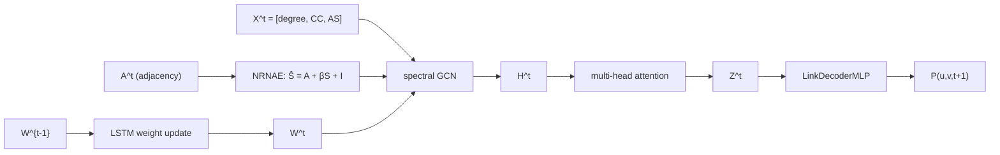
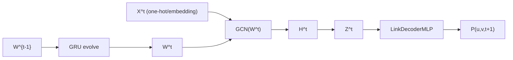
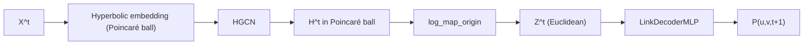
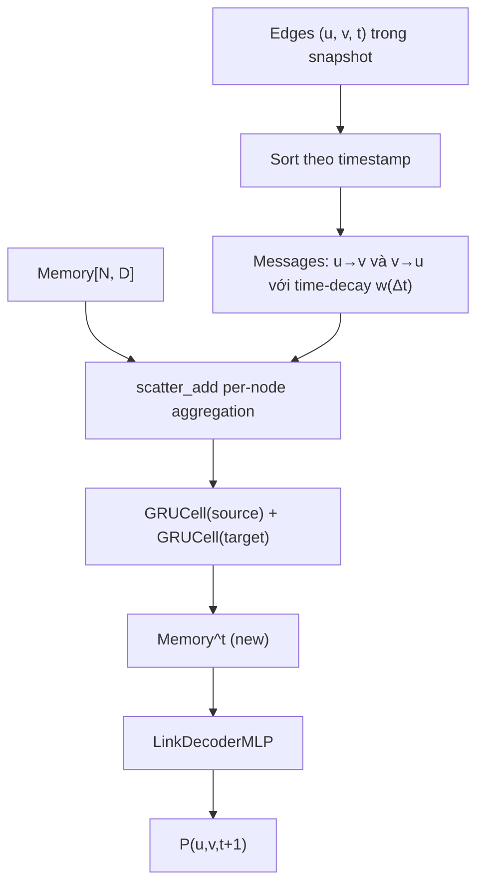
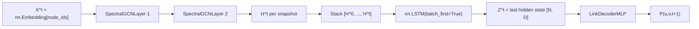

# Chương: Tái hiện thực nghiệm và phân tích so sánh các baseline

## 1. Tóm tắt phương pháp

Phần này mô tả kiến trúc của năm mô hình được so sánh trong thí nghiệm, bao gồm GCN_MA — phương pháp được tái hiện theo bài báo gốc — và bốn baseline được tích hợp để đánh giá chéo. Mỗi mô hình tiếp cận bài toán dự đoán liên kết động (dynamic link prediction) từ một góc nhìn khác nhau: GCN_MA dùng chuẩn hóa đặc trưng cấu trúc cục bộ kết hợp tiến hóa trọng số, EvolveGCN-O cho trọng số GCN tự cập nhật qua GRU, HTGN nhúng đồ thị vào không gian hyperbolic để nắm bắt cấu trúc phân cấp, DyGNN dùng bộ nhớ per-node với cập nhật GRU theo từng cạnh, còn DGCN xếp chồng GCN theo từng snapshot rồi đặt một LSTM qua trục thời gian. Tất cả năm mô hình dùng chung một `LinkDecoderMLP` để đảm bảo so sánh công bằng.

---

### 1.1 GCN_MA (Mei & Zhao 2024) — phương pháp được tái hiện

GCN_MA (Graph Convolutional Network with Multi-head Attention) là mô hình trung tâm của công trình tái hiện này, được đề xuất trong bài báo "Dynamic graph link prediction based on graph convolutional networks with multi-head self-attention mechanism" (Mei & Zhao 2024, *Scientific Reports*, DOI 10.1038/s41598-023-50977-6). Điểm nổi bật của GCN_MA so với các GCN cổ điển là bước tiền xử lý đặc trưng cấu trúc được gọi là **NRNAE** (Neighborhood-Reinforced Node Aggregation Enhancement), cho phép khai thác thông tin topo cục bộ của đồ thị trước khi đưa vào convolution.

**NRNAE — tăng cường đặc trưng cấu trúc cục bộ.** Cho node $i$ có $K(i)$ hàng xóm và $R(i)$ cạnh thực sự tồn tại giữa các cặp hàng xóm đó, hệ số phân cụm (clustering coefficient) được tính là:

$$CC(i) = \frac{2R(i)}{K(i)(K(i)-1)}$$

$CC(i)$ phản ánh mức độ "khép kín" của lân cận node $i$: nếu mọi hàng xóm đều nối nhau thì $CC(i)=1$, nếu không có cạnh nào thì $CC(i)=0$. Từ đó, sức mạnh tổng hợp của node $i$ được định nghĩa là:

$$AS(i) = \deg(i) \cdot CC(i)$$

Hai node $i$ và $j$ có mức độ tương tác pairwise:

$$S(i,j) = |N(i) \cap N(j)| \cdot AS(i)$$

trong đó $|N(i) \cap N(j)|$ là số hàng xóm chung. Cuối cùng, ma trận kề tăng cường được xây dựng là:

$$\hat{S} = A + \beta S + I$$

với $A$ là ma trận kề gốc, $I$ là ma trận đơn vị (self-loop), và $\beta$ là siêu tham số kiểm soát mức độ đóng góp của thông tin cấu trúc cục bộ. Bài báo khuyến nghị $\beta \in [0.7, 0.9]$; trong thực nghiệm tái hiện chúng tôi cố định $\beta = 0.8$, tìm được qua grid-search trên validation set của Bitcoinotc.

**Spectral GCN với trọng số tiến hóa.** Tại mỗi snapshot $t$, node embedding $H^t$ được tính theo công thức convolution phổ:

$$H^t = \sigma\!\left(\hat{D}^{-1/2} \hat{S}^t \hat{D}^{-1/2} X^t W^t\right)$$

trong đó $\hat{D}$ là ma trận bậc của $\hat{S}^t$, $X^t$ là ma trận đặc trưng đầu vào (gồm ba chiều: degree, CC, AS của mỗi node trong snapshot đó), và $W^t$ là ma trận trọng số. Thay vì học $W^t$ độc lập tại mỗi snapshot, GCN_MA dùng một LSTMCell để *tiến hóa* trọng số qua thời gian:

$$W^t = \mathrm{LSTMCell}(W^{t-1}, \mathrm{state}^{t-1})$$

Cơ chế này cho phép model nắm bắt xu hướng thay đổi của đồ thị theo thời gian mà không cần tăng số tham số tỉ lệ với số snapshot $T$. Trọng số khởi đầu $W^0$ được khởi tạo bằng phương pháp Xavier.

**Multi-head self-attention và decoder.** Sau bước GCN, embedding $H^t$ được đưa qua một lớp multi-head self-attention để tổng hợp thông tin giữa các node trong cùng snapshot, thu được biểu diễn cuối $Z^t = \mathrm{MultiHeadSelfAttn}(H^t)$. Xác suất tồn tại cạnh $(u, v)$ tại bước $t+1$ sau đó được dự đoán bởi một shared MLP decoder (chi tiết ở §1.6).

Trong quá trình tái hiện, các siêu tham số không được bài báo công bố (learning rate, hidden dim, số attention head, chiến lược negative sampling, v.v.) đều được chúng tôi xác định độc lập và ghi lại đầy đủ trong reproduction log.

*(Mei & Zhao 2024)*

---

### 1.2 EvolveGCN-O (Pareja et al. 2020)

EvolveGCN (Pareja et al. 2020, *AAAI*) là một trong những phương pháp đầu tiên giải quyết bài toán dynamic graph bằng cách cho phép ma trận trọng số GCN *tiến hóa* theo thời gian thông qua một mạng hồi quy, thay vì học trọng số tĩnh hoặc học riêng lẻ cho từng snapshot. Ý tưởng cốt lõi là: chuỗi trọng số $\{W^0, W^1, \ldots, W^T\}$ bản thân nó là một chuỗi thời gian và có thể được mô hình hóa bởi RNN.

EvolveGCN có hai biến thể: variant **H** (Hidden) dùng GRU cập nhật dựa trên cả embedding lẫn trọng số cũ, và variant **O** (Output) chỉ dùng GRU cập nhật trọng số qua kênh output. Trong project này chúng tôi tích hợp variant O, vì đây là cấu hình được IBM/EvolveGCN cung cấp sẵn và đã được kiểm chứng trên các benchmark chuẩn:

$$W^t = \mathrm{GRU}(W^{t-1})$$

Tại mỗi snapshot $t$, một lớp GCN dùng $W^t$ được áp dụng lên biểu diễn node $X^t$ để tính $H^t$. Upstream IBM/EvolveGCN sử dụng hai lớp GRCU (GRU-driven Convolutional Unit) xếp chồng — kiến trúc này cố định ở 2 lớp trong codebase gốc.

**Cách tích hợp trong project.** Chúng tôi vendored repo IBM/EvolveGCN tại commit `9086906` vào `third_party/EvolveGCN/` và viết một adapter mỏng (~165 LOC) tại `src/models/evolvegcn.py`, kế thừa từ `DynamicLinkPredictor`. Adapter chuyển đổi định dạng snapshot của project sang định dạng `(A_list, Nodes_list, mask_list)` mà upstream EGCN yêu cầu. Thay vì dùng one-hot identity làm đặc trưng đầu vào (tốn 34–59 GB RAM cho các dataset lớn), chúng tôi thay bằng `nn.Embedding` Xavier-initialized — cùng quy ước với chính codebase của IBM/EvolveGCN cho large-N.

Để tương thích với PyTorch 2.4, một hàm `_patch_upstream_egcn()` sửa hai lỗi trong upstream: nâng `GRCU_layers` từ Python list thành `nn.ModuleList` để `.to(device)` hoạt động đúng, và khôi phục `_parameters` về `{}`. Kỹ thuật adjacency symmetrize (thêm reverse edges trước khi build sparse tensor) được áp dụng để đảm bảo các dataset bipartite không bị triệt tiêu embedding về zero.

*(Pareja et al. 2020)*

---

### 1.3 HTGN (Yang et al. 2021)

HTGN (Hyperbolic Temporal Graph Network, Yang et al. 2021) mang đến một hướng tiếp cận căn bản khác: thay vì nhúng node vào không gian Euclidean thông thường, HTGN sử dụng không gian **hyperbolic** — cụ thể là mô hình **Poincaré ball** với độ cong $c > 0$ — để biểu diễn cấu trúc đồ thị. Lý do là nhiều đồ thị thực tế (mạng xã hội, đồ thị citation, tương tác user-item) có cấu trúc phân cấp dạng cây tiềm ẩn; không gian hyperbolic có thể biểu diễn cấu trúc này với độ chính xác cao hơn nhiều so với Euclidean cùng số chiều, vì thể tích hyperbolic tăng theo hàm mũ theo bán kính.

**Kiến trúc.** Lớp cốt lõi là **HGCN** (Hyperbolic Graph Convolutional Network): convolution được thực hiện trên tangent space tại điểm gốc (bằng cách áp dụng logarithmic map để đưa điểm hyperbolic về Euclidean cục bộ), sau đó ánh xạ kết quả trở lại Poincaré ball qua exponential map. HTGN còn tích hợp cơ chế **Hyperbolic Temporal Attention (HTA)** để tổng hợp thông tin qua nhiều snapshot liên tiếp, và sử dụng GRU ẩn để duy trì trạng thái ẩn qua thời gian.

Node embedding sau lớp HGCN nằm trên Poincaré ball với độ cong $c=1.0$. Trước khi đưa vào shared MLP decoder (vốn hoạt động trong Euclidean space), chúng tôi chiếu embedding về không gian tiếp tuyến tại điểm gốc qua phép **log_map_origin**:

$$Z^t = \log_{\mathbf{0}}^c(z_{\mathrm{hyp}}^t)$$

trong đó $\log_{\mathbf{0}}^c$ là logarithmic map tại gốc với độ cong $c$.

**Cách tích hợp trong project.** Chúng tôi vendored repo marlin-codes/HTGN tại commit `561159e` vào `third_party/HTGN/` và viết adapter tại `src/models/htgn.py` (~165 LOC). Upstream `config.py` gọi `argparse.parse_args()` ngay khi import — chúng tôi xử lý bằng cách reset `sys.argv` xung quanh lần import. Một vấn đề khác: upstream HTGN lưu các tensor trạng thái ẩn (`hidden_initial`, các slice của curvature $c$) dưới dạng plain Python attribute thay vì `nn.Parameter`/`nn.Buffer`, khiến `.to(device)` không di chuyển được chúng. Adapter giải quyết bằng cách override `to()`, `cuda()`, `cpu()` để rebuild `core` trực tiếp trên target device, sau đó walk tất cả submodule để di chuyển mọi stale tensor về đúng device. Độ cong được cố định ở $c=1.0$ (không học được) để đảm bảo ổn định số học khi dùng Adam thay cho RAdam Riemannian của bài báo gốc.

*(Yang et al. 2021)*

---

### 1.4 DyGNN (Ma et al. 2020) — biến thể vectorized

DyGNN (Dynamic Graph Neural Network, Ma et al. 2020) là một mô hình dựa trên chuỗi cạnh (edge-sequence model): thay vì xử lý đồ thị theo từng snapshot rời rạc như các mô hình trên, DyGNN xử lý từng cạnh $(u, v, t)$ theo đúng thứ tự thời gian xuất hiện của nó. Mỗi node duy trì một **bộ nhớ trạng thái** (node memory) $m_i \in \mathbb{R}^D$; khi một cạnh $(u, v)$ xuất hiện tại thời điểm $t$, bộ nhớ của cả $u$ lẫn $v$ được cập nhật bằng GRU với thông điệp từ đầu kia và một hệ số suy giảm theo thời gian $w(\Delta t)$:

$$m_u^{(t)} = \mathrm{GRU}_\mathrm{src}\!\left(w(\Delta t) \cdot m_v^{(t^-)},\; m_u^{(t^-)}\right)$$

Hệ số suy giảm $w(\Delta t) = 1/\log(\Delta t + e)$ (với "log" decay) phản ánh trực giác rằng tương tác càng xa về mặt thời gian thì càng ít ảnh hưởng đến trạng thái hiện tại.

**Vấn đề hiệu năng và biến thể vectorized.** Upstream `alge24/DyGNN` implement vòng lặp thuần Python trên từng cạnh, đạt xấp xỉ 3–10 ms/cạnh tùy cài đặt. Với CollegeMsg có ~60.000 cạnh mỗi epoch, chi phí lên đến 6–20 phút/epoch — và đây là dataset nhỏ nhất trong bộ benchmark. Một smoke test 3 epoch với cài đặt `if_propagation=1` (chế độ chuẩn của bài báo) hết timeout sau 30 phút, chưa hoàn thành epoch đầu tiên. Vấn đề này là thuộc tính thuật toán của DyGNN gốc, không phải lỗi implementation.

Do đó, chúng tôi triển khai một **biến thể vectorized** (path B): thay vì cập nhật tuần tự từng cạnh, toàn bộ cạnh trong một snapshot được xử lý song song trong một lần gọi `GRUCell`. Cụ thể:

1. Với mỗi cạnh $(u, v)$, xây dựng message $u \to v$ và $v \to u$, nhân với hệ số suy giảm $w(\Delta t)$.
2. Dùng `index_add` để tổng hợp tất cả message vào từng node đích, chuẩn hóa theo số cạnh.
3. Áp dụng `gru_source` và `gru_target` trên tất cả active node song song, chỉ cập nhật các node thực sự tham gia vào snapshot đó.

Biến thể này đạt tốc độ xấp xỉ **200× nhanh hơn** path A tại cùng workload (8.66 giây cho 3 epoch CollegeMsg). Đây cũng là xấp xỉ mà TGN và các mô hình liên tục-thời gian hiện đại sử dụng: thứ tự theo cạnh trong cùng một snapshot bị mất, nhưng thứ tự cross-snapshot được bảo toàn. Submodule gốc `alge24/DyGNN` vẫn được giữ trong `third_party/DyGNN/` cho mục đích citation, nhưng không được import trong thực nghiệm. LastFM được bỏ qua do ngay cả biến thể vectorized cũng không khả thi trong budget compute với 1.29 triệu cạnh.

*(Ma et al. 2020; biến thể vectorized của project)*

---

### 1.5 DGCN (Manessi et al. 2020) — biến thể WD-GCN

DGCN (Dynamic Graph Convolutional Networks, Manessi et al. 2020, *Pattern Recognition*) đề xuất kết hợp GCN với LSTM theo hai cách khác nhau: **WD-GCN** (Waterfall Dynamic GCN, tức "xếp tầng theo thời gian") và **CD-GCN** (Concatenated Dynamic GCN). Trong project này, chúng tôi reimplementation WD-GCN từ đầu — không có canonical repo công khai cho paper này, nên toàn bộ 150 LOC tại `src/models/dgcn.py` là code gốc của project.

**Kiến trúc WD-GCN.** Tại mỗi snapshot $t$, model áp dụng một stack gồm 2 lớp SpectralGCN lên embedding của node:

$$H^t = \mathrm{SpectralGCN}_2\!\left(\mathrm{SpectralGCN}_1(X^t, \hat{A}^t)\right)$$

trong đó $X^t$ là embedding của node (shared learnable `nn.Embedding`), và $\hat{A}^t = D^{-1/2}(A^t + I)D^{-1/2}$ là ma trận kề đã chuẩn hóa với self-loop. Ma trận kề sparse được xây dựng on-the-fly qua `torch.sparse_coo_tensor` — không vật liệu hóa ma trận dense $N \times N$ — cho phép chạy được Wikipedia và LastFM trên GPU 12GB.

Sau khi thu được dãy embedding $[H^0, H^1, \ldots, H^t]$ qua tất cả snapshot đã qua, model xếp chúng vào một sequence theo chiều node (mỗi node có một chuỗi $T$ embedding), rồi đưa qua LSTM theo trục thời gian:

$$[H^0, \ldots, H^t] \xrightarrow{\text{permute}} \mathrm{LSTM} \to Z^t = \text{last hidden state}$$

Hidden state cuối cùng $Z^t \in \mathbb{R}^{N \times D}$ là biểu diễn được đưa vào decoder.

Sự đơn giản về kiến trúc là điểm mạnh của DGCN: không có trọng số tiến hóa (như GCN_MA), không có không gian hyperbolic (như HTGN), không có per-node memory (như DyGNN) — chỉ là một stack GCN xử lý từng snapshot và một LSTM tổng hợp theo thời gian. Kết quả thực nghiệm cho thấy pipeline đơn giản này vẫn cạnh tranh được với các mô hình phức tạp hơn, đặc biệt trên dataset EUT nơi DGCN đứng đầu với AUC = 0.9847.

*(Manessi et al. 2020; WD-GCN reimplemented)*

---

### 1.6 Decoder dùng chung — LinkDecoderMLP

Tất cả năm mô hình trên đều dùng chung một decoder duy nhất: `LinkDecoderMLP` tại `src/models/gcn_ma/link_decoder.py`. Kiến trúc decoder là một MLP hai lớp nhận đầu vào là concatenation của hai node embedding:

$$\hat{y}_{uv} = \sigma\!\left(W_2 \cdot \mathrm{ReLU}\!\left(W_1 \cdot [Z_u \oplus Z_v]\right)\right)$$

Cụ thể: $[Z_u \oplus Z_v] \in \mathbb{R}^{2D}$ qua Linear$(2D \to D)$, ReLU, Dropout$(p=0.1)$, Linear$(D \to 1)$, và sigmoid để ra xác suất trong $[0, 1]$.

Lý do thiết kế này là để đảm bảo **so sánh công bằng**: mỗi bài báo gốc đề xuất decoder riêng của mình — HTGN dùng khoảng cách Fermi-Dirac trên Poincaré ball, DyGNN dùng scoring head trên bộ nhớ, GCN_MA dùng MLP đơn giản hơn — nhưng sự khác biệt giữa các decoder khiến việc so sánh encoder trở nên không trực tiếp. Bằng cách dùng chung một MLP decoder, hiệu năng AUC/AP đo được giữa năm mô hình phản ánh chất lượng của **encoder** (cơ chế học biểu diễn), không phải chất lượng của decoder.

Hàm loss dùng chung là **Binary Cross-Entropy** (BCE):

$$\mathcal{L} = -\frac{1}{|B|} \sum_{(u,v,y) \in B} \bigl[y \log \hat{y}_{uv} + (1-y)\log(1-\hat{y}_{uv})\bigr]$$

trong đó $B$ là tập mini-batch gồm cả positive edges (cạnh thật) và negative edges (cạnh được sample ngẫu nhiên với tỉ lệ 1:1). Chiến lược negative sampling là uniform random with rejection, resample mỗi epoch cho training và cố định seed=999 cho validation/test — nhất quán trên tất cả mô hình.
