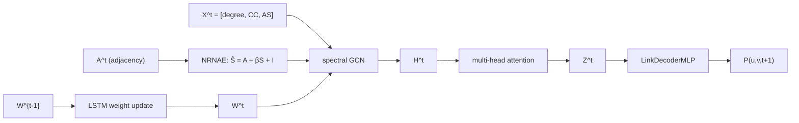
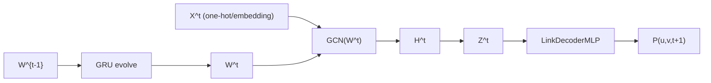
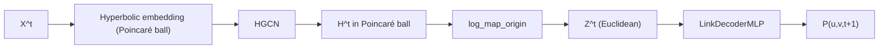
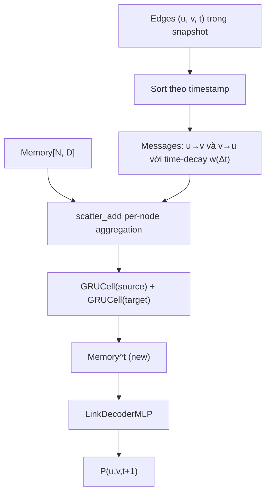
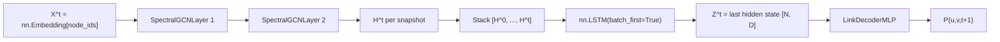

# Chương: Tái hiện thực nghiệm và phân tích so sánh các baseline

## 1. Tóm tắt phương pháp

Phần này mô tả kiến trúc của năm mô hình được so sánh trong thí nghiệm, bao gồm GCN_MA — phương pháp được tái hiện theo bài báo gốc — và bốn baseline được tích hợp để đánh giá chéo. Mỗi mô hình tiếp cận bài toán dự đoán liên kết động (dynamic link prediction) từ một góc nhìn khác nhau: GCN_MA dùng chuẩn hóa đặc trưng cấu trúc cục bộ kết hợp tiến hóa trọng số, EvolveGCN-O cho trọng số GCN tự cập nhật qua GRU, HTGN nhúng đồ thị vào không gian hyperbolic để nắm bắt cấu trúc phân cấp, DyGNN dùng bộ nhớ per-node với cập nhật GRU theo từng cạnh, còn DGCN xếp chồng GCN theo từng snapshot rồi đặt một LSTM qua trục thời gian. Tất cả năm mô hình dùng chung một `LinkDecoderMLP` để đảm bảo so sánh công bằng.

---

### 1.1 GCN_MA (Mei & Zhao 2024) — phương pháp được tái hiện

GCN_MA (Graph Convolutional Network with Multi-head Attention) là mô hình trung tâm của công trình tái hiện này, được đề xuất trong bài báo "Dynamic graph link prediction based on graph convolutional networks with multi-head self-attention mechanism" (Mei & Zhao 2024, *Scientific Reports*, DOI 10.1038/s41598-023-50977-6). Điểm nổi bật của GCN_MA so với các GCN cổ điển là bước tiền xử lý đặc trưng cấu trúc được gọi là **NRNAE** (Neighborhood-Reinforced Node Aggregation Enhancement), cho phép khai thác thông tin topo cục bộ của đồ thị trước khi đưa vào convolution.

**NRNAE — tăng cường đặc trưng cấu trúc cục bộ.** Cho node $i$ có $K(i)$ hàng xóm và $R(i)$ cạnh thực sự tồn tại giữa các cặp hàng xóm đó, hệ số phân cụm (clustering coefficient) được tính là:

$$CC(i) = \frac{2R(i)}{K(i)(K(i)-1)}$$

$CC(i)$ phản ánh mức độ "khép kín" của lân cận node $i$: nếu mọi hàng xóm đều nối nhau thì $CC(i)=1$, nếu không có cạnh nào thì $CC(i)=0$. Từ đó, sức mạnh tổng hợp của node $i$ được định nghĩa là:

$$AS(i) = \deg(i) \cdot CC(i)$$

Hai node $i$ và $j$ có mức độ tương tác pairwise:

$$S(i,j) = |N(i) \cap N(j)| \cdot AS(i)$$

trong đó $|N(i) \cap N(j)|$ là số hàng xóm chung. Cuối cùng, ma trận kề tăng cường được xây dựng là:

$$\hat{S} = A + \beta S + I$$

với $A$ là ma trận kề gốc, $I$ là ma trận đơn vị (self-loop), và $\beta$ là siêu tham số kiểm soát mức độ đóng góp của thông tin cấu trúc cục bộ. Bài báo khuyến nghị $\beta \in [0.7, 0.9]$; trong thực nghiệm tái hiện chúng tôi cố định $\beta = 0.8$, tìm được qua grid-search trên validation set của Bitcoinotc.

**Spectral GCN với trọng số tiến hóa.** Tại mỗi snapshot $t$, node embedding $H^t$ được tính theo công thức convolution phổ:

$$H^t = \sigma\!\left(\hat{D}^{-1/2} \hat{S}^t \hat{D}^{-1/2} X^t W^t\right)$$

trong đó $\hat{D}$ là ma trận bậc của $\hat{S}^t$, $X^t$ là ma trận đặc trưng đầu vào (gồm ba chiều: degree, CC, AS của mỗi node trong snapshot đó), và $W^t$ là ma trận trọng số. Thay vì học $W^t$ độc lập tại mỗi snapshot, GCN_MA dùng một LSTMCell để *tiến hóa* trọng số qua thời gian:

$$W^t = \mathrm{LSTMCell}(W^{t-1}, \mathrm{state}^{t-1})$$

Cơ chế này cho phép model nắm bắt xu hướng thay đổi của đồ thị theo thời gian mà không cần tăng số tham số tỉ lệ với số snapshot $T$. Trọng số khởi đầu $W^0$ được khởi tạo bằng phương pháp Xavier.

**Multi-head self-attention và decoder.** Sau bước GCN, embedding $H^t$ được đưa qua một lớp multi-head self-attention để tổng hợp thông tin giữa các node trong cùng snapshot, thu được biểu diễn cuối $Z^t = \mathrm{MultiHeadSelfAttn}(H^t)$. Xác suất tồn tại cạnh $(u, v)$ tại bước $t+1$ sau đó được dự đoán bởi một shared MLP decoder (chi tiết ở §1.6).

Trong quá trình tái hiện, các siêu tham số không được bài báo công bố (learning rate, hidden dim, số attention head, chiến lược negative sampling, v.v.) đều được chúng tôi xác định độc lập và ghi lại đầy đủ trong reproduction log.

*(Mei & Zhao 2024)*

---

### 1.2 EvolveGCN-O (Pareja et al. 2020)

EvolveGCN (Pareja et al. 2020, *AAAI*) là một trong những phương pháp đầu tiên giải quyết bài toán dynamic graph bằng cách cho phép ma trận trọng số GCN *tiến hóa* theo thời gian thông qua một mạng hồi quy, thay vì học trọng số tĩnh hoặc học riêng lẻ cho từng snapshot. Ý tưởng cốt lõi là: chuỗi trọng số $\{W^0, W^1, \ldots, W^T\}$ bản thân nó là một chuỗi thời gian và có thể được mô hình hóa bởi RNN.

EvolveGCN có hai biến thể: variant **H** (Hidden) dùng GRU cập nhật dựa trên cả embedding lẫn trọng số cũ, và variant **O** (Output) chỉ dùng GRU cập nhật trọng số qua kênh output. Trong project này chúng tôi tích hợp variant O, vì đây là cấu hình được IBM/EvolveGCN cung cấp sẵn và đã được kiểm chứng trên các benchmark chuẩn:

$$W^t = \mathrm{GRU}(W^{t-1})$$

Tại mỗi snapshot $t$, một lớp GCN dùng $W^t$ được áp dụng lên biểu diễn node $X^t$ để tính $H^t$. Upstream IBM/EvolveGCN sử dụng hai lớp GRCU (GRU-driven Convolutional Unit) xếp chồng — kiến trúc này cố định ở 2 lớp trong codebase gốc.

**Cách tích hợp trong project.** Chúng tôi vendored repo IBM/EvolveGCN tại commit `9086906` vào `third_party/EvolveGCN/` và viết một adapter mỏng (~165 LOC) tại `src/models/evolvegcn.py`, kế thừa từ `DynamicLinkPredictor`. Adapter chuyển đổi định dạng snapshot của project sang định dạng `(A_list, Nodes_list, mask_list)` mà upstream EGCN yêu cầu. Thay vì dùng one-hot identity làm đặc trưng đầu vào (tốn 34–59 GB RAM cho các dataset lớn), chúng tôi thay bằng `nn.Embedding` Xavier-initialized — cùng quy ước với chính codebase của IBM/EvolveGCN cho large-N.

Để tương thích với PyTorch 2.4, một hàm `_patch_upstream_egcn()` sửa hai lỗi trong upstream: nâng `GRCU_layers` từ Python list thành `nn.ModuleList` để `.to(device)` hoạt động đúng, và khôi phục `_parameters` về `{}`. Kỹ thuật adjacency symmetrize (thêm reverse edges trước khi build sparse tensor) được áp dụng để đảm bảo các dataset bipartite không bị triệt tiêu embedding về zero.

*(Pareja et al. 2020)*

---

### 1.3 HTGN (Yang et al. 2021)

HTGN (Hyperbolic Temporal Graph Network, Yang et al. 2021) mang đến một hướng tiếp cận căn bản khác: thay vì nhúng node vào không gian Euclidean thông thường, HTGN sử dụng không gian **hyperbolic** — cụ thể là mô hình **Poincaré ball** với độ cong $c > 0$ — để biểu diễn cấu trúc đồ thị. Lý do là nhiều đồ thị thực tế (mạng xã hội, đồ thị citation, tương tác user-item) có cấu trúc phân cấp dạng cây tiềm ẩn; không gian hyperbolic có thể biểu diễn cấu trúc này với độ chính xác cao hơn nhiều so với Euclidean cùng số chiều, vì thể tích hyperbolic tăng theo hàm mũ theo bán kính.

**Kiến trúc.** Lớp cốt lõi là **HGCN** (Hyperbolic Graph Convolutional Network): convolution được thực hiện trên tangent space tại điểm gốc (bằng cách áp dụng logarithmic map để đưa điểm hyperbolic về Euclidean cục bộ), sau đó ánh xạ kết quả trở lại Poincaré ball qua exponential map. HTGN còn tích hợp cơ chế **Hyperbolic Temporal Attention (HTA)** để tổng hợp thông tin qua nhiều snapshot liên tiếp, và sử dụng GRU ẩn để duy trì trạng thái ẩn qua thời gian.

Node embedding sau lớp HGCN nằm trên Poincaré ball với độ cong $c=1.0$. Trước khi đưa vào shared MLP decoder (vốn hoạt động trong Euclidean space), chúng tôi chiếu embedding về không gian tiếp tuyến tại điểm gốc qua phép **log_map_origin**:

$$Z^t = \log_{\mathbf{0}}^c(z_{\mathrm{hyp}}^t)$$

trong đó $\log_{\mathbf{0}}^c$ là logarithmic map tại gốc với độ cong $c$.

**Cách tích hợp trong project.** Chúng tôi vendored repo marlin-codes/HTGN tại commit `561159e` vào `third_party/HTGN/` và viết adapter tại `src/models/htgn.py` (~165 LOC). Upstream `config.py` gọi `argparse.parse_args()` ngay khi import — chúng tôi xử lý bằng cách reset `sys.argv` xung quanh lần import. Một vấn đề khác: upstream HTGN lưu các tensor trạng thái ẩn (`hidden_initial`, các slice của curvature $c$) dưới dạng plain Python attribute thay vì `nn.Parameter`/`nn.Buffer`, khiến `.to(device)` không di chuyển được chúng. Adapter giải quyết bằng cách override `to()`, `cuda()`, `cpu()` để rebuild `core` trực tiếp trên target device, sau đó walk tất cả submodule để di chuyển mọi stale tensor về đúng device. Độ cong được cố định ở $c=1.0$ (không học được) để đảm bảo ổn định số học khi dùng Adam thay cho RAdam Riemannian của bài báo gốc.

*(Yang et al. 2021)*

---

### 1.4 DyGNN (Ma et al. 2020) — biến thể vectorized

DyGNN (Dynamic Graph Neural Network, Ma et al. 2020) là một mô hình dựa trên chuỗi cạnh (edge-sequence model): thay vì xử lý đồ thị theo từng snapshot rời rạc như các mô hình trên, DyGNN xử lý từng cạnh $(u, v, t)$ theo đúng thứ tự thời gian xuất hiện của nó. Mỗi node duy trì một **bộ nhớ trạng thái** (node memory) $m_i \in \mathbb{R}^D$; khi một cạnh $(u, v)$ xuất hiện tại thời điểm $t$, bộ nhớ của cả $u$ lẫn $v$ được cập nhật bằng GRU với thông điệp từ đầu kia và một hệ số suy giảm theo thời gian $w(\Delta t)$:

$$m_u^{(t)} = \mathrm{GRU}_\mathrm{src}\!\left(w(\Delta t) \cdot m_v^{(t^-)},\; m_u^{(t^-)}\right)$$

Hệ số suy giảm $w(\Delta t) = 1/\log(\Delta t + e)$ (với "log" decay) phản ánh trực giác rằng tương tác càng xa về mặt thời gian thì càng ít ảnh hưởng đến trạng thái hiện tại.

**Vấn đề hiệu năng và biến thể vectorized.** Upstream `alge24/DyGNN` implement vòng lặp thuần Python trên từng cạnh, đạt xấp xỉ 3–10 ms/cạnh tùy cài đặt. Với CollegeMsg có ~60.000 cạnh mỗi epoch, chi phí lên đến 6–20 phút/epoch — và đây là dataset nhỏ nhất trong bộ benchmark. Một smoke test 3 epoch với cài đặt `if_propagation=1` (chế độ chuẩn của bài báo) hết timeout sau 30 phút, chưa hoàn thành epoch đầu tiên. Vấn đề này là thuộc tính thuật toán của DyGNN gốc, không phải lỗi implementation.

Do đó, chúng tôi triển khai một **biến thể vectorized** (path B): thay vì cập nhật tuần tự từng cạnh, toàn bộ cạnh trong một snapshot được xử lý song song trong một lần gọi `GRUCell`. Cụ thể:

1. Với mỗi cạnh $(u, v)$, xây dựng message $u \to v$ và $v \to u$, nhân với hệ số suy giảm $w(\Delta t)$.
2. Dùng `index_add` để tổng hợp tất cả message vào từng node đích, chuẩn hóa theo số cạnh.
3. Áp dụng `gru_source` và `gru_target` trên tất cả active node song song, chỉ cập nhật các node thực sự tham gia vào snapshot đó.

Biến thể này đạt tốc độ xấp xỉ **200× nhanh hơn** path A tại cùng workload (8.66 giây cho 3 epoch CollegeMsg). Đây cũng là xấp xỉ mà TGN và các mô hình liên tục-thời gian hiện đại sử dụng: thứ tự theo cạnh trong cùng một snapshot bị mất, nhưng thứ tự cross-snapshot được bảo toàn. Submodule gốc `alge24/DyGNN` vẫn được giữ trong `third_party/DyGNN/` cho mục đích citation, nhưng không được import trong thực nghiệm. LastFM được bỏ qua do ngay cả biến thể vectorized cũng không khả thi trong budget compute với 1.29 triệu cạnh.

*(Ma et al. 2020; biến thể vectorized của project)*

---

### 1.5 DGCN (Manessi et al. 2020) — biến thể WD-GCN

DGCN (Dynamic Graph Convolutional Networks, Manessi et al. 2020, *Pattern Recognition*) đề xuất kết hợp GCN với LSTM theo hai cách khác nhau: **WD-GCN** (Waterfall Dynamic GCN, tức "xếp tầng theo thời gian") và **CD-GCN** (Concatenated Dynamic GCN). Trong project này, chúng tôi reimplementation WD-GCN từ đầu — không có canonical repo công khai cho paper này, nên toàn bộ 150 LOC tại `src/models/dgcn.py` là code gốc của project.

**Kiến trúc WD-GCN.** Tại mỗi snapshot $t$, model áp dụng một stack gồm 2 lớp SpectralGCN lên embedding của node:

$$H^t = \mathrm{SpectralGCN}_2\!\left(\mathrm{SpectralGCN}_1(X^t, \hat{A}^t)\right)$$

trong đó $X^t$ là embedding của node (shared learnable `nn.Embedding`), và $\hat{A}^t = D^{-1/2}(A^t + I)D^{-1/2}$ là ma trận kề đã chuẩn hóa với self-loop. Ma trận kề sparse được xây dựng on-the-fly qua `torch.sparse_coo_tensor` — không vật liệu hóa ma trận dense $N \times N$ — cho phép chạy được Wikipedia và LastFM trên GPU 12GB.

Sau khi thu được dãy embedding $[H^0, H^1, \ldots, H^t]$ qua tất cả snapshot đã qua, model xếp chúng vào một sequence theo chiều node (mỗi node có một chuỗi $T$ embedding), rồi đưa qua LSTM theo trục thời gian:

$$[H^0, \ldots, H^t] \xrightarrow{\text{permute}} \mathrm{LSTM} \to Z^t = \text{last hidden state}$$

Hidden state cuối cùng $Z^t \in \mathbb{R}^{N \times D}$ là biểu diễn được đưa vào decoder.

Sự đơn giản về kiến trúc là điểm mạnh của DGCN: không có trọng số tiến hóa (như GCN_MA), không có không gian hyperbolic (như HTGN), không có per-node memory (như DyGNN) — chỉ là một stack GCN xử lý từng snapshot và một LSTM tổng hợp theo thời gian. Kết quả thực nghiệm cho thấy pipeline đơn giản này vẫn cạnh tranh được với các mô hình phức tạp hơn, đặc biệt trên dataset EUT nơi DGCN đứng đầu với AUC = 0.9847.

*(Manessi et al. 2020; WD-GCN reimplemented)*

---

### 1.6 Decoder dùng chung — LinkDecoderMLP

Tất cả năm mô hình trên đều dùng chung một decoder duy nhất: `LinkDecoderMLP` tại `src/models/gcn_ma/link_decoder.py`. Kiến trúc decoder là một MLP hai lớp nhận đầu vào là concatenation của hai node embedding:

$$\hat{y}_{uv} = \sigma\!\left(W_2 \cdot \mathrm{ReLU}\!\left(W_1 \cdot [Z_u \oplus Z_v]\right)\right)$$

Cụ thể: $[Z_u \oplus Z_v] \in \mathbb{R}^{2D}$ qua Linear$(2D \to D)$, ReLU, Dropout$(p=0.1)$, Linear$(D \to 1)$, và sigmoid để ra xác suất trong $[0, 1]$.

Lý do thiết kế này là để đảm bảo **so sánh công bằng**: mỗi bài báo gốc đề xuất decoder riêng của mình — HTGN dùng khoảng cách Fermi-Dirac trên Poincaré ball, DyGNN dùng scoring head trên bộ nhớ, GCN_MA dùng MLP đơn giản hơn — nhưng sự khác biệt giữa các decoder khiến việc so sánh encoder trở nên không trực tiếp. Bằng cách dùng chung một MLP decoder, hiệu năng AUC/AP đo được giữa năm mô hình phản ánh chất lượng của **encoder** (cơ chế học biểu diễn), không phải chất lượng của decoder.

Hàm loss dùng chung là **Binary Cross-Entropy** (BCE):

$$\mathcal{L} = -\frac{1}{|B|} \sum_{(u,v,y) \in B} \bigl[y \log \hat{y}_{uv} + (1-y)\log(1-\hat{y}_{uv})\bigr]$$

trong đó $B$ là tập mini-batch gồm cả positive edges (cạnh thật) và negative edges (cạnh được sample ngẫu nhiên với tỉ lệ 1:1). Chiến lược negative sampling là uniform random with rejection, resample mỗi epoch cho training và cố định seed=999 cho validation/test — nhất quán trên tất cả mô hình.

---

## 2. Thiết lập thực nghiệm

### 2.1 Bộ dữ liệu

Thực nghiệm được tiến hành trên sáu tập dữ liệu đồ thị động có nhãn thời gian (timestamped temporal graphs), bao gồm cả đồ thị unipartite lẫn bipartite, đến từ hai nguồn chính là Stanford SNAP và bộ dữ liệu JODIE. Sáu tập dữ liệu này được lựa chọn để phù hợp với bộ thực nghiệm gốc của bài báo GCN_MA (Mei & Zhao 2024), đồng thời bao phủ nhiều miền ứng dụng khác nhau: mạng xã hội trực tuyến, thị trường tiền mã hóa, truyền thông email doanh nghiệp, và tương tác người dùng — nội dung trên các nền tảng số.

- **CollegeMsg** (Stanford SNAP): mạng nhắn tin sinh viên đại học, nodes = sinh viên, edges = tin nhắn có timestamp. Unipartite. Nguồn: https://snap.stanford.edu/data/CollegeMsg.txt.gz
- **Bitcoinotc** (Stanford SNAP): mạng tin cậy giao dịch Bitcoin, nodes = ví, edges = đánh giá ±1..±10. Unipartite. Nguồn: https://snap.stanford.edu/data/soc-sign-bitcoinotc.csv.gz
- **EUT** (Email-EU-temporal, Stanford SNAP): email trong một viện nghiên cứu châu Âu, nodes = người dùng, edges = email với timestamp. Unipartite, bursty pattern (workday vs weekend). Nguồn: https://snap.stanford.edu/data/email-Eu-core-temporal.txt.gz
- **Mooc-Actions** (JODIE): tương tác sinh viên ↔ khóa học trên MOOC. Bipartite. Nguồn: http://snap.stanford.edu/jodie/mooc.csv
- **LastFM** (JODIE): người dùng nghe nhạc, nodes = user / artist, edges = play. Bipartite, dense. Nguồn: http://snap.stanford.edu/jodie/lastfm.csv
- **Wikipedia** (JODIE): chỉnh sửa Wikipedia, nodes = editor / page, edges = edit. Bipartite. Nguồn: http://snap.stanford.edu/jodie/wikipedia.csv

Thống kê quy mô của sáu tập dữ liệu được trình bày trong bảng dưới đây. Các con số được tính toán trực tiếp từ dữ liệu thô sau khi build cache (`scripts/make_plots.py`), đảm bảo nhất quán với đúng bộ dữ liệu được dùng trong thực nghiệm.

| Dataset | N (nodes) | E (total edges) | T (snapshots) | Bipartite |
|---|---|---|---|---|
| collegemsg | 1899 | 59835 | 47 | False |
| bitcoinotc | 5881 | 35592 | 62 | False |
| eut | 986 | 332334 | 127 | False |
| mooc_actions | 7144 | 411749 | 72 | True |
| lastfm | 1980 | 1293103 | 41 | True |
| wikipedia | 7474 | 110218 | 42 | True |

Về quy ước tạo snapshot: toàn bộ timeline của từng tập dữ liệu được chia đều thành $T$ khoảng thời gian bằng nhau theo phương pháp **equal-time binning** — mỗi bin có độ dài thời gian giống nhau, bất kể số lượng sự kiện trong đó. Duy nhất EUT là ngoại lệ: do hoạt động email trong môi trường công sở có tính **bursty** rõ ràng (dày đặc vào ngày làm việc, thưa thớt cuối tuần), equal-time binning tạo ra 24 snapshot liên tiếp hoàn toàn rỗng trong vùng test, khiến AUC của val bị kẹt ở 0.5. Để khắc phục, EUT sử dụng **quantile binning**: chia theo số lượng sự kiện đồng đều thay vì theo thời gian, đảm bảo mỗi snapshot đều có ít nhất một cạnh. Lựa chọn này được ghi nhận và thảo luận chi tiết trong §4 (phân tích kết quả từng dataset).

### 2.2 Cách chia tập huấn luyện / đánh giá

Thực nghiệm tuân theo chiến lược **temporal split** — chia dữ liệu theo chiều thời gian để tránh data leakage: không bao giờ dùng thông tin tương lai để dự đoán quá khứ.

Cụ thể, với $T$ snapshot của mỗi tập dữ liệu và `train_ratio = 0.8`, quá trình chia diễn ra như sau. Các snapshot $[0, \lfloor 0.8T \rfloor)$ được dùng làm đầu vào huấn luyện: mô hình học cách dự đoán liên kết tại bước $t{+}1$ từ embedding $Z^t$ được tính tại bước $t$. Snapshot tại vị trí $\lfloor 0.8T \rfloor$ là **val target** — mô hình chạy forward qua toàn bộ dãy encoder lên đến bước đó, sau đó đánh giá link prediction ở bước kế tiếp. Các snapshot từ $\lfloor 0.8T \rfloor + 1$ đến $T{-}1$ là **test targets**: AUC và AP được tính trên từng snapshot này rồi gộp lại (pooled) bằng cách nối tất cả prediction scores và labels trước khi gọi `sklearn.metrics`, thay vì trung bình thủ công — điều này cho phép các snapshot có số edge ít hơn đóng góp ít hơn vào metric cuối, phản ánh đúng phân phối thực.

Vấn đề **data leakage** được xử lý cẩn thận: quá trình training không bao giờ target các snapshot thuộc vùng val/test. Đây là một lỗi tiềm ẩn được phát hiện và sửa trong quá trình self-review ở Plan 1 (xem reproduction log): ban đầu `train_ratio` bị hardcode trong `trainer.py`, không đọc từ config YAML, dẫn đến nguy cơ ranh giới val/test không nhất quán khi thêm dataset mới. Lỗi này được fix bằng cách wiring `train_ratio` từ từng dataset config YAML qua `TrainConfig` vào hàm `temporal_split()`.

**Negative sampling** được thực hiện theo giao thức uniform random with rejection ở tỉ lệ 1:1 (positive:negative). Trong quá trình huấn luyện, negative edges được resample theo từng epoch và từng snapshot, đảm bảo mô hình không ghi nhớ cặp âm cố định. Trong quá trình đánh giá (val và test), negative edges được sinh một lần với seed cố định `999` và giữ nguyên qua tất cả các lần chạy — điều này đảm bảo kết quả đánh giá hoàn toàn deterministic và có thể so sánh trực tiếp giữa các lần thực nghiệm khác nhau cũng như giữa các mô hình khác nhau.

### 2.3 Chính sách siêu tham số (Hybrid policy)

Năm mô hình được so sánh có kiến trúc rất khác nhau: GCN_MA dùng LSTMCell để tiến hóa trọng số ma trận, EvolveGCN-O dùng GRU cell trực tiếp trên trọng số lớp GCN, HTGN hoạt động trên không gian hyperbolic Poincaré ball, DyGNN duy trì bộ nhớ per-node cập nhật theo từng cạnh, còn DGCN xếp chồng GCN theo snapshot rồi đặt LSTM theo trục thời gian. Do sự dị biệt kiến trúc này, việc áp đặt một bộ siêu tham số **hoàn toàn giống nhau** cho cả năm mô hình là không khả thi và cũng không phản ánh trung thực điều kiện mà mỗi bài báo gốc đề xuất.

Thay vào đó, chúng tôi áp dụng một **Hybrid policy**: chia siêu tham số thành hai nhóm.

Nhóm thứ nhất là các **shared hyperparameters** — những tham số kiểm soát capacity tính toán và điều kiện huấn luyện, được giữ đồng nhất trên cả năm mô hình để đảm bảo công bằng:

| Param | Giá trị | Nguồn |
|---|---|---|
| `hidden_dim` | 64 | β grid Bitcoinotc seed 42 50 epochs (Plan 2) chọn 64 > 128 |
| `dropout` | 0.1 | Tiêu chuẩn cho dynamic LP |
| `lr` | 1.0e-3 | Adam default cho GCN family |
| `weight_decay` | 1.0e-5 | Light regularization |
| `optimizer` | Adam | Paper không nêu; tiêu chuẩn |
| `epochs` | 200 + early stop patience 20 | Cho phép convergence mọi dataset |
| `grad_clip_max_norm` | 5.0 | Anti-explode cho LSTM/GRU cell |
| `β` (NRNAE) | 0.8 | Paper khuyến nghị [0.7, 0.9]; ta xác nhận 0.8 trên Bitcoinotc |

Triết lý lựa chọn `hidden_dim = 64` xuất phát từ một grid-search nhỏ được thực hiện trong Plan 2 trên tập Bitcoinotc (seed 42, 50 epochs), so sánh $\beta \in \{0.7, 0.8, 0.9\}$ với `hidden_dim` $\in \{64, 128\}$. Tổ hợp $\beta = 0.8$, `hidden_dim = 64` cho val AUC cao nhất (0.9356), và `hidden_dim = 64` cũng phù hợp hơn với bộ nhớ GPU 12 GB khi chạy đồng thời nhiều dataset lớn như Mooc-Actions và LastFM. Đây cũng là lý do `num_heads` của GCN_MA được giảm từ 8 xuống 4 sau Plan 2: với `hidden_dim = 64`, head dimension là $64/4 = 16$ — đủ biểu cảm và ổn định về mặt số học, trong khi `num_heads = 8` cho head dimension chỉ 8, quá nhỏ cho dot-product attention.

Nhóm thứ hai là các **baseline-specific hyperparameters** — những tham số kiến trúc đặc thù mà mỗi mô hình bắt buộc phải có, không thể chia sẻ:

- **GCN_MA**: `num_heads = 4` (giảm từ 8 sau Plan 2 grid).
- **EvolveGCN-O**: `num_layers = 2`, `activation = rrelu` (theo paper gốc).
- **HTGN**: `curvature = 1.0` (fixed, không learnable do constraint Riemannian optimizer; `trainable_curvature = false`).
- **DyGNN**: `edge_dim = 16`, `decay_method = "log"`, `decay_rate = 1.0` (tham số bộ nhớ temporal decay).
- **DGCN**: `num_gcn_layers = 2`, `num_lstm_layers = 1` (số lớp GCN theo snapshot và số lớp LSTM theo thời gian).

Toàn bộ siêu tham số trên được lưu trong các file YAML tương ứng tại `configs/models/` và `configs/datasets/`, và được load tự động vào `TrainConfig` khi khởi chạy thực nghiệm — không có giá trị nào hardcode trong code training.

### 2.4 Tái lập đa hạt giống và phần cứng

Để đánh giá độ ổn định của kết quả và cung cấp ước lượng thống kê cơ bản, mỗi cấu hình thực nghiệm (model, dataset) được chạy với ba **random seeds** khác nhau: $\{42, 123, 2024\}$. Mỗi cặp (model, dataset, seed) là một run độc lập, kết quả được ghi vào file `results/metrics.jsonl` theo định dạng JSON Lines — mỗi dòng là một record hoàn chỉnh cho một run.

Để hỗ trợ **reproducibility audit**, mỗi record trong `metrics.jsonl` bao gồm hai trường định danh: `git_sha` (commit hash của repository tại thời điểm chạy) và `config_hash` (MD5 của ba file YAML config: model, dataset, và experiment). Nhờ đó, bất kỳ kết quả nào trong file cũng có thể được truy nguyên về đúng phiên bản code và cấu hình đã tạo ra nó — tiêu chí quan trọng cho nghiên cứu tái lập được.

Metric được báo cáo là **mean ± std** qua ba seeds. Tổng số records trong `metrics.jsonl` là 87, phân bổ như sau: 18 GCN_MA, 18 EvolveGCN-O, 18 HTGN, 15 DyGNN, và 18 DGCN. DyGNN có 15 thay vì 18 vì tập LastFM bị bỏ qua do giới hạn compute budget (LastFM có 1.29M edges và DyGNN xử lý từng cạnh tuần tự qua bộ nhớ — runtime quá lớn trên hardware hiện tại); vấn đề này được thảo luận cụ thể trong §4.

**Phần cứng và phần mềm:** Toàn bộ thực nghiệm được chạy trên một GPU NVIDIA RTX 3060 12 GB, chạy trong môi trường WSL2 Linux trên Windows host. Stack phần mềm: Python 3.11, PyTorch 2.4.0, PyTorch Geometric 2.6.1, các thư viện phụ trợ (NetworkX ≥ 3.2, pandas ≥ 2.0, scikit-learn ≥ 1.4) được quản lý bởi `uv` qua môi trường `.venv` cục bộ. Phiên bản CUDA tương thích với PyTorch 2.4.0 (CUDA 12.1).

### 2.5 Định nghĩa metric

Hai metric chính được dùng để đánh giá hiệu năng link prediction là **AUC** (Area Under the ROC Curve) và **AP** (Average Precision, diện tích dưới đường cong Precision-Recall).

Bài toán link prediction được cast thành binary classification: mỗi cạnh (positive hoặc negative) được mô hình gán một điểm số xác suất trong $[0, 1]$, sau đó so sánh với nhãn thật. AUC đo khả năng phân biệt của mô hình — xác suất mà một positive edge được chấm điểm cao hơn một negative edge khi lấy ngẫu nhiên. AP đo độ chính xác trung bình qua các ngưỡng phân loại khác nhau, đặc biệt nhạy cảm với vùng precision cao, phù hợp để đánh giá trong điều kiện mất cân bằng lớp (imbalanced class setting).

Cả hai metric đều được tính trên **toàn bộ tập test**, không phải từng snapshot riêng lẻ. Cụ thể, predictions từ tất cả test snapshots $[\lfloor 0.8T \rfloor + 1, T{-}1]$ được nối lại thành hai vector dài (scores và labels), sau đó `roc_auc_score` và `average_precision_score` của `sklearn.metrics` được gọi một lần trên toàn bộ. Cách tính pooled này đảm bảo rằng các snapshot có nhiều cạnh hơn đóng góp tương xứng vào metric cuối, thay vì bị cân bằng bởi trung bình macro trên số snapshot.

Chúng tôi không thực hiện kiểm định thống kê (statistical significance testing) do số lượng seed chỉ là 3 — không đủ power để phát hiện hiệu ứng nhỏ với độ tin cậy cao. Thay vào đó, std qua 3 seeds được dùng như một chỉ báo về độ ổn định hội tụ. Các hạn chế liên quan đến ý nghĩa thống kê của kết quả được thảo luận trong §4.7.
